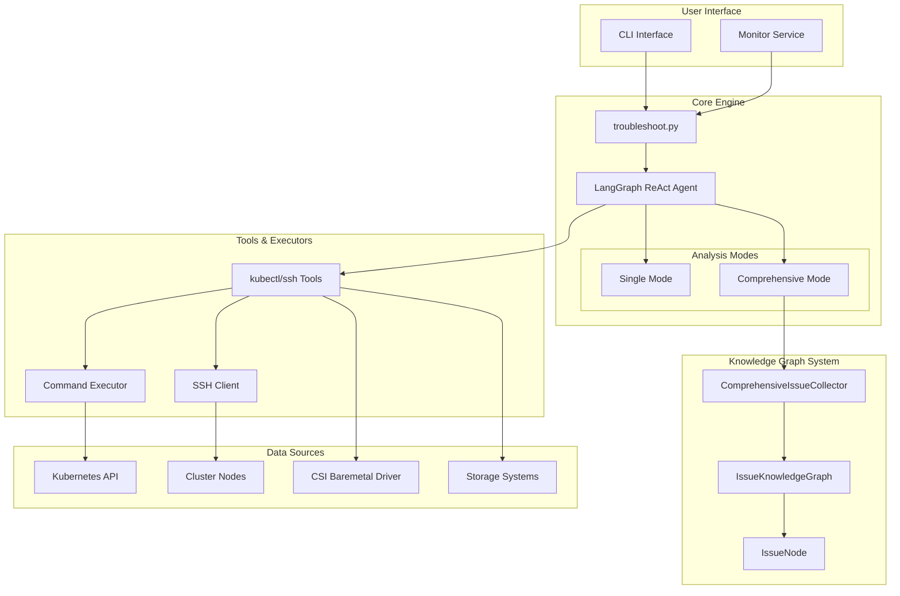
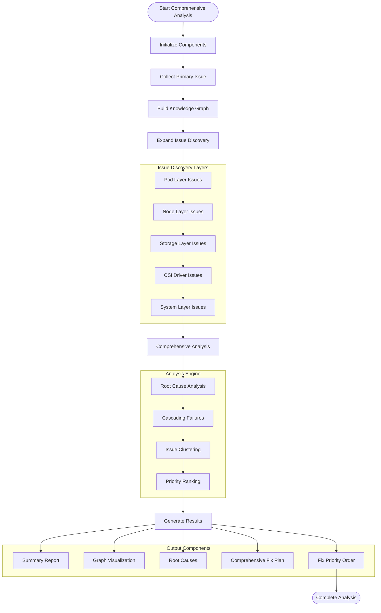
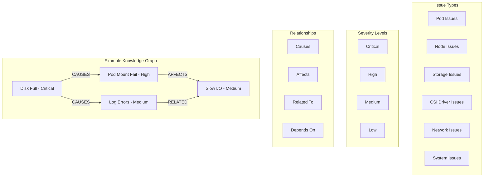

# Kubernetes Volume I/O Error Troubleshooting System

An intelligent troubleshooting system for Kubernetes pod volume I/O errors using LangGraph ReAct agents with comprehensive multi-issue analysis powered by knowledge graphs.

## 🎯 Overview

This system automatically diagnoses and resolves volume I/O errors in Kubernetes pods backed by local HDD/SSD/NVMe disks managed by the CSI Baremetal driver. It features two modes:

- **Single Mode**: Focuses on specific pod issues with targeted analysis
- **Comprehensive Mode**: Systematically analyzes ALL related storage issues across K8s/Linux/storage layers using knowledge graphs

## 🏗️ System Architecture



## 🚀 Quick Start

### Prerequisites

- Kubernetes cluster with CSI Baremetal driver
- kubectl configured
- Python 3.8+
- Required dependencies (see `requirements.txt`)

### Installation

1. Clone the repository:
```bash
git clone <repository-url>
cd cluster-storage-troubleshooting
```

2. Install dependencies:
```bash
pip install -r requirements.txt
```

3. Configure the system:
```bash
cp config.yaml.example config.yaml
# Edit config.yaml with your settings
```

### Basic Usage

#### Single Mode (Traditional)
```bash
python troubleshoot.py --pod-name <pod-name> --namespace <namespace> --volume-path <path>
```

#### Comprehensive Mode (Enhanced)
```bash
python run_comprehensive_mode.py --pod-name <pod-name> --namespace <namespace> --volume-path <path>
```

#### Monitoring Mode
```bash
./start_monitoring.sh
```

## 📊 Comprehensive Mode Workflow



## 🧠 Knowledge Graph Structure



## 📁 Project Structure

```
cluster-storage-troubleshooting/
├── troubleshoot.py              # Main troubleshooting engine
├── knowledge_graph.py           # Knowledge graph implementation
├── issue_collector.py           # Comprehensive issue collector
├── run_comprehensive_mode.py    # Comprehensive mode runner
├── monitor.py                   # Background monitoring service
├── config.yaml                  # Configuration file
├── requirements.txt             # Python dependencies
├── docs/                        # Documentation
│   ├── COMPREHENSIVE_MODE.md    # Comprehensive mode guide
│   ├── PROJECT_STRUCTURE.md     # Project structure details
│   └── design_requirement.md    # Design requirements
└── scripts/                     # Utility scripts
    ├── start_monitoring.sh      # Start monitoring service
    └── run_comprehensive_troubleshoot.sh  # Run comprehensive analysis
```

## 🔧 Configuration

The system is configured via `config.yaml`:

```yaml
# LLM Configuration
llm:
  model: "gpt-4"
  api_key: "your-api-key"
  api_endpoint: "https://api.openai.com/v1"
  temperature: 0.1
  max_tokens: 4000

# Troubleshooting Settings
troubleshoot:
  interactive_mode: true
  phase: "analysis"  # analysis or remediation
  mode: "comprehensive"  # single or comprehensive

# SSH Configuration
ssh:
  enabled: true
  nodes: ["node1", "node2"]
  user: "root"
  key_path: "/path/to/ssh/key"

# Command Validation
commands:
  allowed: ["kubectl*", "smartctl*", "df", "dmesg"]
  disallowed: ["rm*", "fsck*", "dd*"]
```

## 📈 Features

### Core Capabilities
- ✅ **Intelligent Analysis**: LangGraph ReAct agents for systematic troubleshooting
- ✅ **Multi-Layer Discovery**: Pod → Node → Storage → CSI → System analysis
- ✅ **Knowledge Graphs**: Relationship mapping between issues
- ✅ **Root Cause Analysis**: True cause identification vs symptom treatment
- ✅ **Comprehensive Fix Plans**: Ordered remediation considering dependencies
- ✅ **Safety Controls**: Command validation and interactive approval
- ✅ **Monitoring Integration**: Continuous background monitoring

### Enhanced Analysis
- 🔍 **Issue Clustering**: Groups related problems by type and severity
- 🔗 **Cascading Failure Detection**: Identifies how issues propagate
- 📊 **Priority Ranking**: Intelligent fix ordering based on impact
- 🎯 **Comprehensive Scope**: Analyzes entire storage ecosystem
- 📈 **Trend Analysis**: Pattern recognition across multiple incidents

## 🎯 Use Cases

1. **Reactive Troubleshooting**: Diagnose and fix active volume I/O issues
2. **Proactive Monitoring**: Detect potential storage problems before they impact workloads
3. **Comprehensive Analysis**: Understand complex multi-component storage failures
4. **Knowledge Building**: Build organizational knowledge about storage patterns
5. **Compliance**: Maintain audit trails of storage incidents and resolutions

## 🛠️ Development

### Adding New Issue Types
1. Update `IssueType` enum in `knowledge_graph.py`
2. Add detection logic in `issue_collector.py`
3. Update analysis patterns in troubleshooting prompts

### Extending Tool Capabilities
1. Add new tools in `troubleshoot.py`
2. Update command validation in `config.yaml`
3. Test with safety controls enabled

## 📚 Documentation

- [Comprehensive Mode Guide](docs/COMPREHENSIVE_MODE.md)
- [Project Structure](docs/PROJECT_STRUCTURE.md)
- [Design Requirements](docs/design_requirement.md)

## 🤝 Contributing

1. Fork the repository
2. Create a feature branch
3. Add comprehensive tests
4. Update documentation
5. Submit a pull request

## 📄 License

This project is licensed under the MIT License - see the [LICENSE](LICENSE) file for details.

## 🆘 Support

For issues and questions:
- Create an issue on GitHub
- Check the documentation in `/docs`
- Review configuration examples

---

**Built with ❤️ for Kubernetes storage reliability**
