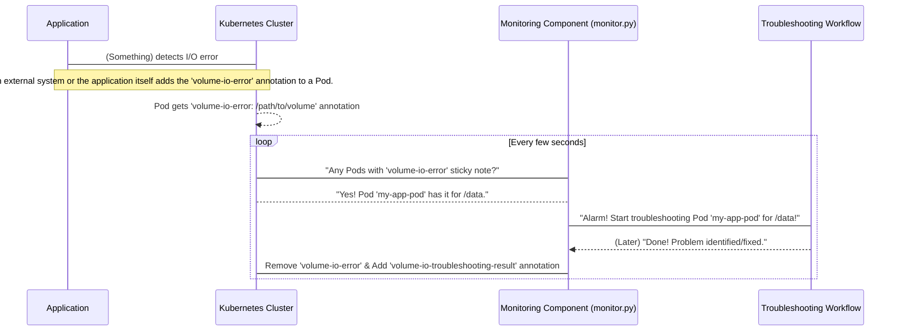

# Chapter 1: Monitoring Component

Welcome to the first chapter of our journey into the `cluster-storage-troubleshooting` project! We're going to explore how this smart system helps fix tricky storage problems in Kubernetes clusters. Don't worry if you're new to Kubernetes or programming; we'll explain everything step by step.

### What Problem Are We Solving? (The Alarm System)

Imagine you have a house, and sometimes, a pipe might burst, or a window might break. How would you know? You could check every pipe and window yourself every few minutes, but that's a lot of work! Instead, you'd probably have an **alarm system** with sensors that alert you when something goes wrong.

Our Kubernetes cluster is like that house, and its storage (where your applications keep their data) is like those pipes and windows. Sometimes, storage can have "I/O errors," which means applications can't read or write data properly. This is a big problem! We don't want to manually check every single application all the time.

This is where the **Monitoring Component** comes in. It's like the alarm system for your Kubernetes cluster's storage. Its main job is to **constantly watch** for signs of trouble, specifically volume I/O errors. When it spots a problem, it sounds the alarm, telling the rest of our system to jump into action and fix it.

### Our Goal: Auto-Detect Storage Errors

Our concrete goal for this chapter is to understand how our system can **automatically detect** when a Kubernetes application (called a "Pod") is experiencing storage problems and then **trigger** the troubleshooting process without anyone needing to manually start it.

### Key Concepts: Sticky Notes on Pods

Before we dive into the details, let's understand two key ideas:

1.  **Kubernetes Pods:** In Kubernetes, your applications run inside small, isolated units called "Pods." Think of a Pod as a tiny, self-contained box where your application lives.
2.  **Annotations:** Pods (and other Kubernetes parts) can have "annotations." These are like **digital sticky notes** you can attach to them. You can write any kind of information on these sticky notes. Our system uses a special sticky note to signal a problem.

#### The Special Sticky Note: `volume-io-error`

Our Monitoring Component is specifically trained to look for a sticky note named `volume-io-error`. If a Pod has this specific sticky note attached, it means: "Hey! This Pod is having trouble with its storage at a specific location!" The value of this sticky note tells us *where* the error is happening (e.g., `/mnt/data`).

When our Monitoring Component finds a Pod with this `volume-io-error` sticky note, it's like the alarm sensor going off. It immediately tells the [Troubleshooting Workflow](02_troubleshooting_workflow_.md) to start investigating.

### How It Works: A Watchman on Duty

Let's simplify how this "alarm system" works:

1.  **The Watchman Patrols:** Our Monitoring Component (`monitor.py` script) is like a watchman who regularly walks around the Kubernetes cluster.
2.  **Checks for Sticky Notes:** As the watchman passes each Pod, they quickly check if it has the `volume-io-error` sticky note.
3.  **Sounds the Alarm:** If the watchman finds a Pod with this sticky note, they immediately alert the [Troubleshooting Workflow](02_troubleshooting_workflow_.md).
4.  **Cleans Up:** Once the [Troubleshooting Workflow](02_troubleshooting_workflow_.md) finishes its job and potentially fixes the problem, the watchman removes the `volume-io-error` sticky note and adds a new `volume-io-troubleshooting-result` sticky note with a summary of what happened.

Here's a simple diagram to visualize this process:



### Diving into the Code (`monitoring/monitor.py`)

Let's look at tiny pieces of the actual code that make this happen. You can find this code in the `monitoring/monitor.py` file.

First, our watchman needs to connect to the Kubernetes cluster to see the Pods:

```python
# monitoring/monitor.py (Simplified)
from kubernetes import client, config

def init_kubernetes_client():
    """Connects to your Kubernetes cluster."""
    config.load_kube_config() # This finds your cluster settings
    return client.CoreV1Api()

# ... in the main part of the script
kube_client = init_kubernetes_client()
```

This code snippet sets up the connection. Think of `config.load_kube_config()` as telling our watchman where to find the cluster, and `client.CoreV1Api()` as giving them the right tools to look at Pods.

Next, the watchman continuously patrols. This happens inside a function called `monitor_pods()`:

```python
# monitoring/monitor.py (Simplified)
# ... inside monitor_pods(kube_client, config_data)
pods = kube_client.list_pod_for_all_namespaces(watch=False)
# This gets a list of ALL pods in your cluster!

for pod in pods.items:
    # Check if the pod has any annotations (sticky notes)
    if pod.metadata.annotations:
        # Check if it has our specific 'volume-io-error' sticky note
        if 'volume-io-error' in pod.metadata.annotations:
            volume_path = pod.metadata.annotations['volume-io-error']
            pod_name = pod.metadata.name
            namespace = pod.metadata.namespace

            print(f"Alarm! Detected I/O error in pod {namespace}/{pod_name} at {volume_path}")
            # Sound the alarm! Trigger the troubleshooting workflow
            invoke_troubleshooting(kube_client, pod_name, namespace, volume_path)
```

This is the core loop! It asks Kubernetes for all Pods, then goes through each one. If it finds the `volume-io-error` sticky note, it extracts the Pod's name, namespace (a way to organize things in Kubernetes), and the specific volume path causing the error. Then, it calls `invoke_troubleshooting()`.

The `invoke_troubleshooting()` function is what actually "sounds the alarm" by starting the next part of our system:

```python
# monitoring/monitor.py (Simplified)
import subprocess # Helps run other programs

def invoke_troubleshooting(kube_client, pod_name, namespace, volume_path):
    # This prepares the command to run the next part of our system
    cmd = ["python3", "troubleshooting/troubleshoot.py", pod_name, namespace, volume_path]
    print(f"Starting troubleshooting for: {' '.join(cmd)}")

    # This runs the 'troubleshoot.py' script in the background
    process = subprocess.Popen(cmd)

    # We also keep track of active troubleshooting tasks to avoid starting them again.
    # (Details simplified here)
```

When `subprocess.Popen(cmd)` runs, it's like telling a team of experts: "Go investigate this problem for `pod_name` at `volume_path`!" This command directly triggers the [Troubleshooting Workflow](02_troubleshooting_workflow_.md), which is what we'll learn about in the next chapter.

Finally, after the [Troubleshooting Workflow](02_troubleshooting_workflow_.md) is done, our Monitoring Component also handles the cleanup:

```python
# monitoring/monitor.py (Simplified)
def add_troubleshooting_result_annotation(kube_client, pod_name, namespace, result_summary):
    # This adds a new 'sticky note' to the Pod with the troubleshooting outcome
    # e.g., 'volume-io-troubleshooting-result: Disk full, please expand.'
    # (Actual Kubernetes API calls are simplified)
    print(f"Adding result annotation to {namespace}/{pod_name}: {result_summary}")

def remove_volume_io_error_annotation(kube_client, pod_name, namespace):
    # This removes the original 'volume-io-error' sticky note from the Pod
    print(f"Removing 'volume-io-error' from {namespace}/{pod_name}")

# ... periodically, the check_completed_troubleshooting function runs:
# It finds if any started 'troubleshoot.py' scripts have finished.
# If they have, it calls these two functions:
# add_troubleshooting_result_annotation(...)
# remove_volume_io_error_annotation(...)
```

This cleanup ensures that once a problem has been investigated (and hopefully resolved), the `volume-io-error` sticky note is removed, preventing our system from continuously trying to fix an already handled issue. A new sticky note with the result is added for your information.

### Summary

In this chapter, we learned that the **Monitoring Component** is the "alarm system" of our project. It continuously watches Kubernetes Pods for a specific "sticky note" called `volume-io-error`. When this note is found, it automatically triggers the main troubleshooting process. It also helps clean up by removing the error note and adding a result note once troubleshooting is complete.

This component is crucial because it makes our system **proactive**, ensuring that storage issues are detected and addressed quickly, without manual intervention.

Now that the alarm has sounded, what happens next? How does our system actually investigate and try to fix the problem? That's what we'll explore in the next chapter!

[Next Chapter: Troubleshooting Workflow](02_troubleshooting_workflow_.md)

---

Generated by [AI Codebase Knowledge Builder](https://github.com/The-Pocket/Tutorial-Codebase-Knowledge)