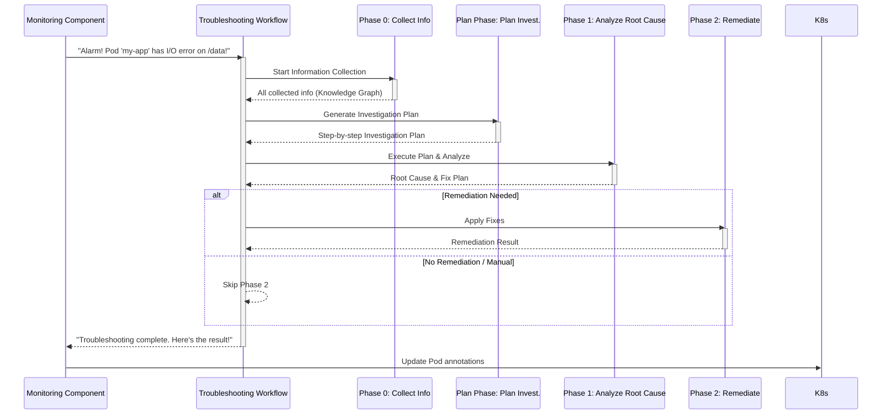

# Chapter 2: Troubleshooting Workflow

Welcome back! In [Chapter 1: Monitoring Component](01_monitoring_component_.md), we learned about our system's "alarm bell." It's like a watchful guard that automatically detects problems, specifically "volume I/O errors" in your Kubernetes applications, and then sounds the alarm.

But what happens *after* the alarm rings? Imagine a fire alarm going off in a building. You wouldn't just panic and run around randomly, right? You'd follow a plan:
1.  **Check** where the fire is.
2.  **Plan** how to put it out or evacuate.
3.  **Act** on the plan.
4.  **Fix** any damage.

This is exactly what the **Troubleshooting Workflow** does for storage errors in your Kubernetes cluster! It's the "master plan" that guides our system step-by-step from recognizing a problem to, hopefully, fixing it. Without this workflow, fixing complex issues would be chaotic and inefficient.

### Our Goal: A Structured Path to Resolution

Our concrete goal for this chapter is to understand how our system takes the "alarm" from the [Monitoring Component](01_monitoring_component_.md) and uses a **structured, step-by-step workflow** to investigate and resolve the issue.

### Key Concepts: The Four Phases of Troubleshooting

Our Troubleshooting Workflow is divided into four main stages, like different departments working together in a well-organized company:

1.  **Phase 0: Information Collection** (The Detective Gathering Clues)
    *   **What it is:** This is the very first step. Before doing anything else, our system gathers *all* the relevant information about the problem. Think of it like a detective arriving at a crime scene and collecting every piece of evidence – photos, fingerprints, witness statements.
    *   **Why it's important:** Having all the facts upfront helps the system understand the full picture and avoid making blind decisions later.

2.  **Plan Phase: Investigation Planning** (The Strategist Making a Blueprint)
    *   **What it is:** Once the information is collected, the system doesn't just start randomly trying fixes. Instead, it carefully creates a step-by-step "Investigation Plan." This plan outlines exactly what needs to be checked, what tools to use, and what information to look for. It's like a blueprint for solving the mystery.
    *   **Why it's important:** A good plan saves time and prevents wasted effort. It ensures a logical and efficient investigation.

3.  **Phase 1: Root Cause Analysis** (The Forensic Expert Solving the Mystery)
    *   **What it is:** With the Investigation Plan in hand, this phase is where the real "thinking" happens. Our system uses powerful AI models and specialized tools to execute the plan, analyze the collected information, and figure out *why* the storage error happened. This is about finding the core problem, not just the symptoms.
    *   **Why it's important:** You can't truly fix a problem until you know its root cause. This phase is crucial for long-term solutions.

4.  **Phase 2: Remediation** (The Engineer Fixing the Problem)
    *   **What it is:** Once the root cause is identified and a "fix plan" is developed (from Phase 1), this final phase is all about taking action. Our system uses its tools to apply the necessary changes to resolve the storage issue. It's like the engineer coming in to repair the broken part.
    *   **Why it's important:** This is where the actual problem gets solved, restoring your Kubernetes applications to health.

This multi-stage approach ensures a structured and efficient problem-solving method. It's like a project management plan for fixing a complex issue, where each phase has specific goals and outputs, leading to a complete resolution.

### How It Works: The Workflow in Action

Let's see how these phases fit together when the [Monitoring Component](01_monitoring_component_.md) detects a `volume-io-error` sticky note on a Pod:



As you can see, the `Troubleshooting Workflow` acts as the central coordinator, moving the problem through each specialized phase.

### Diving into the Code (`troubleshooting/troubleshoot.py`)

The main brain that orchestrates this entire workflow is the `troubleshoot.py` script. When the [Monitoring Component](01_monitoring_component_.md) detects an issue, it runs this script.

Let's look at the core function in `troubleshoot.py` that manages these phases: `run_comprehensive_troubleshooting()`.

```python
# troubleshooting/troubleshoot.py (Simplified)

async def run_comprehensive_troubleshooting(pod_name: str, namespace: str, volume_path: str) -> Dict[str, Any]:
    """
    Run comprehensive 3-phase troubleshooting
    """
    start_time = time.time()
    results = {"pod_name": pod_name, "namespace": namespace, "volume_path": volume_path, "phases": {}}

    try:
        # Phase 0: Information Collection
        collected_info = await run_information_collection_phase_wrapper(pod_name, namespace, volume_path)
        results["phases"]["phase_0_collection"] = {"status": "completed", ...}

        # Plan Phase: Generate Investigation Plan
        investigation_plan, plan_phase_message_list = await run_plan_phase(
            pod_name, namespace, volume_path, collected_info, CONFIG_DATA
        )
        results["phases"]["plan_phase"] = {"status": "completed", ...}

        # Phase 1: ReAct Investigation
        phase1_final_response, skip_phase2, summary, phase1_message_list = await run_analysis_phase_wrapper(
            pod_name, namespace, volume_path, collected_info, investigation_plan
        )
        results["phases"]["phase_1_analysis"] = {"status": "completed", "skip_phase2": skip_phase2, ...}

        # Phase 2: Remediation (only if not skipped)
        if not skip_phase2:
            remediation_result, _ = await run_remediation_phase_wrapper(phase1_final_response, collected_info, phase1_message_list)
            results["phases"]["phase_2_remediation"] = {"status": "completed", "result": remediation_result, ...}
        else:
            results["phases"]["phase_2_remediation"] = {"status": "skipped", ...}

        return results

    except Exception as e:
        # Handle errors and return failed status
        pass
```

This simplified code shows the sequential execution of the phases. Each `await` call means the system waits for that phase to finish its job before moving on to the next.

*   `run_information_collection_phase_wrapper`: This calls the logic for **Phase 0**. It gathers all the necessary data about the Pod, volume, node, etc. This data is then put into something called a [Knowledge Graph](05_knowledge_graph_.md), which is like a smart database for all the collected facts.
*   `run_plan_phase`: This calls the logic for the **Plan Phase**. It takes the information (especially the [Knowledge Graph](05_knowledge_graph_.md)) from Phase 0 and uses it to generate a detailed step-by-step investigation plan. This plan tells Phase 1 exactly what to look for.
*   `run_analysis_phase_wrapper`: This calls the logic for **Phase 1**. It takes the Investigation Plan and collected information, then uses advanced techniques (which we'll learn about in [LangGraph ReAct Agent](06_langgraph_react_agent_.md)) to analyze the problem and figure out the root cause. It also creates a "Fix Plan" or decides if no remediation is needed.
*   `run_remediation_phase_wrapper`: This calls the logic for **Phase 2**. If a Fix Plan was generated, this phase attempts to apply the necessary changes to resolve the issue. If Phase 1 determined no fix was needed (e.g., it was a transient error), Phase 2 can be skipped.

### Internal Implementation: The Phase Functions

The `troubleshoot.py` script acts like the general manager, but the actual work for each phase is done by specialized functions, which are located in the `phases` directory.

For example, `run_information_collection_phase` (which is wrapped by `run_information_collection_phase_wrapper` in `troubleshoot.py`) lives in `phases/phase_information_collection.py`.

```python
# phases/__init__.py (Simplified)
# This file helps organize and import the phase functions

from .phase_information_collection import InformationCollectionPhase, run_information_collection_phase
from .phase_plan_phase import PlanPhase, run_plan_phase
from .phase_analysis import AnalysisPhase, run_analysis_phase_with_plan
from .phase_remediation import RemediationPhase, run_remediation_phase

# This allows other scripts like troubleshoot.py to easily import them
```

This `__init__.py` file acts like a directory, making it easy for `troubleshoot.py` to find and use `run_information_collection_phase`, `run_plan_phase`, `run_analysis_phase_with_plan`, and `run_remediation_phase`. Each of these functions then kicks off the specific logic for its phase.

We will dive deeper into what happens inside each of these phase functions in the upcoming chapters, starting with how information is collected.

### Summary

In this chapter, we unpacked the **Troubleshooting Workflow**, the structured "master plan" our system follows to fix storage issues. We learned that it consists of four crucial phases:

*   **Phase 0: Information Collection:** Gathering all the facts.
*   **Plan Phase: Investigation Planning:** Creating a step-by-step plan.
*   **Phase 1: Root Cause Analysis:** Executing the plan to find the real problem.
*   **Phase 2: Remediation:** Applying the fix.

This workflow ensures that when the [Monitoring Component](01_monitoring_component_.md) sounds the alarm, our system responds with a clear, efficient, and intelligent approach to problem-solving.

Now that we understand the overall flow, let's zoom in on the first crucial step: gathering all the necessary information.

[Next Chapter: Information Collector](03_information_collector_.md)

---

Generated by [AI Codebase Knowledge Builder](https://github.com/The-Pocket/Tutorial-Codebase-Knowledge)