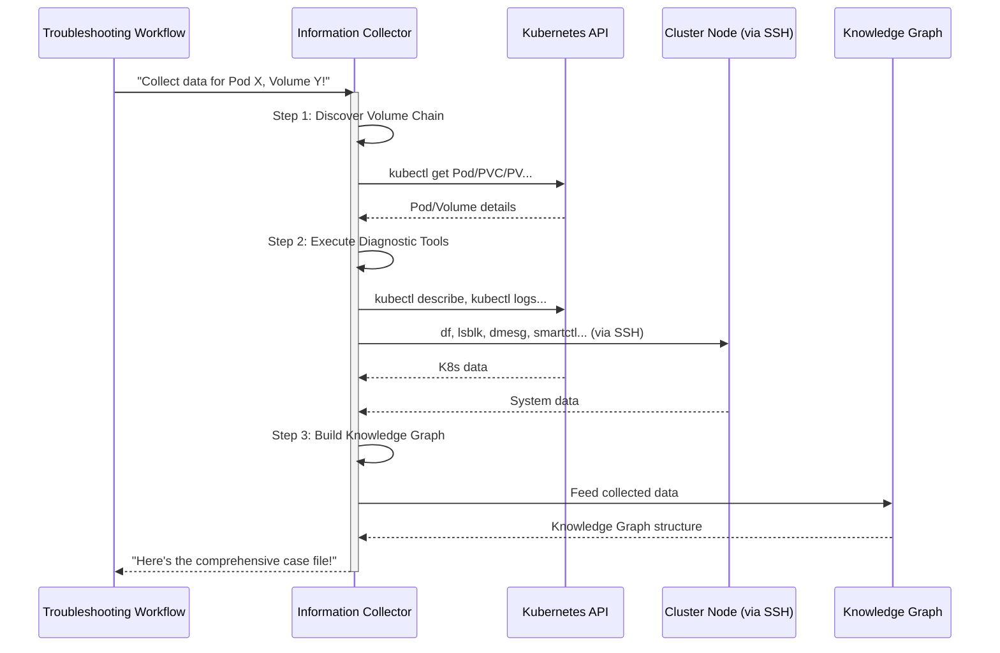

# Chapter 3: Information Collector

Welcome back! In [Chapter 2: Troubleshooting Workflow](02_troubleshooting_workflow_.md), we learned that when our system detects a storage problem, it doesn't just panic. Instead, it follows a structured plan with four important phases. The very first step in this plan, "Phase 0," is **Information Collection**.

Imagine you're a super detective. Before you can solve a mystery, you need clues, right? You wouldn't just guess who the culprit is; you'd gather fingerprints, witness statements, security camera footage, and anything else that helps you understand what happened.

Our **Information Collector** is exactly like that super detective for your Kubernetes cluster's storage problems. When a "volume I/O error" alarm goes off (thanks to our [Monitoring Component](01_monitoring_component_.md)), the very first thing our system does is send in the Information Collector.

### What Problem Are We Solving? (The Case File)

When something goes wrong with storage in Kubernetes, it's often not immediately clear *why*. Is the disk full? Is the network slow? Is a cable broken? Is the storage software misbehaving? To figure this out, we need a lot of information from different places:
*   Details about the application (Pod) itself.
*   Details about the storage pieces it uses (Volumes, PVCs, PVs).
*   Details about the physical drives involved.
*   Information from the server (Node) where the application is running, like its disk space or system messages.

Manually gathering all this data would be incredibly tedious and time-consuming. You'd have to type many complex commands, sift through tons of text, and then try to connect the dots.

Our **Information Collector** solves this problem by **automatically gathering all this raw diagnostic data** for you. It collects everything needed and organizes it into a comprehensive "case file." This organized "case file" is then used by the later stages of our [Troubleshooting Workflow](02_troubleshooting_workflow_.md) to understand and fix the problem.

### Our Goal: Automatically Gather All Diagnostic Data

Our concrete goal for this chapter is to understand how the Information Collector automatically gathers all the necessary "clues" (diagnostic data) about a storage problem. This ensures that the next steps in the troubleshooting process have a complete picture to work with.

### Key Concepts: Your Automated Data Detective

Let's break down how this "data detective" works:

1.  **Raw Diagnostic Data:** This is simply all the bits and pieces of information about the cluster, storage, and servers. Think of it as:
    *   **Kubernetes Information:** What are the Pods, Volumes, and Storage Classes doing?
    *   **Storage Component Information:** What are the specific storage drives and logical groups doing?
    *   **Logs:** Are there any error messages in the application's logs or the server's system messages?
    *   **System Metrics:** How much disk space is left? Are there any hardware errors?

2.  **`kubectl` and System Commands:** How does our detective get this information? It uses many common commands that a human administrator would use!
    *   `kubectl`: This is the main command-line tool for talking to Kubernetes. Our collector uses commands like `kubectl get` (to get info about Kubernetes items), `kubectl describe` (to get detailed info), and `kubectl logs` (to get application messages).
    *   **System Commands:** To get information from the underlying servers (nodes), it uses commands like `df` (to check disk space), `lsblk` (to list disk devices), `dmesg` (for kernel messages), `journalctl` (for system logs), and `smartctl` (for hard drive health).
    *   **The Magic:** The Information Collector runs these commands *for you*, automatically, and smartly, based on what it needs to find.

3.  **Organized Case File (Knowledge Graph):** The collected data isn't just dumped in a pile. The Information Collector makes sure it's organized and then feeds it into a special "smart database" we call the [Knowledge Graph](05_knowledge_graph_.md). This makes it easy for our system to search for connections and spot patterns.

### How It Works: Following the Breadcrumbs

When the [Monitoring Component](01_monitoring_component_.md) triggers the [Troubleshooting Workflow](02_troubleshooting_workflow_.md) for a Pod with a `volume-io-error`, the Information Collector steps in. Here's a simplified look at its process:



Let's break down the main steps:

1.  **Discover Volume Chain:** The collector starts with the problem Pod and then figures out its entire "storage chain." This is like following a breadcrumb trail:
    *   Which **Pod** is having trouble?
    *   Which **Persistent Volume Claim (PVC)** is it using?
    *   Which **Persistent Volume (PV)** is bound to that PVC?
    *   Which specific **storage drive** (or logical volume group) is connected to that PV?
    *   Which **Kubernetes Node** (server) is hosting that drive and the Pod?
    This step is crucial because it tells the collector *where* to gather more specific information.

2.  **Execute Diagnostic Tools:** Once the collector knows the full chain, it runs various `kubectl` and system commands on the relevant parts (the Pod, the Node, the Drive). It asks all the right questions to get detailed answers.

3.  **Build Knowledge Graph:** Finally, all the raw outputs from these commands are processed, structured, and added to the [Knowledge Graph](05_knowledge_graph_.md). This turns messy text into connected, understandable facts.

### Diving into the Code (`information_collector/`)

The core of the Information Collector lives in the `information_collector/` directory.

The main entry point for the Information Collection phase (Phase 0) is found in `phases/phase_information_collection.py`, which then calls the `ComprehensiveInformationCollector` to do the real work.

```python
# phases/phase_information_collection.py (Simplified)

from information_collector import ComprehensiveInformationCollector

async def run_information_collection_phase(pod_name: str, namespace: str, volume_path: str, config_data: Dict[str, Any]) -> Dict[str, Any]:
    """
    Run Phase 0: Information Collection - Gather all necessary data upfront
    """
    logging.info("Starting Phase 0: Information Collection")

    # 1. Initialize our main Information Collector detective
    info_collector = ComprehensiveInformationCollector(config_data)

    # 2. Tell the detective to start gathering all the clues
    collection_result = await info_collector.comprehensive_collect(
        target_pod=pod_name,
        target_namespace=namespace,
        target_volume_path=volume_path
    )

    # 3. Format the collected data into a neat "case file"
    collected_info = phase._format_collected_data(collection_result, knowledge_graph)
    
    return collected_info
```
This simplified code snippet shows how the `run_information_collection_phase` function (which is called by the [Troubleshooting Workflow](02_troubleshooting_workflow_.md)) sets up and kicks off the `ComprehensiveInformationCollector`. It tells the collector *which* Pod, namespace, and volume path to focus on.

#### The "Command Runner" (`information_collector/base.py`)

At the heart of the collector is a smart function that runs commands and handles their output. This function is in `information_collector/base.py`.

```python
# information_collector/base.py (Simplified)

class InformationCollectorBase:
    # ... (other setup like Kubernetes connection)

    def _execute_tool_with_validation(self, tool_func, tool_args: List[Any], tool_name: str, purpose: str) -> str:
        """
        Execute a diagnostic tool (like 'kubectl get pod') and store its output.
        """
        try:
            # 1. Optional: Ask user for approval in interactive mode
            if not self._prompt_user_approval(tool_name, purpose):
                return f"Tool execution denied by user: {tool_name}"

            logging.info(f"Executing tool: {tool_name} - {purpose}")

            # 2. Run the actual command (tool_func can be kubectl, df, etc.)
            result = tool_func.invoke(tool_args) # Or tool_func(*tool_args) for simpler tools

            # 3. Extract the actual output
            result_str = str(result.content) # Or just str(result)

            # 4. Store the output in our collected_data (the "case file")
            self.collected_data['tool_outputs'][f"{tool_name}_{int(time.time())}"] = {
                'tool': tool_name,
                'output': result_str,
                # ... other details
            }
            return result_str

        except Exception as e:
            error_msg = f"Error executing tool {tool_name}: {str(e)}"
            self.collected_data['errors'].append(error_msg)
            return f"Error: {error_msg}"
```
This `_execute_tool_with_validation` function is like the "executive assistant" for our detective. When the detective decides it needs a piece of information (like "get pod details"), it tells this assistant. The assistant then runs the actual command (`tool_func`), captures its output, and makes sure it's saved correctly in the `collected_data` dictionary.

#### Following the Volume Chain (`information_collector/volume_discovery.py`)

This file contains the logic for figuring out the entire storage path from the Pod to the physical drive.

```python
# information_collector/volume_discovery.py (Simplified)

from tools import kubectl_get # Our tool to run 'kubectl get' commands

class VolumeDiscovery(InformationCollectorBase):
    def _discover_volume_dependency_chain(self, target_pod: str, target_namespace: str) -> Dict[str, List[str]]:
        """
        Discover the volume dependency chain: Pod -> PVC -> PV -> Drives -> Nodes.
        """
        chain = {'pods': [], 'pvcs': [], 'pvs': [], 'drives': [], 'nodes': [], 'storage_classes': []}
        
        # Start by getting the target Pod's details
        pod_output = self._execute_tool_with_validation(
            kubectl_get, {'resource_type': 'pod', 'resource_name': target_pod, 'namespace': target_namespace, 'output_format': 'yaml'},
            'kubectl_get_pod', f'Get details for target pod {target_pod}'
        )
        # Parse pod_output to find its associated PVCs and NodeName
        # ... (simplified: assumes parsing extracts pvc_name and node_name)
        # Add found PVCs to chain['pvcs']
        # Add found Node to chain['nodes']

        # For each PVC found, get its details to find the PV
        for pvc_key in chain['pvcs']:
            pvc_name = pvc_key.split('/')[-1]
            pvc_output = self._execute_tool_with_validation(
                kubectl_get, {'resource_type': 'pvc', 'resource_name': pvc_name, 'namespace': target_namespace, 'output_format': 'yaml'},
                'kubectl_get_pvc', f'Get PVC details for {pvc_name}'
            )
            # Parse pvc_output to find the PV name and StorageClass
            # ... (simplified: assumes parsing extracts pv_name and sc_name)
            # Add found PV to chain['pvs']
            # Add found StorageClass to chain['storage_classes']

        # For each PV found, get its details to find the Drive and Node
        for pv_name in chain['pvs']:
            pv_output = self._execute_tool_with_validation(
                kubectl_get, {'resource_type': 'pv', 'resource_name': pv_name, 'output_format': 'yaml'},
                'kubectl_get_pv', f'Get PV details for {pv_name}'
            )
            # Parse pv_output to find the drive UUID and associated Node (if any)
            # ... (simplified: assumes parsing extracts drive_uuid and more node info)
            # Add found Drive to chain['drives']
            # Refine Node list in chain['nodes']

        # Similarly, logic for volumes and LVGs
        # ...

        return chain
```
This function is like a "pathfinder" for our detective. It repeatedly uses the `kubectl_get` tool to jump from one Kubernetes resource (Pod) to the next (PVC, PV), extracting identifiers until it finds the specific drives and nodes involved.

#### Executing the Commands (`information_collector/tool_executors.py`)

Once the collector knows the full volume chain, it uses specific "tool execution" methods to gather various data points.

```python
# information_collector/tool_executors.py (Simplified)

from tools import (
    kubectl_get, kubectl_describe, kubectl_logs, # Kubernetes tools
    df_command, lsblk_command, dmesg_command, journalctl_command # System tools
)

class ToolExecutors(InformationCollectorBase):
    async def _execute_pod_discovery_tools(self, target_pod: str, target_namespace: str):
        """Execute tools to get detailed pod information."""
        logging.info(f"Executing pod discovery tools for {target_namespace}/{target_pod}")
        
        # Get basic pod information in YAML format
        pod_output = self._execute_tool_with_validation(
            kubectl_get, {'resource_type': 'pod', 'resource_name': target_pod, 'namespace': target_namespace, 'output_format': 'yaml'},
            'kubectl_get_pod', 'Get target pod details'
        )
        self.collected_data['kubernetes']['target_pod'] = pod_output
        
        # Get more detailed pod description and events
        pod_describe = self._execute_tool_with_validation(
            kubectl_describe, {'resource_type': 'pod', 'resource_name': target_pod, 'namespace': target_namespace},
            'kubectl_describe_pod', 'Get detailed pod configuration and events'
        )
        self.collected_data['kubernetes']['target_pod_describe'] = pod_describe
        
    async def _execute_node_system_tools(self, nodes: List[str]):
        """Execute system commands on cluster nodes."""
        logging.info("Executing node and system discovery tools")
        
        for node_name in nodes:
            # Check disk usage on the node
            df_output = self._execute_tool_with_validation(
                df_command, {'node_name': node_name, 'options': '-h'},
                f'df_command_{node_name}', f'Check disk space usage on {node_name}'
            )
            self.collected_data['system'][node_name]['disk_usage'] = df_output
            
            # Get block devices information
            lsblk_output = self._execute_tool_with_validation(
                lsblk_command, {'node_name': node_name, 'options': ''},
                f'lsblk_command_{node_name}', f'List block devices on {node_name}'
            )
            self.collected_data['system'][node_name]['block_devices'] = lsblk_output
            
            # Check kernel logs for storage-related issues
            dmesg_output = self._execute_tool_with_validation(
                dmesg_command, {'node_name': node_name, 'options': '| grep -iE "disk|error|i/o" | tail -50'},
                f'dmesg_command_{node_name}', f'Check kernel logs for storage errors on {node_name}'
            )
            self.collected_data['system'][node_name]['kernel_logs'] = dmesg_output
```
These functions are like the "specialized investigators" our detective sends out. One investigates the Pod (using `kubectl`), another investigates the Node (using `df`, `lsblk`, `dmesg`). Notice how they all call the `_execute_tool_with_validation` function we just discussed – that's how they actually run the commands and save the results.

### Summary

In this chapter, we explored the **Information Collector**, which acts as our system's "data detective." Its job is to automatically gather all the necessary "clues" or raw diagnostic data from your Kubernetes cluster, its storage components, and the underlying servers when a storage problem is detected.

It does this by:
1.  Figuring out the entire **volume dependency chain** (Pod -> PVC -> PV -> Drives -> Nodes).
2.  Executing a wide range of `kubectl` and system commands on these components.
3.  Organizing all the collected data into a comprehensive "case file" that is then fed into the [Knowledge Graph](05_knowledge_graph_.md).

This automated collection saves immense time and ensures that the subsequent phases of our [Troubleshooting Workflow](02_troubleshooting_workflow_.md) have all the facts they need to diagnose and resolve the issue efficiently.

Now that we have all our "clues" gathered, what kind of commands and questions does our system use to investigate further? That's what we'll explore in the next chapter!

[Next Chapter: Diagnostic Tools](04_diagnostic_tools_.md)

---

Generated by [AI Codebase Knowledge Builder](https://github.com/The-Pocket/Tutorial-Codebase-Knowledge)