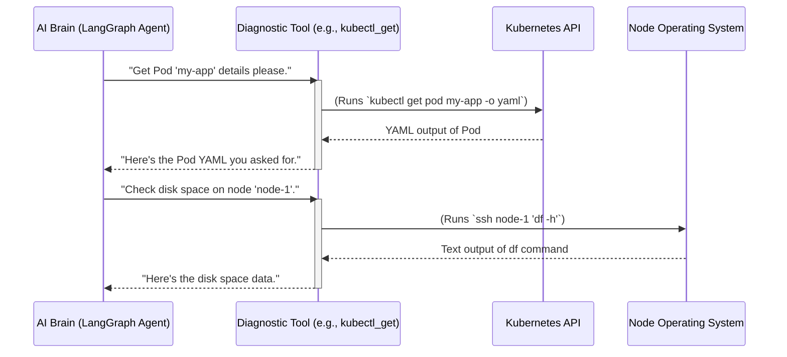

# Chapter 4: Diagnostic Tools

Welcome back! In [Chapter 3: Information Collector](03_information_collector_.md), we learned how our system acts like a super detective, automatically gathering all the necessary "clues" (diagnostic data) about a storage problem. It collects information from Kubernetes, its storage components, and the underlying servers, putting it all into an organized "case file."

But how does our detective *actually get* those clues? It doesn't just wave a magic wand! It needs specialized equipment and techniques to interact with the cluster and its hardware. This is where **Diagnostic Tools** come in.

### What Problem Are We Solving? (The Mechanic's Toolkit)

Imagine you're a car mechanic, and a car comes in with a strange engine noise. You wouldn't just listen and guess what's wrong. You'd open your **toolkit** and use specialized instruments:
*   A **wrench** to tighten a loose bolt.
*   A **multimeter** to check electrical currents.
*   A **diagnostic scanner** to read error codes from the car's computer.
*   Even your **eyes and ears** are "tools" to observe and listen carefully.

Each of these tools has a specific purpose, helps you gather a particular piece of information, or perform a precise action.

In the world of Kubernetes, fixing storage problems is similar. To find out if a disk is full, if a network connection is slow, or if a specific Kubernetes component is misbehaving, you need to run commands like `kubectl get`, `df`, `smartctl`, or `journalctl`.

Manually typing these commands, remembering their options, and then parsing their output is a lot of work. It's slow and prone to human errors.

Our **Diagnostic Tools** are the specialized functions that automate this! They are like the mechanic's carefully organized toolkit for our AI system. They wrap common, complex commands into simple, reusable functions that the system can call automatically.

### Our Goal: Giving the AI Its Hands and Eyes

Our concrete goal for this chapter is to understand that **Diagnostic Tools** are the specialized functions that allow our AI to interact with the Kubernetes cluster and its underlying servers. They gather specific information or perform actions, acting as the system's "hands and eyes" to solve storage problems.

### Key Concepts: Specialized Commands for the AI

Let's break down these essential "tools":

1.  **Specialized Functions:** Each Diagnostic Tool is a small, focused piece of code (a function) designed to do one thing well. For example, one tool might be specifically for checking disk space, another for getting Kubernetes Pod details, and another for reading system logs.

2.  **Wrapping Common Commands:** These tools don't *invent* new ways to get information. Instead, they "wrap" or automate the running of standard Linux commands (like `df`, `lsblk`, `smartctl`, `journalctl`) or Kubernetes commands (`kubectl get`, `kubectl describe`, `kubectl logs`). This means our system uses the same commands an expert human administrator would use, but it does so automatically and efficiently.

3.  **Information Gathering & Actions:**
    *   **Information Gathering:** Many tools are designed to simply collect data (e.g., `kubectl_get` to retrieve a Pod's configuration, `smartctl_check` to get disk health). This is like using a diagnostic scanner or multimeter.
    *   **Performing Actions:** Some tools can also make changes (e.g., `kubectl_apply` to create or update Kubernetes resources, `fsck_check` to fix a filesystem). These are used later in the [Remediation](#_Remediation_link_from_workflow) phase of the workflow, much like a mechanic uses a wrench to fix something.

4.  **Hands and Eyes of the AI:** This is a key analogy. The AI brain (which we'll learn about in [LangGraph ReAct Agent](06_langgraph_react_agent_.md)) doesn't directly "see" the cluster or "type" commands. Instead, it "asks" these Diagnostic Tools to perform a specific action or retrieve a piece of information. The tools then execute the command and report the raw output back to the AI.

5.  **The `@tool` Magic:** You'll see a special `@tool` tag above many of these functions in the code. This is a special marker (from a library called `langchain_core`) that tells our AI system: "Hey! This is a function that you can use as a tool!" It makes these functions discoverable and callable by the AI.

### How It Works: The AI's Command Line Interface

When our [Troubleshooting Workflow](02_troubleshooting_workflow_.md) is active, and especially during the [Information Collector](03_information_collector_.md) phase or the [Root Cause Analysis](#_Root_Cause_Analysis_link_from_workflow) phase, the system needs to get specific data. Instead of writing complex logic for each command, it simply asks the relevant Diagnostic Tool to do the job.

Here's a simple flow:



As you can see, the AI doesn't know *how* to run `kubectl` or `df`; it just knows *which tool* to use for a task. The Diagnostic Tool handles all the details of connecting and executing the actual command.

### Diving into the Code (`tools/`)

All our Diagnostic Tools are organized in the `tools/` directory. This is like our centralized "tool chest."

#### The Tool Chest (`tools/registry.py`)

The `tools/registry.py` file acts as the main inventory for all our tools. It groups them by type (Kubernetes, diagnostic, etc.) and makes them easy to find.

```python
# tools/registry.py (Simplified)

from tools.kubernetes.core import kubectl_get, kubectl_describe # ... and others
from tools.diagnostics.system import df_command, lsblk_command # ... and others
from tools.diagnostics.hardware import smartctl_check # ... and others

def get_all_tools():
    """
    Get all available tools for troubleshooting.
    """
    return [
        kubectl_get,
        kubectl_describe,
        df_command,
        lsblk_command,
        smartctl_check,
        # ... many more tools
    ]

def get_phase1_tools():
    """
    Get Phase 1 investigation tools (read-only, information gathering).
    """
    return [
        kubectl_get,
        kubectl_describe,
        df_command,
        # ... subset of tools that don't make changes
    ]
```

This `registry.py` doesn't contain the tools themselves, but it holds lists of them. Think of it as the index in a large book, pointing you to where each tool's actual definition can be found. It even has different lists depending on whether the AI is just *investigating* (Phase 1, read-only tools) or *remediating* (Phase 2, tools that can make changes).

#### Kubernetes Tools (`tools/kubernetes/core.py`)

Here's an example of a core Kubernetes tool: `kubectl_get`. Notice the `@tool` decorator, which is crucial for the AI.

```python
# tools/kubernetes/core.py (Simplified)
import subprocess
from langchain_core.tools import tool # This is the magic!

@tool
def kubectl_get(resource_type: str, resource_name: str = None, namespace: str = None, output_format: str = "yaml") -> str:
    """
    Execute kubectl get command to retrieve Kubernetes resource details.
    
    Args:
        resource_type: Type of resource (e.g., 'pod', 'pvc', 'node').
        resource_name: Name of the specific resource (optional).
        namespace: Namespace of the resource (optional).
        output_format: Desired output format (e.g., 'yaml', 'json', 'wide').
    """
    cmd = ["kubectl", "get", resource_type] # Build the command
    if resource_name: cmd.append(resource_name)
    if namespace: cmd.extend(["-n", namespace])
    cmd.extend(["-o", output_format])
    
    try:
        # This actually runs the command on your computer/server
        result = subprocess.run(cmd, check=True, stdout=subprocess.PIPE, stderr=subprocess.PIPE, text=True)
        return result.stdout # Return what the command printed
    except Exception as e:
        return f"Error executing kubectl get: {str(e)}"
```

**Explanation:**
*   `@tool`: This line is important. It tells the AI system that `kubectl_get` is a tool it can use.
*   `subprocess.run(cmd, ...)`: This is the core. It's how Python runs external programs. Here, it runs the `kubectl get` command just like you would in your terminal.
*   `return result.stdout`: Whatever `kubectl` prints to your screen, this function captures it and sends it back to the AI.

Another example from `tools/kubernetes/csi_baremetal.py` shows tools specific to particular Kubernetes storage solutions:

```python
# tools/kubernetes/csi_baremetal.py (Simplified)
import subprocess
from langchain_core.tools import tool

@tool
def kubectl_get_drive(drive_uuid: str = None, output_format: str = "wide") -> str:
    """
    Get CSI Baremetal Drive custom resource information.
    
    Args:
        drive_uuid: Specific Drive UUID (optional, gets all drives if not specified).
        output_format: Output format (wide, yaml, json).
    """
    cmd = ["kubectl", "get", "drive"] # Specific to CSI Baremetal 'Drive' resources
    if drive_uuid: cmd.append(drive_uuid)
    cmd.extend(["-o", output_format])
    
    try:
        result = subprocess.run(cmd, check=True, stdout=subprocess.PIPE, stderr=subprocess.PIPE, text=True)
        return result.stdout
    except Exception as e:
        return f"Error executing kubectl get drive: {str(e)}"
```
**Explanation:** This works very similarly to `kubectl_get`, but it's specialized for `kubectl get drive`, which is a custom command for the CSI Baremetal storage system. This highlights how tools can be specific to different parts of your cluster.

#### System and Hardware Tools (`tools/diagnostics/system.py` and `tools/diagnostics/hardware.py`)

Many diagnostic tools need to run commands directly on the underlying server (Node) where the Pod is running, not just through Kubernetes. For this, we use SSH (Secure Shell) to run commands remotely. Notice how `df_command` uses another tool, `ssh_execute`, to do its job! This shows how tools can build on each other.

```python
# tools/diagnostics/system.py (Simplified)
from langchain_core.tools import tool
from tools.diagnostics.hardware import ssh_execute # It uses another tool!

@tool
def df_command(node_name: str, path: str = None, options: str = "-h") -> str:
    """
    Execute 'df' command on a remote node via SSH to show disk space usage.
    
    Args:
        node_name: Node hostname or IP to connect to.
        path: Specific path to check (optional).
        options: Command options (e.g., -h for human-readable).
    """
    cmd_str = f"df {options} {path if path else ''}".strip()
    
    # This calls the ssh_execute tool!
    return ssh_execute.invoke({"node_name": node_name, "command": cmd_str})

# tools/diagnostics/hardware.py (Simplified)
import subprocess
from langchain_core.tools import tool

@tool
def smartctl_check(node_name: str, device_path: str) -> str:
    """
    Check disk health using smartctl via SSH.
    
    Args:
        node_name: Node hostname or IP.
        device_path: Device path (e.g., /dev/sda).
    """
    cmd = f"sudo smartctl -a {device_path}"
    return ssh_execute.invoke({"node_name": node_name, "command": cmd}) # Uses ssh_execute

@tool
def ssh_execute(node_name: str, command: str) -> str:
    """
    Execute a command on a remote node via SSH.
    (Simplified - actual code handles SSH keys, errors, etc.)
    """
    # In a real scenario, this would use a library like paramiko
    # to establish an SSH connection and run the command.
    # For this tutorial, imagine it just safely runs:
    # `ssh {node_name} '{command}'`
    return f"Simulated SSH command output for '{command}' on '{node_name}'"
```

**Explanation:**
*   `df_command` and `smartctl_check` are marked with `@tool` so the AI can use them.
*   They don't directly run `df` or `smartctl`. Instead, they construct the command string (e.g., `df -h /mnt/data`) and then pass it to `ssh_execute.invoke()`.
*   `ssh_execute` is *another tool* that handles the actual work of connecting to the remote server using SSH and running the command there. This modularity means `df_command` doesn't need to know SSH details; it just trusts `ssh_execute` to do that part.

This modular design makes it easy to add new diagnostic capabilities. If we need to check a new type of log, we just create a new `@tool` function that wraps the relevant command, and the AI can immediately start using it!

### Summary

In this chapter, we explored **Diagnostic Tools**, the "hands and eyes" of our `cluster-storage-troubleshooting` system. We learned that:

*   They are **specialized functions** that wrap common `kubectl` and system commands.
*   They **gather information** (like disk space, logs) or **perform actions** (like fixing a filesystem).
*   They are crucial for allowing our AI to **interact directly** with the Kubernetes cluster and its underlying hardware.
*   The `@tool` decorator makes them discoverable and usable by the AI.

These tools are essential because they provide the raw data that our system needs to understand and solve complex storage problems. But what happens to all this raw output once the tools have gathered it? How does the AI make sense of it? That's what we'll uncover in the next chapter!

[Next Chapter: Knowledge Graph](05_knowledge_graph_.md)

---

Generated by [AI Codebase Knowledge Builder](https://github.com/The-Pocket/Tutorial-Codebase-Knowledge)