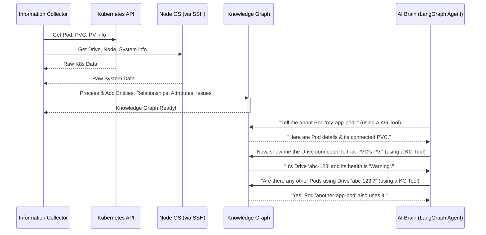

# Chapter 5: Knowledge Graph

Welcome back! In [Chapter 4: Diagnostic Tools](04_diagnostic_tools_.md), we learned how our system uses specialized "tools" to automatically gather all sorts of raw diagnostic data from your Kubernetes cluster, its storage, and the underlying servers. This is like our super detective collecting fingerprints, photos, and witness statements.

But imagine our detective comes back with hundreds of raw files, images, and notes. It's just a huge pile of disconnected information! How do you make sense of it all? How do you quickly see how a specific Pod is connected to a certain volume, which is on a particular disk, which itself has a "bad health" status? Sifting through raw text files for connections would be incredibly hard and slow.

This is where the **Knowledge Graph** comes in. It's not just a collection of facts; it's a **smart, interconnected map** of your entire system. Instead of a pile of notes, imagine a giant whiteboard with all your system's components drawn out, and lines connecting them, showing exactly how they relate to each other.

### What Problem Are We Solving? (The System's Brain)

When our system detects a problem, like an "I/O error" on a Pod's volume, it needs to quickly answer complex questions such as:
*   "Which specific disk drive is serving data to this problematic Pod?"
*   "Are there any other applications affected by this same disk?"
*   "What were the latest error messages from the operating system on the node where this disk is located?"
*   "Has this exact problem happened before, and how was it solved?"

Trying to answer these questions by re-running commands and manually piecing together text outputs every time would be a nightmare. It would be slow, inefficient, and prone to mistakes.

The **Knowledge Graph** solves this by acting as the **central brain** or **detailed blueprint** of your Kubernetes storage system. All the raw data collected by the [Information Collector](03_information_collector_.md) is processed and stored here in an intelligent, interconnected way. This allows our AI to **understand relationships** between components and **quickly pinpoint the source of a problem** without having to collect data all over again.

### Our Goal: A Unified View of the System

Our concrete goal for this chapter is to understand that the Knowledge Graph is a central database that stores all collected information about your Kubernetes cluster's components and their relationships. This unified view allows the AI to "see" how everything is connected, making it much easier to diagnose and fix problems.

### Key Concepts: Building a Smart System Map

Let's break down the key ideas behind our Knowledge Graph:

1.  **Entities (The "Things"):** These are the individual components of your system. Think of them as the "nouns" on our smart map.
    *   **Kubernetes Entities:** Pods, PVCs (Persistent Volume Claims), PVs (Persistent Volumes), StorageClasses, Nodes.
    *   **Storage Entities:** Drives (physical disks), LVGs (Logical Volume Groups), Volumes (logical storage units).
    *   **System Entities:** Kernel, Filesystem, specific services running on a Node.
    *   **Historical Experiences:** Records of past problems and their solutions (super valuable for learning!).

2.  **Relationships (The "Connections"):** These are the links showing how entities interact or depend on each other. Think of them as the "verbs" or lines connecting the nouns on our map.
    *   A Pod **`uses`** a PVC.
    *   A PVC **`is_bound_to`** a PV.
    *   A PV **`maps_to`** a Drive.
    *   A Drive **`is_located_on`** a Node.
    *   A Pod **`runs_on`** a Node.

3.  **Attributes (The "Details"):** Each entity has specific information or properties attached to it. These are the descriptive facts about each noun on our map.
    *   A Pod's `status` (e.g., "Running", "Failed").
    *   A Drive's `health` (e.g., "GOOD", "Warning", "BAD") or `size`.
    *   A Node's `disk_pressure` status or `IP address`.

4.  **Issues (The "Problems"):** When a problem is detected (like an I/O error or a full disk), it's recorded as an "issue" and attached to the relevant entity. This highlights exactly where the problems lie on our map.

Together, these form a **graph structure**, which is like a network of connected information. It's extremely powerful for complex systems because it allows us to easily traverse (move through) the connections and find related information, even if it's spread across many different components.

### How It Works: The AI's Blueprint

The [Information Collector](03_information_collector_.md) (Phase 0 of our workflow) is responsible for taking all the raw data it gathers and **building** this Knowledge Graph. It identifies all the entities, their relationships, and their attributes, then populates the graph.

Once the Knowledge Graph is built, the AI (specifically, the [LangGraph ReAct Agent](06_langgraph_react_agent_.md) in Phase 1) doesn't need to re-run diagnostic commands for every question. Instead, it interacts directly with the Knowledge Graph using specialized "tools" (which are themselves part of our [Diagnostic Tools](04_diagnostic_tools_.md) collection). It's like asking questions to a super-smart assistant who already has all the answers neatly organized.

Here's a simplified flow:



As you can see, the AI can efficiently "navigate" the system by querying the Knowledge Graph, seeing connections, and understanding the full context of a problem.

### Diving into the Code (`knowledge_graph/` and `tools/core/knowledge_graph.py`)

The core logic for creating and managing the Knowledge Graph lives in the `knowledge_graph/` directory, specifically in `knowledge_graph/knowledge_graph.py`. The tools the AI uses to *query* this graph are found in `tools/core/knowledge_graph.py`.

#### The Knowledge Graph Class (`knowledge_graph/knowledge_graph.py`)

This file defines the `KnowledgeGraph` class, which is responsible for holding our system's map. It uses a popular Python library called `networkx` to create and manage the graph structure.

Here's how entities (nodes) and relationships (edges) are added:

```python
# knowledge_graph/knowledge_graph.py (Simplified)
import networkx as nx

class KnowledgeGraph:
    def __init__(self):
        self.graph = nx.DiGraph() # This is our actual graph structure
        self.issues = [] # List to keep track of problems
        # ... other setup

    def add_gnode_pod(self, name: str, namespace: str, **attributes) -> str:
        """Add a Pod node to the knowledge graph."""
        node_id = f"gnode:Pod:{namespace}/{name}"
        self.graph.add_node(node_id, 
                           entity_type="Pod", # More specific entity type
                           name=name,
                           namespace=namespace,
                           **attributes) # Add any other details
        return node_id
    
    def add_gnode_drive(self, uuid: str, **attributes) -> str:
        """Add a Drive node to the knowledge graph."""
        node_id = f"gnode:Drive:{uuid}"
        self.graph.add_node(node_id, 
                           entity_type="Drive", # More specific entity type
                           uuid=uuid,
                           **attributes) # Add health, size, etc.
        return node_id

    def add_relationship(self, source_id: str, target_id: str, relationship: str, **attributes):
        """Add a relationship edge between two nodes."""
        self.graph.add_edge(source_id, target_id,
                           relationship=relationship, # e.g., "USES", "BOUND_TO"
                           **attributes) # Any details about the connection
```
**Explanation:**
*   `networkx.DiGraph()`: This creates an empty "directed graph," meaning connections go in one direction (e.g., Pod -> PVC, not PVC -> Pod for "uses").
*   `add_gnode_pod`, `add_gnode_drive` (and many other `add_gnode_*` methods): These functions are how the [Information Collector](03_information_collector_.md) adds different types of components (entities) to the graph. Each entity gets a unique `node_id` and has important `attributes` (like name, namespace, health, etc.).
*   `add_relationship`: This is how connections between entities are drawn. It takes two `node_id`s (source and target) and a `relationship` type (like "USES" or "BOUND_TO").

#### Knowledge Graph Tools (`tools/core/knowledge_graph.py`)

These are the special `@tool` functions that the AI (our [LangGraph ReAct Agent](06_langgraph_react_agent_.md)) uses to "ask questions" to the Knowledge Graph. They allow the AI to retrieve specific information, find related entities, or discover paths between components.

First, a helper function to get the Knowledge Graph instance:

```python
# tools/core/knowledge_graph.py (Simplified)
from knowledge_graph import KnowledgeGraph # Import the KG class

KNOWLEDGE_GRAPH = None # A place to store our KG instance

def initialize_knowledge_graph(kg_instance: KnowledgeGraph) -> KnowledgeGraph:
    """Initialize or set the global Knowledge Graph instance from Phase0."""
    global KNOWLEDGE_GRAPH
    KNOWLEDGE_GRAPH = kg_instance
    return KNOWLEDGE_GRAPH

def get_knowledge_graph() -> KnowledgeGraph:
    """Get the global Knowledge Graph instance."""
    if KNOWLEDGE_GRAPH is None:
        raise ValueError("Knowledge Graph not initialized!")
    return KNOWLEDGE_GRAPH
```
**Explanation:** When the troubleshooting process starts, the `initialize_knowledge_graph` function is called to connect these tools to the actual Knowledge Graph that the [Information Collector](03_information_collector_.md) just built. `get_knowledge_graph` is then used by all the other tools to get access to the graph.

Now, let's look at some of the query tools:

```python
# tools/core/knowledge_graph.py (Simplified)
from langchain_core.tools import tool # This is the magic!

@tool
def kg_get_entity_info(entity_type: str, id: str) -> str:
    """
    Get detailed information about an entity in the Knowledge Graph.
    Args: entity_type (e.g., 'Pod'), id (e.g., 'default/my-app-pod').
    Returns: JSON serialized entity details.
    """
    kg = get_knowledge_graph() # Get our graph instance
    node_id_full = f"gnode:{entity_type}:{id}" # Construct unique ID
    
    if not kg.graph.has_node(node_id_full):
        return f"Error: Entity {node_id_full} not found."
    
    node_attrs = dict(kg.graph.nodes[node_id_full]) # Get attributes
    # Simplify output for tutorial
    return f"Found {entity_type} '{id}' with attributes: {node_attrs}"

@tool
def kg_get_related_entities(entity_type: str, id: str, relationship_type: str = None) -> str:
    """
    Get entities related to a target entity in the Knowledge Graph.
    Args: entity_type, id, relationship_type (e.g., 'uses').
    Returns: JSON serialized list of related entities.
    """
    kg = get_knowledge_graph()
    node_id_full = f"gnode:{entity_type}:{id}"

    if not kg.graph.has_node(node_id_full):
        return f"Error: Entity {node_id_full} not found."
    
    related_nodes = []
    for _, target_node, edge_data in kg.graph.out_edges(node_id_full, data=True):
        if relationship_type is None or edge_data.get('relationship') == relationship_type:
            target_attrs = dict(kg.graph.nodes[target_node])
            related_nodes.append({
                "id": target_node,
                "type": target_attrs.get('entity_type'),
                "relationship": edge_data.get('relationship'),
                "name": target_attrs.get('name', target_node.split(':')[-1])
            })
    # Simplify output for tutorial
    return f"Related entities for {id}: {related_nodes}"
```
**Explanation:**
*   `@tool`: Again, this special marker tells the AI that these are callable functions.
*   `kg_get_entity_info`: This tool allows the AI to "zoom in" on a specific component (like a Pod or a Drive) and get all its known details and attributes.
*   `kg_get_related_entities`: This is incredibly powerful. It allows the AI to "follow the connections" on the map. For example, it can ask: "What PVC is this Pod *using*?" or "What Node is this Drive *located on*?".

There are many other similar tools like `kg_find_path` (to find a path between any two entities, e.g., "show me the connection from this Pod to that specific Drive") and `kg_get_all_issues` (to list all problems recorded in the graph). These tools empower the AI to navigate the system's "brain" and build a complete understanding of the problem.

### Summary

In this chapter, we discovered the **Knowledge Graph**, the central, smart map of our Kubernetes storage system. We learned that:

*   It stores all collected information about components (entities), their connections (relationships), their details (attributes), and identified issues.
*   It solves the problem of dealing with messy, disconnected raw data by providing an organized, interconnected view.
*   The [Information Collector](03_information_collector_.md) builds this graph, and the AI ([LangGraph ReAct Agent](06_langgraph_react_agent_.md)) queries it using specialized [Diagnostic Tools](04_diagnostic_tools_.md).
*   It acts as the "brain" or "blueprint," allowing the AI to quickly understand complex relationships and pinpoint problem sources.

This intelligent organization of data is crucial for the next step: how our AI actually *thinks* and plans its investigation using this rich source of information.

[Next Chapter: LangGraph ReAct Agent](06_langgraph_react_agent_.md)

---

Generated by [AI Codebase Knowledge Builder](https://github.com/The-Pocket/Tutorial-Codebase-Knowledge)