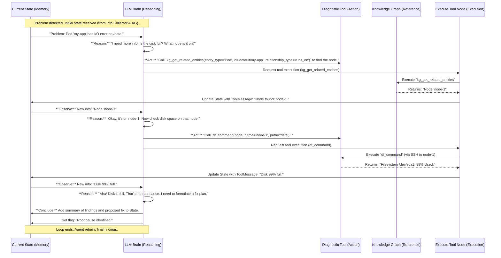

# Chapter 6: LangGraph ReAct Agent

Welcome back! In [Chapter 5: Knowledge Graph](05_knowledge_graph_.md), we learned how our system acts like a super-smart librarian, organizing all the collected information about your Kubernetes cluster into a connected map called the Knowledge Graph. This map allows us to quickly understand how different components relate to each other.

But who uses this map? Who looks at all the information and *thinks* about what to do next? That's where the **LangGraph ReAct Agent** comes in!

### What Problem Are We Solving? (The Master Troubleshooter)

Imagine you've called a highly skilled human troubleshooter to fix a complex problem with your car. They wouldn't just randomly poke around. Instead, they would:

1.  **Listen** to your description of the problem (e.g., "The engine makes a weird noise").
2.  **Think** about possible causes and what information they need (e.g., "Could be the fan belt, I need to check its tension").
3.  **Act** by using a tool (e.g., grab a wrench and check the belt).
4.  **Observe** the result (e.g., "The belt is loose!").
5.  **Think again** based on the new observation (e.g., "Okay, a loose belt can cause that noise. I should tighten it.").
6.  **Act** by using another tool (e.g., tighten the belt).
7.  **Observe** the result (e.g., "Noise is gone!").
8.  **Conclude** (e.g., "Problem solved: loose fan belt.").

This "think, act, observe" loop is exactly what the **LangGraph ReAct Agent** does for your Kubernetes storage issues! It's the **intelligent core** of our troubleshooting system. It takes all the raw data (from [Diagnostic Tools](04_diagnostic_tools_.md)) and the organized map (from [Knowledge Graph](05_knowledge_graph_.md)), and then, just like a human expert, it *reasons* about the problem, *decides* which diagnostic steps to take, *executes* them, *observes* the results, and then refines its understanding and next steps.

Without this intelligent core, our system would just be a collection of data and tools without any "brain" to connect them and drive the investigation.

### Our Goal: Understanding the AI's Thinking Process

Our concrete goal for this chapter is to understand how the LangGraph ReAct Agent uses a powerful AI model and a special "Reasoning and Acting" (ReAct) process to intelligently navigate the troubleshooting workflow, making smart decisions and using tools to gather information until the problem is solved.

### Key Concepts: The AI's Brain, Loop, and Hands

Let's break down the core ideas that make our ReAct Agent so smart:

1.  **Large Language Model (LLM): The "Brain"**
    *   This is the powerful AI model at the heart of our agent. Think of it as the highly trained human troubleshooter's brain.
    *   It understands complex requests, can summarize information, and most importantly, it can **reason** about problems and **decide** what to do next. It's trained on vast amounts of text and code, so it has a broad understanding of how systems work and what typical problems look like.

2.  **ReAct Framework: The "Thinking Loop"**
    *   "ReAct" stands for **Reasoning and Acting**. This is the core strategy the LLM uses. It's a continuous cycle:
        *   **Reasoning:** The LLM receives the current state of the problem (e.g., initial problem description, previous tool outputs, information from the Knowledge Graph). It then "thinks aloud" (generates thoughts) about what it knows, what it needs to find out, and what tools it might use to get that information.
        *   **Acting:** Based on its reasoning, the LLM decides to "act" by calling one of the [Diagnostic Tools](04_diagnostic_tools_.md) (like `kubectl_get` or `df_command`). It provides the tool with the necessary arguments.
        *   **Observing:** The chosen tool executes, and its output (the "observation") is fed back to the LLM. This is how the AI "sees" the results of its actions.
        *   This loop continues until the LLM determines it has enough information to identify the root cause or formulate a fix plan.

3.  **LangGraph: The "Flowchart Builder"**
    *   LangGraph is a special library that helps us build these complex, multi-step AI "agents" like flowcharts.
    *   It lets us define different "nodes" (steps) in our process (like "call the LLM" or "execute a tool") and "edges" (paths) that connect them. It's excellent for creating robust and controllable AI workflows that can loop and make decisions.

4.  **Diagnostic Tools: The "Hands and Eyes"**
    *   As we learned in [Chapter 4: Diagnostic Tools](04_diagnostic_tools_.md), these are the specific functions that allow our AI to interact with the real world (your Kubernetes cluster).
    *   When the LLM "Acts," it's essentially telling one of these tools: "Go get me this information!" or "Perform this action!".

### How It Works: The ReAct Loop in Action

Let's trace how the LangGraph ReAct Agent works during a typical troubleshooting session, especially in the "Root Cause Analysis" phase ([Phase 1](02_troubleshooting_workflow_.md)):



This diagram shows the continuous loop. The LLM's "Reasoning" step involves looking at the entire conversation history (including previous tool outputs) and the context from the [Knowledge Graph](05_knowledge_graph_.md). It then generates a thought process and decides to "Act" by calling a tool. The `Execute Tool Node` is responsible for running that tool and feeding its "Observation" back into the `State`, which then becomes part of the LLM's next input.

### Diving into the Code (`llm_graph/graphs/` and `troubleshooting/execute_tool_node.py`)

The LangGraph ReAct Agent is primarily implemented within the `llm_graph/graphs/` directory, specifically in files like `phase1_llm_graph.py` (for the Root Cause Analysis phase) and `plan_llm_graph.py` (for the Investigation Planning phase). The central logic for executing tools lives in `troubleshooting/execute_tool_node.py`.

Let's look at the core structure:

First, a simplified look at how the overall graph is built (from `troubleshooting/graph.py`):

```python
# troubleshooting/graph.py (Simplified)
from langgraph.graph import StateGraph, START, END
from langgraph.prebuilt import tools_condition # This is key for ReAct
from troubleshooting.execute_tool_node import ExecuteToolNode

def _build_graph(call_model, check_end_conditions, execute_tool_node: ExecuteToolNode) -> StateGraph:
    """Builds the core ReAct graph."""
    builder = StateGraph(MessagesState) # MessagesState tracks the conversation

    # 1. Node for the LLM to 'think' and 'reason'
    builder.add_node("call_model", call_model) 

    # 2. Node for executing the tools the LLM 'acts' upon
    builder.add_node("execute_tools", execute_tool_node) 

    # 3. Node to decide if the troubleshooting loop should 'end' or 'continue'
    builder.add_node("check_end", check_end_conditions) 
    
    # Define the flow:
    builder.add_edge(START, "call_model") # Start by calling the model

    # If 'call_model' wants to use tools, go to 'execute_tools'
    # If not, go to 'check_end' (to see if it's done)
    builder.add_conditional_edges(
        "call_model",
        tools_condition, # This magic function checks if LLM called a tool
        {"tools": "execute_tools", "none": "check_end"}
    )
    
    # After executing tools, always go back to 'call_model' for the next 'Reasoning' step
    builder.add_edge("execute_tools", "call_model")

    # From 'check_end', either end the graph or loop back to 'call_model'
    builder.add_conditional_edges(
        "check_end",
        lambda state: check_end_conditions(state)["result"], # Your custom end logic
        {"end": END, "continue": "call_model"}
    )
    
    return builder.compile()
```
**Explanation:** This `_build_graph` function defines the *flowchart* of our ReAct Agent.
*   `StateGraph(MessagesState)`: This sets up the central "memory" for the agent, which is a list of messages (conversation history).
*   `add_node("call_model", call_model)`: This node runs our LLM. When the agent is at this node, the LLM processes the current state and decides what to do.
*   `add_node("execute_tools", execute_tool_node)`: This node is where the actual [Diagnostic Tools](04_diagnostic_tools_.md) are run.
*   `tools_condition`: This is a very important LangGraph feature. It looks at the LLM's output. If the LLM decided to call one or more tools, `tools_condition` routes the flow to the `execute_tools` node. If the LLM didn't call any tools (meaning it thinks it's done or needs to reflect), it routes to `check_end`.
*   The edges (`add_edge`, `add_conditional_edges`) define the `Reason -> Act -> Observe` loop. From `execute_tools`, the flow always goes back to `call_model` so the LLM can "observe" the tool's output and `Reason` again.

Now, let's look at the `call_model` function (the "Reasoning" part), found in files like `llm_graph/graphs/phase1_llm_graph.py`:

```python
# llm_graph/graphs/phase1_llm_graph.py (Simplified)

class Phase1LLMGraph(LangGraphInterface):
    # ... (init and other methods)

    def call_model(self, state: Phase1State) -> Phase1State:
        """LLM reasoning node that analyzes current state and decides next action."""
        # 1. Update iteration count (to prevent infinite loops)
        state["iteration_count"] += 1 
        
        self.logger.info(f"Calling model (iteration {state['iteration_count']})")
        
        try:
            # 2. The magic happens here: LLM decides based on current messages
            #    `self.llm` is our Large Language Model (e.g., GPT-4)
            #    `bind_tools` tells the LLM which tools it can use.
            response = self.llm.bind_tools(self.mcp_tools).invoke(state["messages"])
            
            # 3. Add LLM's thought/tool call/final answer to the conversation history
            state["messages"].append(response)
            
            self.logger.info(f"Model response: {response.content[:100]}...")
            
            return state
        except Exception as e:
            # Handle errors, add error message to state
            error_message = SystemMessage(content=f"Error calling model: {e}")
            state["messages"].append(error_message)
            return state
```
**Explanation:**
*   This `call_model` function is executed whenever the LangGraph hits the `call_model` node.
*   `self.llm.bind_tools(self.mcp_tools).invoke(state["messages"])`: This is the core "Reasoning" step. The LLM takes the entire conversation history (`state["messages"]`) as input. Because `bind_tools` is used, the LLM knows it has access to a list of [Diagnostic Tools](04_diagnostic_tools_.md) (like `kubectl_get`, `df_command`, or [Knowledge Graph](05_knowledge_graph_.md) query tools) and can decide to call one or more of them. The `response` can be a thought, a question, a tool call, or a final answer.
*   `state["messages"].append(response)`: The LLM's response is added to the state, becoming part of the "memory" for the next iteration.

Finally, the `ExecuteToolNode` (from `troubleshooting/execute_tool_node.py`) handles the "Acting" and "Observing" parts:

```python
# troubleshooting/execute_tool_node.py (Simplified)
from langchain_core.messages import ToolMessage
import asyncio # For async tools
import concurrent.futures # For parallel tools

class ExecuteToolNode(RunnableCallable):
    def __init__(self, tools: Sequence[Union[BaseTool, Callable]], parallel_tools: Set[str], serial_tools: Set[str], **kwargs):
        # ... (initialization of tools_by_name, parallel/serial strategies)
        self.tools_by_name = {tool_.name: create_tool(tool_) if not isinstance(tool_, BaseTool) else tool_ for tool_ in tools}

    def _run_one(self, call: ToolCall, input_type: Literal["list", "dict", "tool_calls"], config: RunnableConfig, call_type: str = "Serial") -> ToolMessage:
        """Execute a single tool synchronously."""
        tool_name = call["name"]
        tool_args = call["args"]
        tool = self.tools_by_name[tool_name] # Get the actual tool function
        
        try:
            # This is where the tool is actually invoked
            response = tool.invoke({"args": tool_args}, config)
            return ToolMessage(content=str(response), name=tool_name, tool_call_id=call["id"])
        except Exception as e:
            # Handle tool execution errors
            return ToolMessage(content=f"Error: {e}", name=tool_name, tool_call_id=call["id"], status="error")

    async def _afunc(self, input: Union[list[AnyMessage], dict[str, Any], BaseModel], config: RunnableConfig, *, store: Optional[BaseStore]) -> Any:
        """Asynchronous entry point for the node, handles multiple tool calls."""
        tool_calls, input_type = self._parse_input(input, store)
        outputs = []
        
        # Parallel tools are executed concurrently using asyncio.gather (async version)
        if parallel_tool_calls := self._filter_parallel_tools(tool_calls):
            tasks = [self._arun_one(call, input_type, config, "Parallel") for call in parallel_tool_calls]
            results = await asyncio.gather(*tasks, return_exceptions=True)
            for i, res in enumerate(results):
                if isinstance(res, Exception): # Handle exceptions from parallel tools
                    outputs.append(ToolMessage(content=f"Error: {res}", name=parallel_tool_calls[i]["name"], tool_call_id=parallel_tool_calls[i]["id"], status="error"))
                else:
                    outputs.append(res)

        # Serial tools are executed one after another
        if serial_tool_calls := self._filter_serial_tools(tool_calls):
            for call in serial_tool_calls:
                outputs.append(await self._arun_one(call, input_type, config, "Serial")) # Await each one

        return {self.messages_key: outputs} # Return tool outputs to state
```
**Explanation:**
*   `ExecuteToolNode` is a specialized node that takes the tool calls (generated by the LLM in `call_model`) and executes them.
*   `_run_one` (and its async counterpart `_arun_one`): This is the heart of the "Acting" part. It takes a single `ToolCall` object (which contains the tool's `name` and `args`), finds the corresponding function in `self.tools_by_name`, and actually *invokes* it.
*   The `_afunc` (asynchronous function) demonstrates the "Observing" part and our advanced feature: it can run multiple tool calls in **parallel** (using `asyncio.gather` for speed) if configured, and then gathers all their `ToolMessage` outputs.
*   `return {self.messages_key: outputs}`: Crucially, the results of these tool executions (the "observations") are then added back into the `messages` list in the graph's `State`. This means the LLM will see these results in its next `call_model` step, completing the `Reason -> Act -> Observe` loop.

This entire mechanism allows our AI troubleshooter to "think," "act" by running commands, "see" the results, and then "think" again, continually refining its understanding until the storage problem is diagnosed or fixed.

### Summary

In this chapter, we uncovered the **LangGraph ReAct Agent**, the intelligent brain behind our troubleshooting system. We learned that:

*   It uses a **Large Language Model (LLM)** as its core "brain."
*   It operates on a **ReAct (Reasoning and Acting)** loop: The LLM reasons, decides to act by calling a [Diagnostic Tool](04_diagnostic_tools_.md), observes the tool's output, and then reasons again.
*   **LangGraph** is the framework that helps us build and control this complex, looping workflow.
*   The agent leverages the organized data from the [Knowledge Graph](05_knowledge_graph_.md) and the capabilities of the [Diagnostic Tools](04_diagnostic_tools_.md) to intelligently solve problems.

This intelligent agent is what makes our system truly powerful, allowing it to autonomously investigate and find solutions. But for the LLM to effectively "reason," it needs to be given very clear instructions and context. That's what we'll dive into in the next chapter!

[Next Chapter: Prompt Management](07_prompt_management_.md)

---

Generated by [AI Codebase Knowledge Builder](https://github.com/The-Pocket/Tutorial-Codebase-Knowledge)