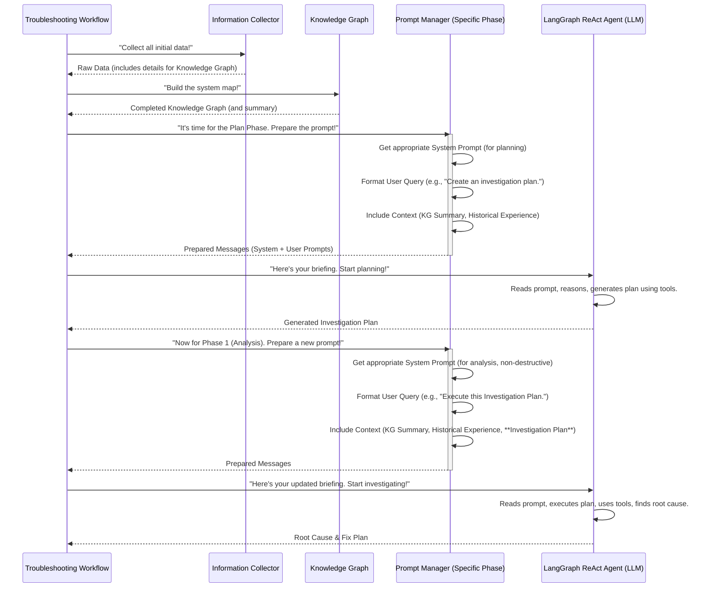

# Chapter 7: Prompt Management

Welcome back! In [Chapter 6: LangGraph ReAct Agent](06_langgraph_react_agent_.md), we explored the intelligent "brain" of our troubleshooting system – the **LangGraph ReAct Agent**. We learned how this AI model "thinks," "acts" by using tools, and "observes" the results in a continuous loop to solve problems.

But even the smartest "brain" needs clear instructions! Imagine hiring a brilliant detective, but you just tell them, "Go solve some crimes." They wouldn't know where to start, what kind of crimes to focus on, what tools they can use, or how to report back. They need a detailed briefing!

This is where **Prompt Management** comes in. It's like providing a **detailed job briefing and a rulebook** to our AI detective before they start their task. It ensures the AI receives:
*   **Clear guidelines** on its role (e.g., "You are a Kubernetes expert").
*   **Relevant background information** (e.g., "Here's what we already know about the problem").
*   **Available tools** it can use (e.g., "These are your investigation gadgets").
*   **Expected output format** (e.g., "Report your findings like this").

Without good prompt management, our powerful AI might get confused, waste time on irrelevant tasks, or provide answers in a format that the rest of our system can't understand.

### What Problem Are We Solving? (The AI's Briefing)

When the [LangGraph ReAct Agent](06_langgraph_react_agent_.md) starts its work, it needs to understand:
*   **Who it is:** "Am I an investigator or someone who fixes things?"
*   **What's the main goal:** "Am I finding the problem, or am I fixing it?"
*   **What facts are already known:** "What did the [Information Collector](03_information_collector_.md) find?"
*   **What tools are available:** "Which [Diagnostic Tools](04_diagnostic_tools_.md) can I use?"
*   **What did we learn from the past:** "Have we seen similar problems before, and how were they solved?"
*   **How should I tell you my answer:** "In what format should I give my report?"

Manually preparing all this information for the LLM every single time would be tedious, inconsistent, and error-prone.

**Prompt Management** solves this by **automatically preparing and delivering tailored, consistent instructions and context** to the LLM at each stage of the troubleshooting process. It makes sure the AI always has the perfect "briefing" to do its job effectively.

### Our Goal: Giving the AI Perfect Instructions

Our concrete goal for this chapter is to understand how **Prompt Management** prepares detailed, phase-specific instructions and context for our AI, ensuring it has all the necessary information and guidelines to perform its troubleshooting tasks accurately and efficiently.

### Key Concepts: The AI's Job Briefing

Let's break down the different parts of the "briefing" our AI receives:

1.  **Prompt:** In simple terms, a "prompt" is just the text input we give to an LLM. It's how we "talk" to the AI.

2.  **Prompt Management:** This is the systematic way we create, organize, and deliver these prompts. It's about making sure the AI gets the *right* information, in the *right* way, at the *right* time.

3.  **System Prompt (The Role & Rules):**
    *   This is the "big picture" part of the briefing. It tells the LLM its core identity and responsibilities.
    *   Example: "You are an expert Kubernetes storage troubleshooter."
    *   It also includes general rules, troubleshooting methodologies (like the "Chain of Thought" we saw earlier), and important constraints (e.g., "Do NOT delete anything in Phase 1").
    *   It often defines the **overall expected output format** for the LLM's final answer.

4.  **User Query / User Message (The Specific Task):**
    *   This is the "what to do *now*" part of the briefing. It's the specific question or task the LLM needs to address in the current step.
    *   Example: "Analyze the volume I/O error in pod 'my-app' at `/data` using the provided Investigation Plan."
    *   It also injects dynamic information specific to the current problem.

5.  **Context / Background Information (The Facts):**
    *   This provides the LLM with all the relevant data it needs to "think" effectively.
    *   **[Knowledge Graph](05_knowledge_graph_.md) Summary:** A concise summary of the collected facts about the problematic Pod, its storage, and the cluster's state. This is crucial for the LLM to understand the current situation without having to infer everything from scratch.
    *   **Historical Experience:** Examples of past problems and how they were diagnosed and resolved. This is like giving the AI a "case study" playbook, helping it learn from previous successes and apply similar logic.

6.  **Tool Prompts (The Gadget Manual):**
    *   These instructions, often embedded within the System Prompt, tell the LLM about the [Diagnostic Tools](04_diagnostic_tools_.md) it has access to.
    *   They describe what each tool does and how to use it correctly (e.g., `kubectl_get(resource_type, name, namespace)`). This is how the LLM knows which "gadget" to use for a particular task.

By carefully managing all these prompt components, we empower our AI to be a highly effective and reliable troubleshooter.

### How It Works: The Dynamic Briefing Process

The process of preparing prompts is tightly integrated with our overall [Troubleshooting Workflow](02_troubleshooting_workflow_.md). As the system moves from one phase to another (e.g., from Plan Phase to Phase 1, or Phase 1 to Phase 2), the type of "briefing" (the prompt) changes to match the new goals and available tools.

Here's how it generally flows:



As you can see, the `Prompt Manager` is called by the `Troubleshooting Workflow` at key points to dynamically generate and deliver the most relevant set of instructions and context to the LLM.

### Diving into the Code (`llm_graph/prompt_managers/`)

The core of our Prompt Management system is located in the `llm_graph/prompt_managers/` directory. Each phase of the troubleshooting process has its own specialized prompt manager to handle its unique requirements.

First, let's look at the general blueprint for all prompt managers:

```python
# llm_graph/prompt_manager_interface.py (Simplified)
from abc import ABC, abstractmethod
from typing import Dict, List, Any

class PromptManagerInterface(ABC):
    """Abstract base class for prompt management. Defines what every prompt manager MUST do."""

    @abstractmethod
    def get_system_prompt(self, **kwargs) -> str:
        """Returns the LLM's role, rules, and general guidelines for the current phase."""
        pass # This means subclasses must implement this method

    @abstractmethod
    def format_user_query(self, query: str, **kwargs) -> str:
        """Formats the specific task or question for the LLM."""
        pass

    @abstractmethod
    def prepare_messages(self, system_prompt: str, user_message: str, 
                       message_list: Optional[List[Dict[str, str]]] = None) -> List[Dict[str, str]]:
        """Combines system and user prompts into a list of messages for the LLM."""
        pass
```
**Explanation:** This `PromptManagerInterface` is like a job description template. It says: "Any class that claims to be a `Prompt Manager` *must* have methods to `get_system_prompt`, `format_user_query`, and `prepare_messages`." This ensures consistency.

Now, let's see how all prompt managers get access to past experiences:

```python
# llm_graph/prompt_managers/base_prompt_manager.py (Simplified)
import os
import json
from langchain_core.messages import SystemMessage, HumanMessage

class BasePromptManager(PromptManagerInterface):
    """Provides common functionality for all prompt managers, like loading historical data."""
    
    def _load_historical_experience(self) -> str:
        """Loads historical problem-solving examples from a JSON file and formats them."""
        # This calculates the path to the 'historical_experience.json' file
        history_path = os.path.join(
            os.path.dirname(os.path.dirname(os.path.dirname(os.path.abspath(__file__)))),
            'data', 'historical_experience.json'
        )
        try:
            with open(history_path, 'r') as f:
                experiences = json.load(f)
            formatted_examples = ""
            for i, exp in enumerate(experiences):
                if i >= 2: break # We limit to 2 examples to keep the prompt from getting too long
                formatted_examples += f"\n## Example {i+1}: {exp.get('observation', 'Unknown Case')}\n"
                formatted_examples += f"**OBSERVATION**: {exp.get('observation', '')}\n"
                formatted_examples += f"**DIAGNOSIS**: {exp.get('diagnosis', '')}\n"
                formatted_examples += f"**RESOLUTION**: {exp.get('resolution', '')}\n"
            return formatted_examples
        except Exception as e:
            return f"Error loading historical experience: {e}"

    def prepare_messages(self, system_prompt: str, user_message: str, 
                       message_list: Optional[List[Dict[str, str]]] = None) -> List[Dict[str, str]]:
        """Combines the system prompt and user message into the format the LLM expects."""
        if message_list is None:
            return [
                SystemMessage(content=system_prompt), # This is the AI's role and rules
                HumanMessage(content=user_message)    # This is the specific task
            ]
        # (Simplified: actual code handles existing conversation history)
        return message_list
```
**Explanation:** The `BasePromptManager` provides common features. The `_load_historical_experience` function reads a JSON file containing past troubleshooting scenarios and formats them into a readable string. This string is then inserted into the LLM's prompt, allowing the AI to learn from "case studies." The `prepare_messages` function takes the `SystemMessage` (the role and rules) and `HumanMessage` (the specific task) and combines them into a list, which is the standard way to send inputs to many LLMs.

Now, let's look at a concrete example for Phase 1 (Root Cause Analysis):

```python
# llm_graph/prompt_managers/phase1_prompt_manager.py (Simplified)
from llm_graph.prompt_managers.base_prompt_manager import BasePromptManager

class Phase1PromptManager(BasePromptManager):
    """Prompt manager for the Analysis phase (Phase 1)."""
    
    def get_system_prompt(self, final_output_example: str = "", **kwargs) -> str:
        """Sets the LLM's role, troubleshooting guidelines, and output format for Phase 1."""
        historical_examples = self._load_historical_experience() # Get past examples

        return f"""You are an AI assistant powering a Kubernetes volume troubleshooting system (Phase 1: Analysis).
        Your role is to diagnose volume I/O errors.

        # CHAIN OF THOUGHT APPROACH:
        1. OBSERVATION: What issue am I seeing?
        2. THINKING: Possible causes? What tools to use?
        3. INVESTIGATION: Run tools, analyze results.
        4. DIAGNOSIS: Determine root cause.
        5. RESOLUTION: Propose a fix plan.

        # HISTORICAL EXPERIENCE EXAMPLES
        {historical_examples}

        CONSTRAINTS:
        - NO destructive operations (e.g., no deleting pods, no changing configs).
        - Prioritize Knowledge Graph tools before executing direct commands.
        - Output MUST include: Summary, Detailed Analysis, Root Cause, **Fix Plan**.
        """
        
    def format_user_query(self, query: str, pod_name: str = "", namespace: str = "", 
                        volume_path: str = "", investigation_plan: str = "", **kwargs) -> str:
        """Formats the specific task for the LLM, injecting problem details and the Investigation Plan."""
        collected_info = kwargs.get('collected_info', {})
        historical_exp_formatted = self.format_historical_experiences_from_collected_info(collected_info) # From base class
        
        return f"""Phase 1 - Investigation: Execute the Investigation Plan to actively investigate
        the volume I/O error in pod {pod_name} in namespace {namespace} at volume path {volume_path}.

        INVESTIGATION PLAN TO FOLLOW:
        {investigation_plan}

        HISTORICAL EXPERIENCE:
        {historical_exp_formatted}

        SPECIAL CASE DETECTION:
        - If no issues found: Output "SKIP_PHASE2: YES" and a summary.
        - If manual intervention needed: Output "SKIP_PHASE2: YES" and instructions.
        - Otherwise, provide a Root Cause and Fix Plan.
        """
```
**Explanation:**
*   **`Phase1PromptManager`:** This class specializes in creating prompts for the "Analysis" phase (Phase 1).
*   **`get_system_prompt`:** This method constructs the core rules for Phase 1. It explicitly states the AI's role, outlines the "Chain of Thought" reasoning process, injects the `historical_examples`, and sets crucial `CONSTRAINTS` (like "NO destructive operations") and `OUTPUT REQUIREMENTS`.
*   **`format_user_query`:** This method builds the specific task message. It takes the problem details (`pod_name`, `namespace`, `volume_path`) and, importantly, the `investigation_plan` (which was created in the [Investigation Planner](08_investigation_planner_.md) phase). It also defines special markers (`SKIP_PHASE2: YES`) for the LLM to use if it determines no automatic fix is possible.

Similarly, for Phase 2 (Remediation), the prompt changes significantly:

```python
# llm_graph/prompt_managers/phase2_prompt_manager.py (Simplified)
from llm_graph.prompt_managers.base_prompt_manager import BasePromptManager

class Phase2PromptManager(BasePromptManager):
    """Prompt manager for the Remediation phase (Phase 2)."""
    
    def get_system_prompt(self, **kwargs) -> str:
        """Sets the LLM's role for Phase 2: executing the Fix Plan."""
        historical_examples = self._load_historical_experience()

        return f"""You are an expert Kubernetes storage troubleshooter (Phase 2: Remediation).

        TASK:
        1. Execute the Fix Plan to resolve identified issues.
        2. Validate the fixes.
        3. Provide a detailed report of actions taken.

        KNOWLEDGE GRAPH TOOLS USAGE:
        - (Reminder on how to use Knowledge Graph entity IDs: "gnode:Pod:namespace/name")

        PHASE 2 CAPABILITIES:
        - Execute remediation actions (e.g., `kubectl_apply`, `fsck_check`).
        - Create test resources to validate fixes.
        
        # CHAIN OF THOUGHT APPROACH
        (Same CoT as Phase 1)
        
        # HISTORICAL EXPERIENCE EXAMPLES
        {historical_examples}
        
        CONSTRAINTS:
        - Follow the Fix Plan step by step.
        - Use ONLY the tools available in the Phase 2 tool registry (which include destructive ones).
        - Validate each fix.

        OUTPUT FORMAT:
        Your response must include: Actions Taken, Validation Results, Resolution Status, Recommendations.
        """
```
**Explanation:**
*   Notice how the `get_system_prompt` for Phase 2 explicitly changes the `TASK` to emphasize execution and validation.
*   It highlights "PHASE 2 CAPABILITIES," which now include tools that can *make changes* to the cluster, unlike Phase 1. This change in allowed tools is crucial guidance for the LLM.

The `prompt_manager.py` file in the `troubleshooting/` directory is essentially a wrapper around these newer, more organized prompt managers for backward compatibility, simplifying the initial integration.

In essence, Prompt Management is the unseen hero that ensures our AI agent is always well-informed, knows its boundaries, and understands exactly what's expected of it, leading to more accurate and reliable troubleshooting.

### Summary

In this chapter, we explored **Prompt Management**, the essential process of preparing and delivering precise instructions and context to our AI. We learned that:

*   It acts as a **detailed job briefing** for the [LangGraph ReAct Agent](06_langgraph_react_agent_.md), telling it its role, rules, and how to perform tasks.
*   It uses **System Prompts** (for overall guidelines), **User Queries** (for specific tasks), and **Context** (like [Knowledge Graph](05_knowledge_graph_.md) summaries and Historical Experience) to provide comprehensive input to the LLM.
*   It ensures the AI always has the **right information and constraints** for the current phase of troubleshooting.

This careful management of prompts is vital for the AI to effectively understand the problem and *plan* its investigation. How does the AI then take this detailed briefing and create a step-by-step investigation plan? That's what we'll uncover in the next chapter!

[Next Chapter: Investigation Planner](08_investigation_planner_.md)

---

Generated by [AI Codebase Knowledge Builder](https://github.com/The-Pocket/Tutorial-Codebase-Knowledge)