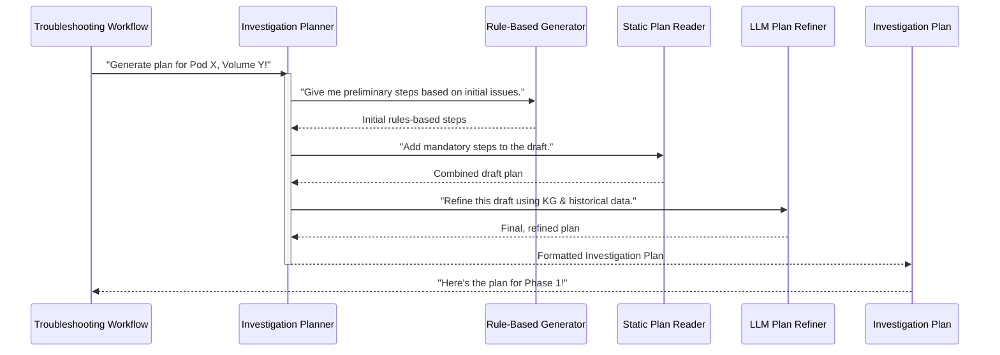

# Chapter 8: Investigation Planner

Welcome back! In [Chapter 7: Prompt Management](07_prompt_management_.md), we discovered how important it is to give our AI clear, well-structured instructions and context, just like giving a detailed job briefing to a human expert. This ensures our AI knows its role, what information it has, and what's expected of it.

But even with a perfect briefing, a troubleshooter doesn't just jump into action randomly. Imagine you're a skilled project manager hired to solve a complex technical problem. You've received all the initial reports and data (from [Information Collector](03_information_collector_.md)), you know your team has amazing tools (from [Diagnostic Tools](04_diagnostic_tools_.md)), and you have a very smart assistant (our [LangGraph ReAct Agent](06_langgraph_react_agent_.md)) who understands instructions perfectly (thanks to [Prompt Management](07_prompt_management_.md)).

Before anyone starts, you, the project manager, would create a **detailed, step-by-step plan** for how the investigation will proceed. This plan would outline:
*   What specific checks need to be done first.
*   What mandatory procedures must be followed.
*   How to adapt the plan based on the unique aspects of *this* problem.

This is exactly what the **Investigation Planner** does for our system! It's the component that takes all the initial information and the AI's understanding, and then **generates a thorough, logical, step-by-step roadmap** for how the AI should investigate the detected storage issue.

### What Problem Are We Solving? (The Project Manager's Blueprint)

When our system detects a "volume I/O error" in a Kubernetes Pod, the challenge isn't just to *react*, but to *investigate smartly*. Without a plan:
*   The investigation might miss crucial steps.
*   It could waste time on irrelevant checks.
*   It might not follow a consistent, best-practice approach.
*   It would be hard to ensure all possibilities are covered.

The **Investigation Planner** solves this by acting like a project manager who outlines the exact steps to follow. It ensures that the root cause analysis phase ([Phase 1](02_troubleshooting_workflow_.md) of our [Troubleshooting Workflow](02_troubleshooting_workflow_.md)) has a clear, structured roadmap to efficiently find the problem.

### Our Goal: A Structured Roadmap for AI Investigation

Our concrete goal for this chapter is to understand how the **Investigation Planner** component creates a detailed, step-by-step plan for the AI to follow. This plan combines initial rules, mandatory steps, and AI-driven refinement to ensure a thorough and logical investigation.

### Key Concepts: The Three-Step Plan Creation

The Investigation Planner builds its roadmap using a clever **three-step process**:

1.  **Rule-Based Preliminary Steps (The Quick Checks):**
    *   **What it is:** This is like a set of "if-then" rules. For example, "If a disk is showing a 'critical' health status, immediately check disk logs and SMART data." These are immediate, high-priority steps based on clear indicators found in the [Knowledge Graph](05_knowledge_graph_.md).
    *   **Why it's important:** It ensures that obvious or critical issues are addressed first, providing a rapid initial response.

2.  **Mandatory Predefined Steps (The Safety Checklist):**
    *   **What it is:** These are steps that *always* need to be included in any investigation, regardless of the initial findings. Think of them as a standard safety checklist or fundamental diagnostic procedures that should never be skipped. They are loaded from a static file.
    *   **Why it's important:** It guarantees a baseline level of thoroughness and consistency across all investigations.

3.  **LLM Refinement (The Smart Optimization):**
    *   **What it is:** This is where the AI's intelligence truly shines. The Large Language Model (LLM) takes the initial draft plan (from steps 1 and 2) and, using all the context from the [Knowledge Graph](05_knowledge_graph_.md) and [Historical Experience](07_prompt_management_.md), refines it. It can add more specific steps, reorder existing ones for better flow, and ensure the plan is truly comprehensive and logical for *this specific issue*.
    *   **Why it's important:** It makes the plan highly adaptable and intelligent, ensuring it's tailored to the unique problem without direct human intervention.

Each step in the generated plan will involve calling one of our [Diagnostic Tools](04_diagnostic_tools_.md) to gather specific information or perform a check. The LLM's job here is *only* to *generate the plan*, not to execute the tools itself. The actual execution happens in the next phase ([Root Cause Analysis](02_troubleshooting_workflow_.md)).

### How It Works: Building the Investigation Roadmap

The `Plan Phase` of our [Troubleshooting Workflow](02_troubleshooting_workflow_.md) is responsible for kicking off the `Investigation Planner`. Here's a simplified flow of how the plan is generated:



Let's break down the main components in the code.

### Diving into the Code (`phases/`)

The core logic for the `Investigation Planner` resides in the `phases/` directory.

The overall orchestration of the "Plan Phase" within the [Troubleshooting Workflow](02_troubleshooting_workflow_.md) is handled by `phases/phase_plan_phase.py`. This file initializes the `InvestigationPlanner`.

```python
# phases/phase_plan_phase.py (Simplified)
from phases.investigation_planner import InvestigationPlanner
from knowledge_graph import KnowledgeGraph # Used to pass the KG to the planner

class PlanPhase:
    def __init__(self, config_data: Dict[str, Any] = None):
        self.config_data = config_data or {}
        self.investigation_planner = None # Will be initialized later
        self.use_react = self.config_data.get('plan_phase', {}).get('use_react', False)

    async def execute(self, knowledge_graph: KnowledgeGraph, pod_name: str, namespace: str,
                    volume_path: str, message_list: List[Dict[str, str]] = None) -> Dict[str, Any]:
        
        # 1. Initialize our Investigation Planner with the collected Knowledge Graph
        self.investigation_planner = InvestigationPlanner(knowledge_graph, self.config_data)
        
        # 2. Tell the planner to generate the plan
        investigation_plan, message_list = await self.investigation_planner.generate_investigation_plan(
            pod_name, namespace, volume_path, message_list, self.use_react
        )
        
        # 3. Parse the plan into a structured format for the next phase
        structured_plan = self._parse_investigation_plan(investigation_plan)
        
        return {
            "status": "success",
            "investigation_plan": investigation_plan,
            "structured_plan": structured_plan,
            # ... other details
            "message_list": message_list
        }
```
**Explanation:** The `PlanPhase` acts as the overall manager. Its `execute` method is called when it's time to generate the plan. It creates an `InvestigationPlanner` instance, gives it the [Knowledge Graph](05_knowledge_graph_.md) (which contains all the collected facts), and then asks it to `generate_investigation_plan`.

#### The Main Orchestrator (`phases/investigation_planner.py`)

This is the central class that coordinates the three-step planning process.

```python
# phases/investigation_planner.py (Simplified)
from knowledge_graph import KnowledgeGraph
from phases.rule_based_plan_generator import RuleBasedPlanGenerator
from phases.static_plan_step_reader import StaticPlanStepReader
from phases.llm_plan_generator import LLMPlanGenerator

class InvestigationPlanner:
    def __init__(self, knowledge_graph, config_data: Dict[str, Any] = None):
        self.kg = knowledge_graph
        self.config_data = config_data
        
        # Initialize the three main components of our planner
        self.rule_based_plan_generator = RuleBasedPlanGenerator(knowledge_graph)
        self.static_plan_step_reader = StaticPlanStepReader(config_data)
        self.llm_plan_generator = LLMPlanGenerator(config_data)

    async def generate_investigation_plan(self, pod_name: str, namespace: str, volume_path: str,
                                  message_list: List[Dict[str, str]] = None, use_react: bool = True) -> Tuple[str, List[Dict[str, str]]]:
        
        # This calls the method that runs the three-step process
        formatted_plan, updated_message_list = await self._generate_plan_with_three_step_process(
            pod_name, namespace, volume_path, message_list, use_react
        )
        return formatted_plan, updated_message_list
        
    async def _generate_plan_with_three_step_process(self, pod_name: str, namespace: str, volume_path: str,
                                             message_list: List[Dict[str, str]] = None, use_react: bool = True) -> Tuple[str, List[Dict[str, str]]]:
        
        # Step 1: Generate preliminary steps using rule-based approach
        preliminary_steps = self.rule_based_plan_generator.generate_preliminary_steps(
            pod_name, namespace, volume_path, # ... other arguments
        )
        
        # Step 2: Add static plan steps to the preliminary steps
        draft_plan = self.static_plan_step_reader.add_static_steps(preliminary_steps)
        
        # Step 3: Refine with LLM if enabled, otherwise use the draft plan directly
        use_llm = self.config_data.get('plan_phase', {}).get('use_llm', True)
        if use_llm and self.llm_plan_generator.llm is not None:
            return await self.llm_plan_generator.refine_plan(
                draft_plan, pod_name, namespace, volume_path, # ... other arguments
            )
        else:
            # If LLM refinement is off, just format and return the combined draft plan
            return self._format_draft_plan_with_message_list(draft_plan, pod_name, namespace, volume_path, message_list)
```
**Explanation:**
*   `InvestigationPlanner` itself doesn't generate steps directly; it delegates that to its specialized components.
*   In `_generate_plan_with_three_step_process`, you see the sequential calls to `rule_based_plan_generator`, then `static_plan_step_reader`, and finally `llm_plan_generator`. This clearly shows the three-step flow.
*   The `draft_plan` is built up in stages before potentially being passed to the LLM for final refinement.

#### 1. Rule-Based Preliminary Steps (`phases/rule_based_plan_generator.py`)

This component generates the initial, high-priority steps based on a set of predefined rules and the analysis of existing issues in the [Knowledge Graph](05_knowledge_graph_.md).

```python
# phases/rule_based_plan_generator.py (Simplified)
from knowledge_graph import KnowledgeGraph

class RuleBasedPlanGenerator:
    def __init__(self, knowledge_graph):
        self.kg = knowledge_graph

    def generate_preliminary_steps(self, pod_name: str, namespace: str, volume_path: str,
                                  target_entities: Dict[str, str], issues_analysis: Dict[str, Any],
                                  historical_experience: List[Dict[str, Any]] = None) -> List[Dict[str, Any]]:
        
        priorities = self._determine_investigation_priority(issues_analysis, target_entities, historical_experience)
        
        all_potential_steps = []
        
        # Add steps based on determined priorities and identified entities
        self._add_critical_issue_steps(all_potential_steps, priorities, target_entities)
        self._add_hardware_verification_steps(all_potential_steps, priorities, target_entities)
        self._add_pod_investigation_steps(all_potential_steps, target_entities)
        self._add_drive_investigation_steps(all_potential_steps, target_entities)
        self._add_volume_investigation_steps(all_potential_steps, target_entities, volume_path)
        self._add_network_verification_steps(all_potential_steps, priorities)
        
        # Select and format the top N steps based on their priority score
        return self._select_and_format_steps(all_potential_steps, max_steps=10) # Limit to 10 for preliminary
        
    def _add_pod_investigation_steps(self, steps_list: List[Dict[str, Any]], target_entities: Dict[str, str]) -> None:
        if "pod" in target_entities:
            pod_id = target_entities["pod"]
            steps_list.append({
                "step": None, # Will be assigned later
                "description": f"Get detailed information about the problem pod {pod_id} and its current state",
                "tool": "kg_get_entity_info", # Uses a Knowledge Graph tool
                "arguments": {"entity_type": "Pod", "entity_id": pod_id},
                "expected": "Pod configuration, status, and any detected issues",
                "priority": "critical",
                "priority_score": 85
            })
```
**Explanation:**
*   `RuleBasedPlanGenerator`'s `generate_preliminary_steps` takes the `issues_analysis` (from [Knowledge Graph](05_knowledge_graph_.md)) and `historical_experience` as input.
*   It then determines an `investigation_priority` based on these inputs.
*   Methods like `_add_pod_investigation_steps` then check if a certain priority or entity exists and, if so, add a pre-defined step (like "Get detailed information about the pod") to the list of `all_potential_steps`.
*   Crucially, these steps specify which [Diagnostic Tool](04_diagnostic_tools_.md) (`kg_get_entity_info` in this example) should be used and what `arguments` it needs.

#### 2. Mandatory Predefined Steps (`phases/static_plan_step_reader.py`)

This component reads a JSON file containing a list of mandatory investigation steps that should always be included in the plan, regardless of the specific issue.

```python
# phases/static_plan_step_reader.py (Simplified)
import json
import os

class StaticPlanStepReader:
    def __init__(self, config_data: Dict[str, Any] = None):
        self.static_plan_step_path = self.config_data.get('plan_phase', {}).get(
            'static_plan_step_path', 'static_plan_step.json' # Default file name
        )

    def read_static_steps(self) -> List[Dict[str, Any]]:
        try:
            with open(self.static_plan_step_path, 'r') as f:
                static_steps = json.load(f)
            return static_steps
        except Exception as e:
            return [] # Return empty list if file not found or error

    def add_static_steps(self, preliminary_steps: List[Dict[str, Any]]) -> List[Dict[str, Any]]:
        static_steps = self.read_static_steps()
        
        # Filter out static steps that use tools already present in preliminary steps
        used_tools = set(step.get('tool', '').split('(')[0] for step in preliminary_steps)
        filtered_static_steps = [
            step for step in static_steps 
            if step.get('tool', '').split('(')[0] not in used_tools
        ]
        
        # Sort static steps by priority score before adding
        filtered_static_steps.sort(key=lambda x: x.get('priority_score', 0), reverse=True)
        
        # Combine preliminary and filtered static steps
        return preliminary_steps + filtered_static_steps
```
**Explanation:**
*   `StaticPlanStepReader`'s `read_static_steps` simply opens and parses a `static_plan_step.json` file.
*   The `add_static_steps` method takes the `preliminary_steps` generated earlier and appends the static ones. It also intelligently filters out duplicate tools to avoid redundancy.

#### 3. LLM Refinement (`phases/llm_plan_generator.py`)

This is the final and most dynamic step. The `LLMPlanGenerator` uses our [Large Language Model (LLM)](06_langgraph_react_agent_.md) to review the combined "draft plan" and refine it for optimal efficiency and thoroughness.

```python
# phases/llm_plan_generator.py (Simplified)
from phases.llm_factory import LLMFactory # For initializing the LLM
from langchain_core.messages import SystemMessage, HumanMessage # For prompt structure

class LLMPlanGenerator:
    def __init__(self, config_data: Dict[str, Any] = None):
        self.config_data = config_data
        self.llm = LLMFactory(config_data).create_llm(phase_name="plan_phase")

    async def refine_plan(self, draft_plan: List[Dict[str, Any]], pod_name: str, namespace: str,
                   volume_path: str, kg_context: Dict[str, Any], phase1_tools: List[Dict[str, Any]],
                   message_list: List[Dict[str, str]] = None, use_react: bool = True) -> Tuple[str, List[Dict[str, str]]]:
        
        # Prepare the System Prompt (AI's role, rules, desired output format)
        system_prompt = self._generate_refinement_system_prompt(use_react)
        
        # Prepare the User Message (problem details, draft plan, KG context, available tools)
        user_message = self._prepare_user_message(
            draft_plan, pod_name, namespace, volume_path, kg_context, phase1_tools, use_react
        )
        
        # Combine into a list of messages for the LLM
        messages = self._prepare_messages(system_prompt, user_message, message_list)
        
        # Call the LLM to get its refined plan
        response = await self.llm.invoke(messages) # LLM "thinks" and generates the plan text
        
        plan_text = response.content # Extract the generated plan
        
        # Ensure the plan has the required header format
        if "Investigation Plan:" not in plan_text:
            plan_text = self._format_raw_plan(plan_text, pod_name, namespace, volume_path)
        
        return plan_text, message_list

    def _generate_refinement_system_prompt(self, use_react: bool = False) -> str:
        # This function creates the system prompt that tells the LLM how to refine the plan.
        # It includes instructions on respecting existing steps, adding new ones, and output format.
        return "You are an expert Kubernetes storage troubleshooter... Your task is to refine a draft Investigation Plan..."
        
    def _prepare_user_message(self, draft_plan: List[Dict[str, Any]], *args, **kwargs) -> str:
        # This function formats all the context for the LLM:
        # - The Knowledge Graph summary
        # - Historical experience examples
        # - The current draft plan
        # - A list of all available Phase 1 tools (so LLM knows what tools it can recommend)
        return f"""# INVESTIGATION PLAN GENERATION
        ## TARGET: Volume read/write errors in pod {kwargs['pod_name']}...
        
        ### 1. KNOWLEDGE GRAPH CONTEXT
        ...
        ### 2. HISTORICAL EXPERIENCE
        ...
        ### 3. DRAFT PLAN
        {json.dumps(draft_plan, indent=2)}
        ...
        """
```
**Explanation:**
*   `LLMPlanGenerator`'s `refine_plan` first creates a `system_prompt` (AI's general instructions) and a `user_message` (specific task and all relevant context: the `draft_plan`, [Knowledge Graph](05_knowledge_graph_.md) context, [historical experiences](07_prompt_management_.md), and a list of all [Phase 1 Diagnostic Tools](04_diagnostic_tools_.md) it can recommend).
*   It then `invokes` the `self.llm` (our Language Model) with these `messages`. The LLM "reads" this comprehensive input and generates a detailed string that is the final investigation plan.
*   Notice that the `phase1_tools` are passed to the LLM, but the LLM *does not execute them*. It only sees their descriptions and parameters, allowing it to correctly format the tool calls within the generated plan.

The output of the `Investigation Planner` is a structured string that looks something like this:

```
Investigation Plan:
Target: Pod my-app/my-namespace, Volume Path: /data
Generated Steps: 5 main steps, 1 fallback steps

PossibleProblem 1: Disk is full
Step 1: Check disk space usage on the affected node | Tool: df_command(node_name='node-1', path='/data') | Expected: Disk space percentage, free space
Step 2: Analyze volume space usage to identify large files | Tool: analyze_volume_space_usage(pod_name='my-app', namespace='my-namespace', mount_path='/data') | Expected: Top directories/files by size

PossibleProblem 2: Underlying hardware issue
Step 3: Check disk health status using SMART data | Tool: check_disk_health(node_name='node-1', device_path='/dev/sda') | Expected: Disk health assessment (GOOD, WARNING, BAD)
Step 4: Scan system logs for disk-related errors | Tool: scan_disk_error_logs(node_name='node-1', hours_back=24) | Expected: Summary of disk errors

PossibleProblem 3: Volume mount issue
Step 5: Verify that the pod volume is correctly mounted and accessible | Tool: verify_volume_mount(pod_name='my-app', namespace='my-namespace', mount_path='/data') | Expected: Mount point verification with accessibility status

Fallback Steps (if main steps fail):
Step F1: Get all critical issues from Knowledge Graph | Tool: kg_get_all_issues(severity='primary') | Expected: List of critical issues affecting the system | Trigger: All main steps failed or unexpected errors.
```
This comprehensive plan is then fed to the [LangGraph ReAct Agent](06_langgraph_react_agent_.md) in [Phase 1: Root Cause Analysis](02_troubleshooting_workflow_.md), guiding its execution of the diagnostic steps.

### Summary

In this chapter, we explored the **Investigation Planner**, the "project manager" of our troubleshooting system. We learned that:

*   It generates a **detailed, step-by-step roadmap** for the AI to follow during root cause analysis.
*   This roadmap is created through a **three-step process**:
    1.  **Rule-based preliminary steps:** For quick, high-priority checks.
    2.  **Mandatory predefined steps:** For consistent, baseline thoroughness.
    3.  **LLM refinement:** For intelligent, adaptive, and comprehensive plan optimization using the [Knowledge Graph](05_knowledge_graph_.md) and [Historical Experience](07_prompt_management_.md).
*   Each step in the plan specifies which [Diagnostic Tool](04_diagnostic_tools_.md) to use, what arguments to provide, and what output to expect.

The Investigation Planner is crucial because it transforms initial alarms into a structured, intelligent path to problem resolution, ensuring our AI can methodically diagnose even complex storage issues.

With this, we've completed our journey through the `cluster-storage-troubleshooting` project's core components! We've seen how the system monitors for issues, orchestrates a workflow, collects information, uses diagnostic tools, builds a knowledge graph, leverages an intelligent AI agent, manages its instructions, and finally, plans its investigation. Together, these components form a powerful, autonomous system for keeping your Kubernetes storage healthy.

---

Generated by [AI Codebase Knowledge Builder](https://github.com/The-Pocket/Tutorial-Codebase-Knowledge)