# Comprehensive Mode Guide

This guide explains the comprehensive troubleshooting mode that uses knowledge graphs to analyze ALL related storage issues across the Kubernetes cluster.

## 🎯 Overview

Comprehensive Mode transforms the troubleshooting approach from single-issue focused to ecosystem-wide analysis:

- **Traditional Approach**: "Meet one issue → Give final response"
- **Comprehensive Approach**: "Collect ALL related issues → Build knowledge graph → Comprehensive analysis"

## 🏗️ Architecture


## 🔍 Issue Discovery Process

### Layer-by-Layer Analysis


## 🧠 Knowledge Graph Components

### Issue Types Classification


### Severity Levels


### Relationship Types


## 📊 Analysis Algorithms

### Root Cause Identification


### Cascading Failure Detection

```mermaid
flowchart TD
    RootCause[Identified Root Cause] --> FindPaths[Find All Outgoing Paths]
    FindPaths --> TraceCascade[Trace Cascade Effects]
    
    subgraph "Cascade Analysis"
        TraceCascade --> Path1[Path 1: Root → A → B → C]
        TraceCascade --> Path2[Path 2: Root → D → E]
        TraceCascade --> Path3[Path 3: Root → F]
    end
    
    Path1 --> Impact1[Calculate Impact Score]
    Path2 --> Impact2[Calculate Impact Score]
    Path3 --> Impact3[Calculate Impact Score]
    
    Impact1 --> Combine[Combine All Cascades]
    Impact2 --> Combine
    Impact3 --> Combine
    
    Combine --> Report[Cascade Report]
```



### Issue Clustering


## 🎯 Comprehensive Analysis Output

### Analysis Structure


### Sample Output Format

```
=== COMPREHENSIVE STORAGE TROUBLESHOOTING RESULTS ===

SUMMARY:
  Total Issues Found: 7
  Critical Issues: 1
  High Priority Issues: 3
  Primary Issue: Disk Full on Node1 (CRITICAL)

KNOWLEDGE GRAPH VISUALIZATION:
┌─────────────────────┐    CAUSES    ┌─────────────────────┐
│ Disk Full (CRITICAL)│─────────────→│ Pod Mount Fail (HIGH)│
└─────────────────────┘              └─────────────────────┘
           │                                     │
           │ CAUSES                              │ AFFECTS
           ↓                                     ↓
┌─────────────────────┐              ┌─────────────────────┐
│ Log Errors (MEDIUM) │              │ Slow I/O (MEDIUM)  │
└─────────────────────┘              └─────────────────────┘

ROOT CAUSES (Ordered by Impact):
  1. Disk Full on /var/lib/kubelet (CRITICAL)
     Resource: Node/worker-node-1
     Description: Available disk space < 1GB
     Node: worker-node-1

CASCADING FAILURE PATTERNS:
  Source: Disk Full on /var/lib/kubelet
  Impact Chain: Disk Full → Pod Mount Fail → Application Errors → User Impact
  Affected Components: 4

=== COMPREHENSIVE ROOT CAUSE ANALYSIS ===
The primary root cause is insufficient disk space on worker-node-1's /var/lib/kubelet 
partition. This has cascaded to cause pod mount failures, which in turn affect 
application performance and user experience...

=== COMPREHENSIVE FIX PLAN ===
IMMEDIATE ACTIONS (Critical):
1. Clean up unused container images on worker-node-1
2. Expand /var/lib/kubelet partition
3. Restart failed pods

PREVENTIVE MEASURES (High):
4. Implement disk space monitoring
5. Configure log rotation policies
6. Set up storage capacity alerts

LONG-TERM IMPROVEMENTS (Medium):
7. Review storage allocation policies
8. Implement automated cleanup procedures
```

## 🚀 Usage Examples

### Basic Comprehensive Analysis

```bash
# Run comprehensive analysis for a failing pod
python run_comprehensive_mode.py \
  --pod-name nginx-deployment-abc123 \
  --namespace production \
  --volume-path /var/www/html
```

### Advanced Configuration

```python
# Programmatic usage
from issue_collector import ComprehensiveIssueCollector
from knowledge_graph import IssueKnowledgeGraph

collector = ComprehensiveIssueCollector(k8s_client, config)
graph = await collector.collect_comprehensive_issues(
    pod_name="nginx-deployment-abc123",
    namespace="production", 
    volume_path="/var/www/html",
    tool_executor=execute_tool_mock
)

analysis = graph.generate_comprehensive_analysis()
```

## 🔧 Configuration Options

### Comprehensive Mode Settings

```yaml
comprehensive_mode:
  # Maximum issues to collect per layer
  max_issues_per_layer: 20
  
  # Analysis depth (1-5, higher = more thorough)
  analysis_depth: 3
  
  # Enable specific analysis types
  enable_cascading_analysis: true
  enable_clustering: true
  enable_trend_analysis: false
  
  # Relationship detection sensitivity
  relationship_threshold: 0.7
  
  # Output format options
  include_graph_visualization: true
  include_detailed_logs: false
  max_root_causes_displayed: 5
```

## 🎯 Best Practices

### When to Use Comprehensive Mode

1. **Complex Multi-Component Failures**: When simple troubleshooting doesn't reveal root causes
2. **Recurring Issues**: Patterns that suggest systemic problems
3. **High-Impact Outages**: Critical incidents requiring thorough analysis
4. **Post-Incident Analysis**: Understanding full scope of problems
5. **Capacity Planning**: Identifying bottlenecks and scaling needs

### Performance Considerations

- **Analysis Time**: Comprehensive mode takes 2-5x longer than single mode
- **Resource Usage**: Higher memory usage due to knowledge graph storage
- **Network Overhead**: More API calls to gather comprehensive data
- **Storage Requirements**: Detailed logs and analysis results

### Interpretation Guidelines

1. **Focus on Root Causes**: Address root causes before symptoms
2. **Consider Dependencies**: Fix critical dependencies first
3. **Validate Fixes**: Use single mode to verify each fix
4. **Monitor Trends**: Track improvement over time
5. **Document Patterns**: Build organizational knowledge

## 🛠️ Extending Comprehensive Mode

### Adding New Issue Types

```python
# In knowledge_graph.py
class IssueType(Enum):
    # Add new issue type
    CUSTOM_STORAGE_ERROR = "custom_storage_error"

# In issue_collector.py
async def collect_custom_issues(self, context: Dict[str, Any]) -> List[IssueNode]:
    """Collect custom storage issues"""
    # Implementation for detecting custom issues
    pass
```

### Custom Analysis Algorithms

```python
# Add custom analysis in knowledge_graph.py
def custom_analysis_algorithm(self) -> Dict[str, Any]:
    """Custom analysis algorithm"""
    # Implement custom logic
    return analysis_results
```

## 📈 Monitoring and Metrics

### Key Metrics

- **Issues Detected**: Total number of issues found per analysis
- **Root Cause Accuracy**: Percentage of correctly identified root causes
- **Fix Success Rate**: Percentage of issues resolved by recommended fixes
- **Analysis Time**: Time taken for comprehensive analysis
- **Cascade Detection**: Number of cascading failures identified

### Performance Tracking


---

**Comprehensive Mode enables deep, systematic analysis of complex storage issues across your entire Kubernetes infrastructure.**
