# Project Structure Documentation

This document provides a detailed overview of the project structure for the Kubernetes Volume I/O Error Troubleshooting System with comprehensive mode capabilities.

## 📁 Directory Structure

```mermaid
graph TD
    Root[cluster-storage-troubleshooting/] --> Core[Core Components]
    Root --> Docs[docs/]
    Root --> Scripts[scripts/]
    Root --> Config[Configuration Files]
    Root --> Tests[Test Files]
    
    subgraph "Core Components"
        Core --> TS[troubleshoot.py]
        Core --> KG[knowledge_graph.py]
        Core --> IC[issue_collector.py]
        Core --> RCM[run_comprehensive_mode.py]
        Core --> MON[monitor.py]
    end
    
    subgraph "Documentation"
        Docs --> CM[COMPREHENSIVE_MODE.md]
        Docs --> PS[PROJECT_STRUCTURE.md]
        Docs --> DR[design_requirement.md]
    end
    
    subgraph "Scripts"
        Scripts --> SM[start_monitoring.sh]
        Scripts --> RCT[run_comprehensive_troubleshoot.sh]
    end
    
    subgraph "Configuration"
        Config --> YAML[config.yaml]
        Config --> REQ[requirements.txt]
        Config --> PY[pyproject.toml]
    end
```

## 🏗️ Component Architecture

### Core Engine Components

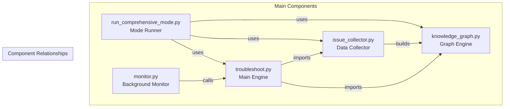

## 📄 File Descriptions

### Core Files

#### `troubleshoot.py` - Main Troubleshooting Engine
**Purpose**: Primary troubleshooting script with LangGraph ReAct agents
**Size**: ~1,200 lines
**Key Components**:
- LangGraph ReAct agent implementation
- Tool definitions (kubectl, ssh, test pod creation)
- Command execution and validation
- SSH client management
- Comprehensive mode integration

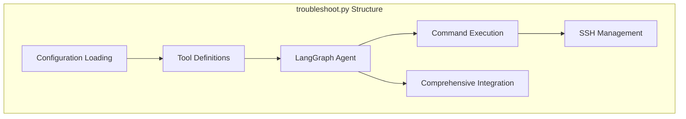

#### `knowledge_graph.py` - Knowledge Graph Engine
**Purpose**: Manages issue relationships and comprehensive analysis
**Size**: ~800 lines
**Key Components**:
- `IssueKnowledgeGraph` class
- `IssueNode` data structure
- Issue type and severity enums
- Relationship management
- Analysis algorithms

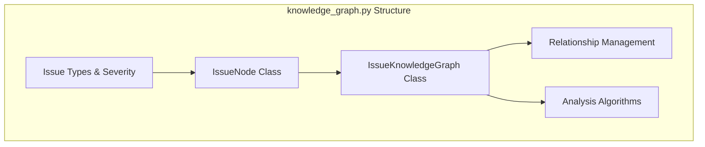

#### `issue_collector.py` - Comprehensive Issue Collector
**Purpose**: Systematically collects issues across all infrastructure layers
**Size**: ~600 lines
**Key Components**:
- `ComprehensiveIssueCollector` class
- Layer-specific collection methods
- Issue discovery patterns
- Tool integration

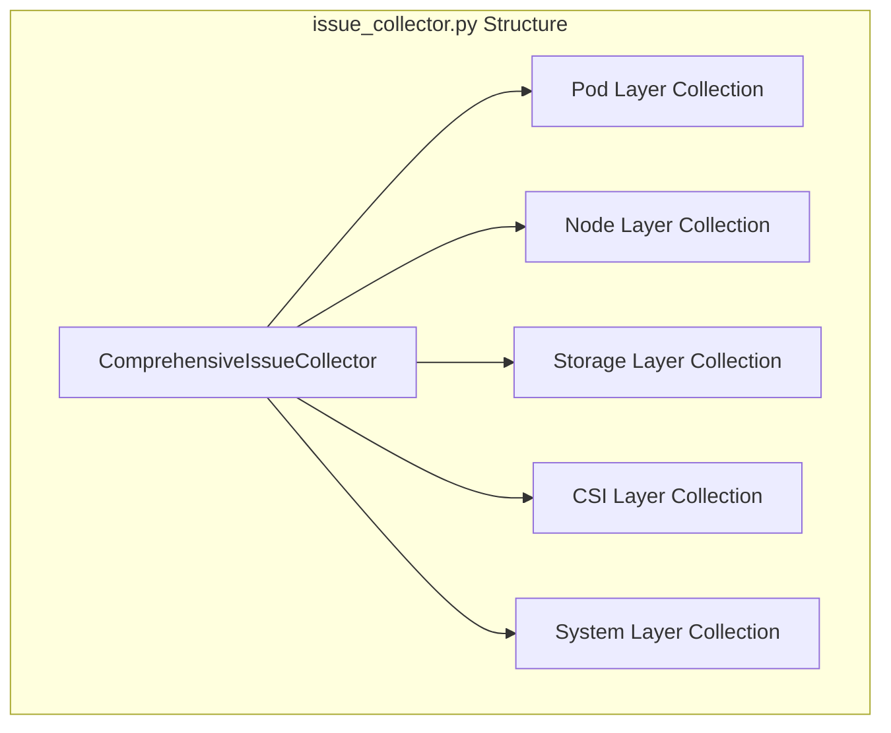

#### `run_comprehensive_mode.py` - Comprehensive Mode Runner
**Purpose**: Entry point for comprehensive analysis mode
**Size**: ~200 lines
**Key Components**:
- Command-line interface
- Configuration management
- Comprehensive analysis orchestration
- Result formatting

#### `monitor.py` - Background Monitoring Service
**Purpose**: Continuous monitoring for storage issues
**Size**: ~400 lines
**Key Components**:
- Background monitoring loop
- Issue detection patterns
- Alert generation
- Integration with troubleshooting engine

### Configuration Files

#### `config.yaml` - Main Configuration
**Purpose**: System configuration and settings
**Structure**:
```yaml
llm:              # LLM model configuration
troubleshoot:     # Troubleshooting settings
commands:         # Command validation rules
logging:          # Logging configuration
monitoring:       # Background monitoring settings
comprehensive_mode: # Comprehensive analysis settings
```

#### `requirements.txt` - Python Dependencies
**Purpose**: Python package dependencies
**Key Dependencies**:
- `langgraph`: ReAct agent framework
- `langchain`: LLM integration
- `kubernetes`: Kubernetes API client
- `paramiko`: SSH client
- `pyyaml`: YAML configuration parsing

#### `pyproject.toml` - Project Metadata
**Purpose**: Project packaging and metadata
**Contains**:
- Project description
- Author information
- Version management
- Build configuration

## 🔄 Data Flow Architecture

### Single Mode Flow

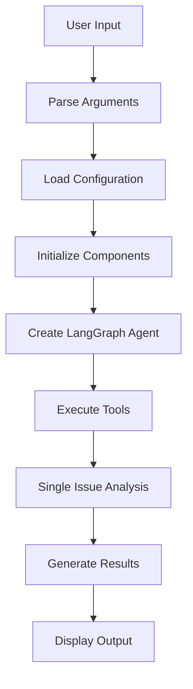

### Comprehensive Mode Flow

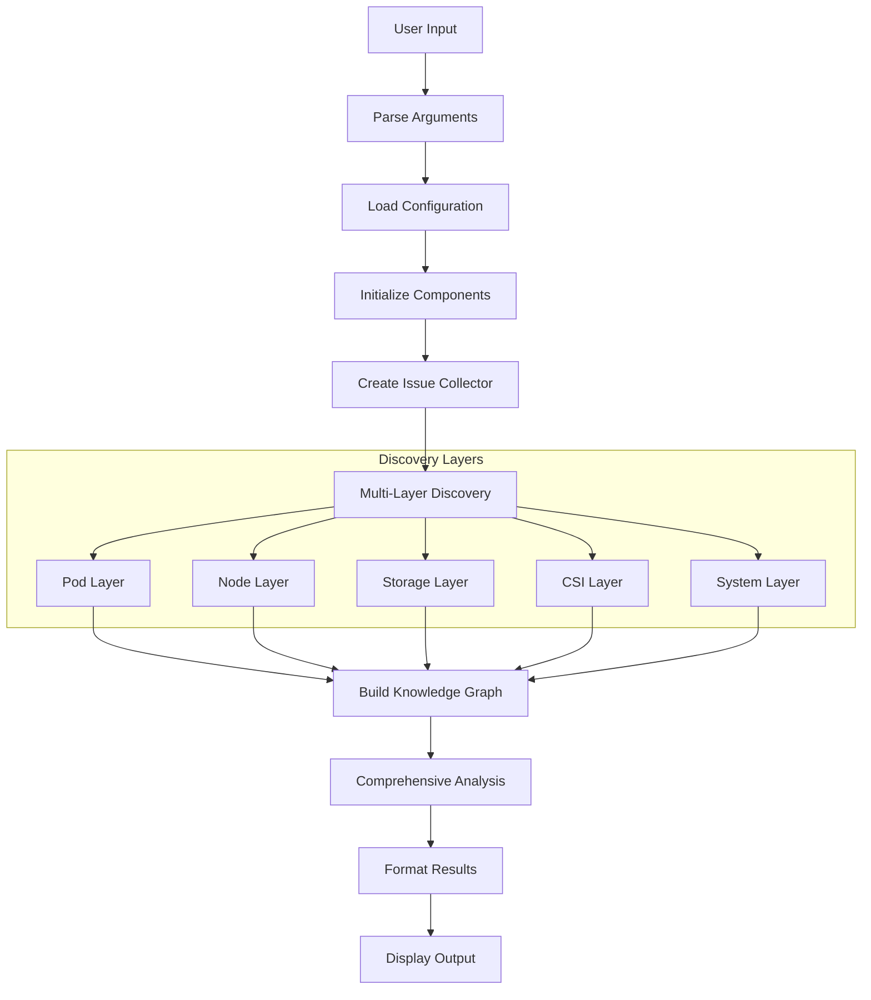

## 🧩 Module Dependencies

### Import Hierarchy

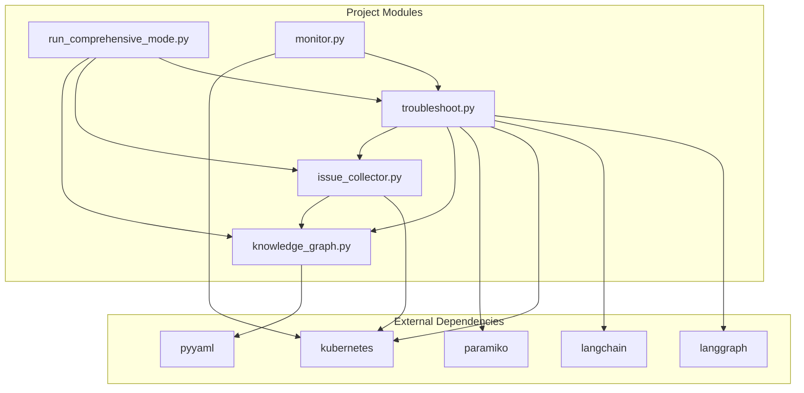

### Component Interfaces

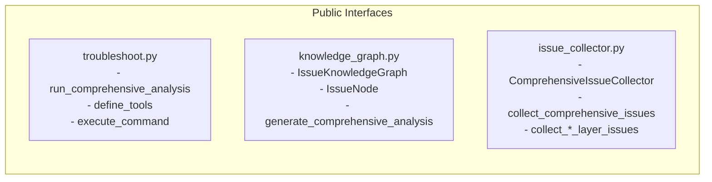

## 📊 File Size and Complexity

### Code Metrics

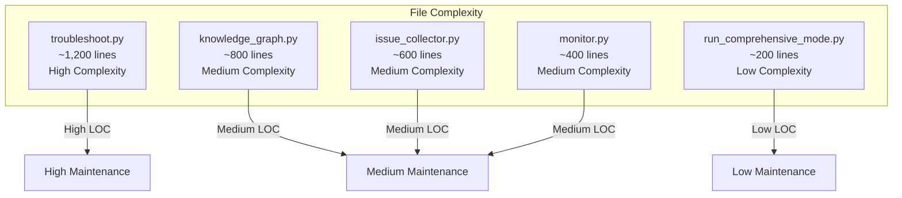

## 🔒 Security Considerations

### Security Architecture

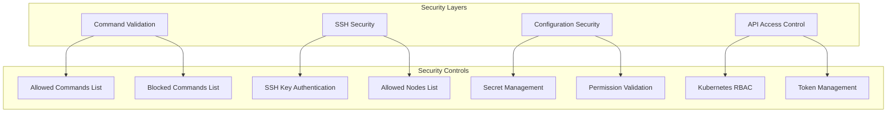

## 🧪 Testing Structure

### Test Organization

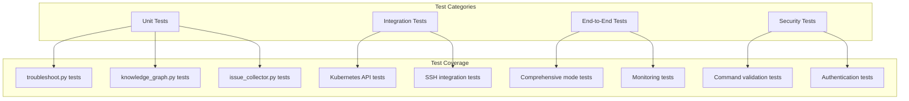

## 📈 Performance Considerations

### Performance Profiles

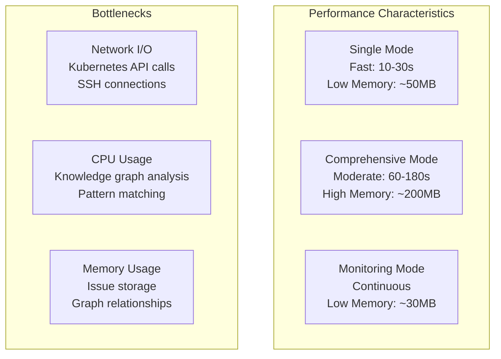

## 🚀 Deployment Patterns

### Deployment Options

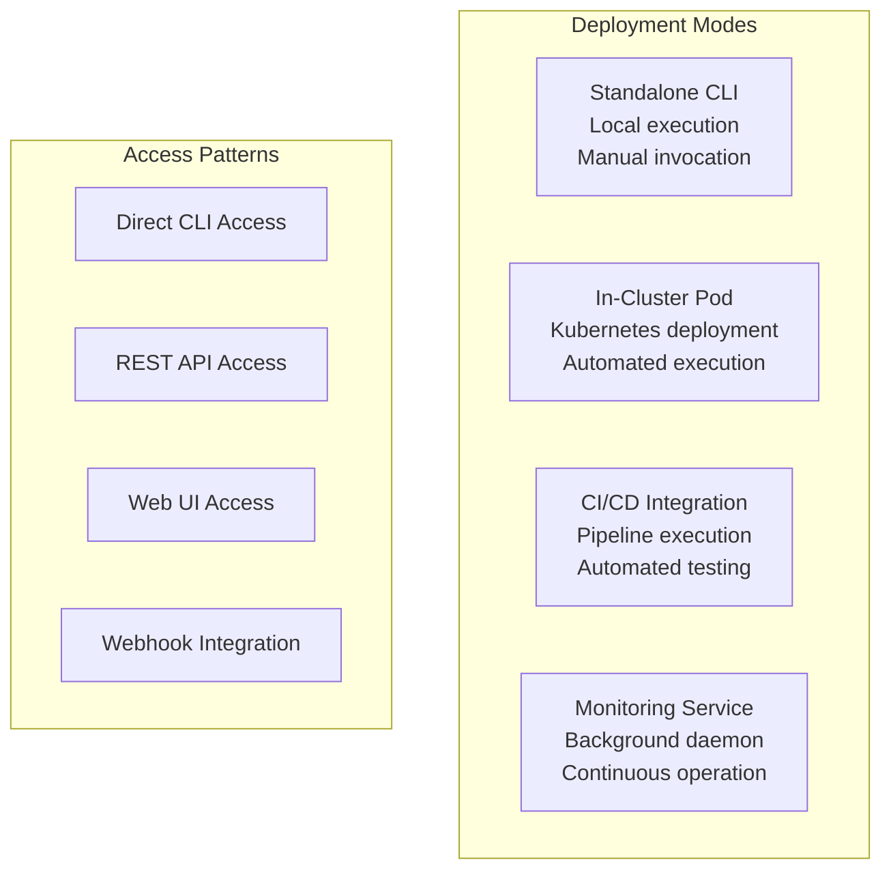

## 🔧 Configuration Management

### Configuration Hierarchy

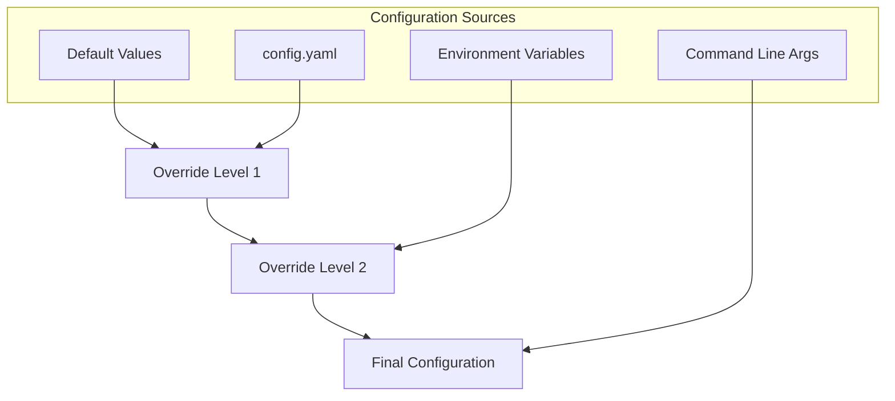

## 📝 Documentation Structure

### Documentation Hierarchy

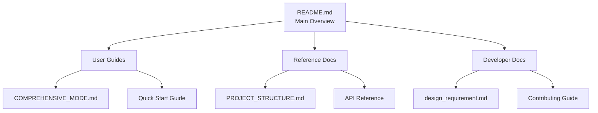

## 🔄 Maintenance Guidelines

### Code Maintenance

1. **Regular Updates**:
   - Update dependencies monthly
   - Review security patches weekly
   - Update documentation with changes

2. **Code Quality**:
   - Maintain test coverage >80%
   - Follow Python PEP 8 standards
   - Regular code reviews

3. **Performance Monitoring**:
   - Track analysis execution times
   - Monitor memory usage patterns
   - Optimize critical paths

4. **Security Audits**:
   - Review command validation rules
   - Audit SSH access controls
   - Validate API permissions

---

**This project structure supports scalable, maintainable, and secure Kubernetes storage troubleshooting.**
