# Design Requirements Document

This document outlines the design requirements and architectural decisions for the Kubernetes Volume I/O Error Troubleshooting System with comprehensive mode capabilities.

## 🎯 System Overview

### Vision Statement
Create an intelligent, comprehensive troubleshooting system that can analyze ALL related storage issues across Kubernetes/Linux/storage layers, identify root causes, understand issue relationships, and provide actionable fix plans.

### Mission
Transform storage troubleshooting from reactive single-issue resolution to proactive ecosystem-wide analysis using knowledge graphs and AI-powered reasoning.

### Project Evolution
- **Previous Design**: Single-issue focused troubleshooting ("meet one issue → give final response")
- **Current Design**: Comprehensive multi-issue analysis using knowledge graphs ("collect ALL related issues → build relationships → comprehensive analysis")

## 📋 Functional Requirements

### FR-1: Dual Mode Operation

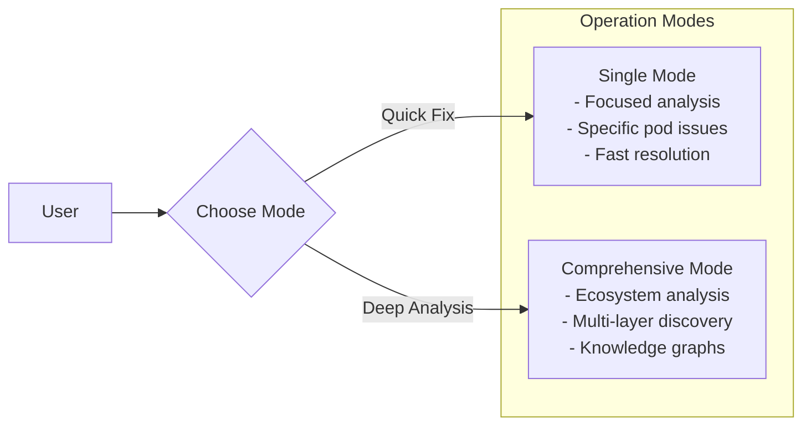

**Requirements**:
- **FR-1.1**: Support traditional single-issue troubleshooting mode
- **FR-1.2**: Provide comprehensive multi-issue analysis mode
- **FR-1.3**: Allow mode selection via CLI parameters
- **FR-1.4**: Maintain backward compatibility with existing usage

### FR-2: Comprehensive Issue Discovery

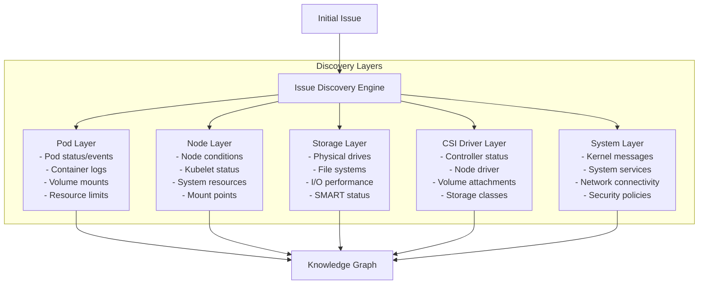

**Requirements**:
- **FR-2.1**: Discover issues across all infrastructure layers systematically
- **FR-2.2**: Build relationships between discovered issues
- **FR-2.3**: Classify issues by type, severity, and impact
- **FR-2.4**: Support configurable discovery depth and scope

### FR-3: Knowledge Graph Engine

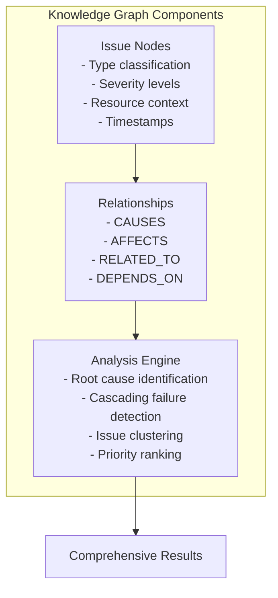

**Requirements**:
- **FR-3.1**: Model issues as nodes with rich metadata
- **FR-3.2**: Support multiple relationship types between issues
- **FR-3.3**: Implement graph traversal algorithms for analysis
- **FR-3.4**: Generate visual representations of issue relationships

### FR-4: Comprehensive Analysis Algorithms

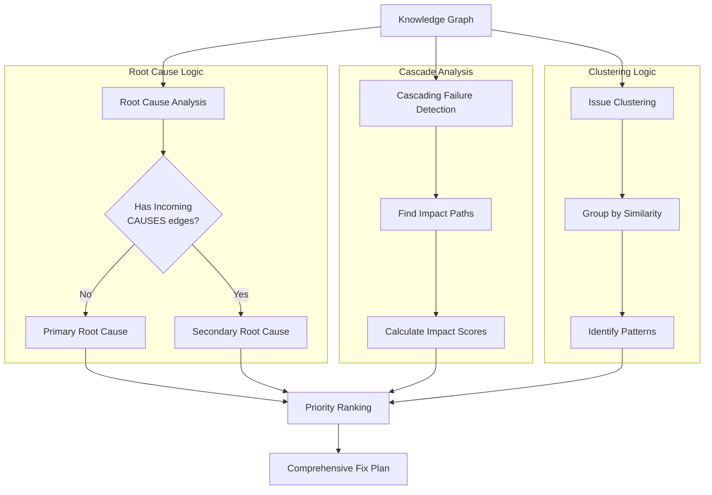

**Requirements**:
- **FR-4.1**: Identify true root causes vs symptoms
- **FR-4.2**: Map cascading failure patterns
- **FR-4.3**: Group related issues into clusters
- **FR-4.4**: Generate prioritized fix plans considering dependencies

## 🔧 Technical Requirements

### General Requirements
- **Deployment Environment**: Runs on the Kubernetes master node (host)
- **Language and Framework**: Python 3.8+ with LangGraph ReAct module for agent-based troubleshooting
- **New Components**:
  - `knowledge_graph.py`: Knowledge graph implementation
  - `issue_collector.py`: Comprehensive issue collector
  - `run_comprehensive_mode.py`: Comprehensive mode runner

### Tool Integration
- Executes Linux commands (e.g., `kubectl`, `df`, `lsblk`, `smartctl`, `fio`) to gather cluster and system information
- Uses SSH to run diagnostic commands on worker nodes hosting the affected disks
- Supports CSI Baremetal-specific commands (e.g., `kubectl get drive`, `kubectl get csibmnode`, `kubectl get ac`, `kubectl get lvg`) to inspect drive and capacity details
- All commands (read-only and write/change operations) are defined in a configuration file (`config.yaml`) with allow/deny permissions

### Configuration File Enhancement

```yaml
# Enhanced Configuration for Comprehensive Mode
comprehensive_mode:
  # Maximum issues to collect per layer
  max_issues_per_layer: 20
  
  # Analysis depth (1-5, higher = more thorough)
  analysis_depth: 3
  
  # Enable specific analysis types
  enable_cascading_analysis: true
  enable_clustering: true
  enable_trend_analysis: false
  
  # Relationship detection sensitivity
  relationship_threshold: 0.7
  
  # Output format options
  include_graph_visualization: true
  include_detailed_logs: false
  max_root_causes_displayed: 5

# LLM Configuration
llm:
  model: "gpt-4"
  api_endpoint: "https://api.openai.com/v1"
  api_key: ''
  temperature: 0.1
  max_tokens: 4000

# Troubleshooting Configuration
troubleshoot:
  timeout_seconds: 300
  interactive_mode: true
  mode: "comprehensive"  # single or comprehensive
  ssh:
    enabled: true
    user: "admin"
    key_path: "/path/to/ssh/key"
    nodes:
      - "workernode1"
      - "workernode2"
      - "masternode1"
    retries: 3
    retry_backoff_seconds: 5

# Command Validation
commands:
  allowed:
    - "kubectl*"
    - "smartctl*"
    - "df"
    - "dmesg"
    - "lsblk"
    - "fio*"
  disallowed:
    - "fsck*"
    - "rm*"
    - "dd*"
    - "mkfs*"
```

## 🏗️ System Architecture

### Comprehensive Mode Architecture

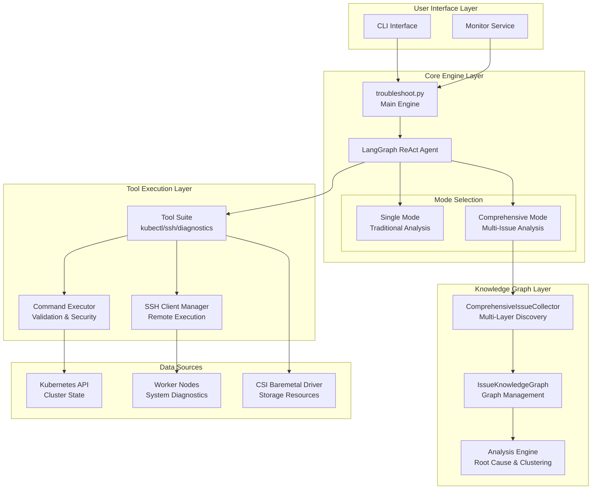

### Data Flow Architecture

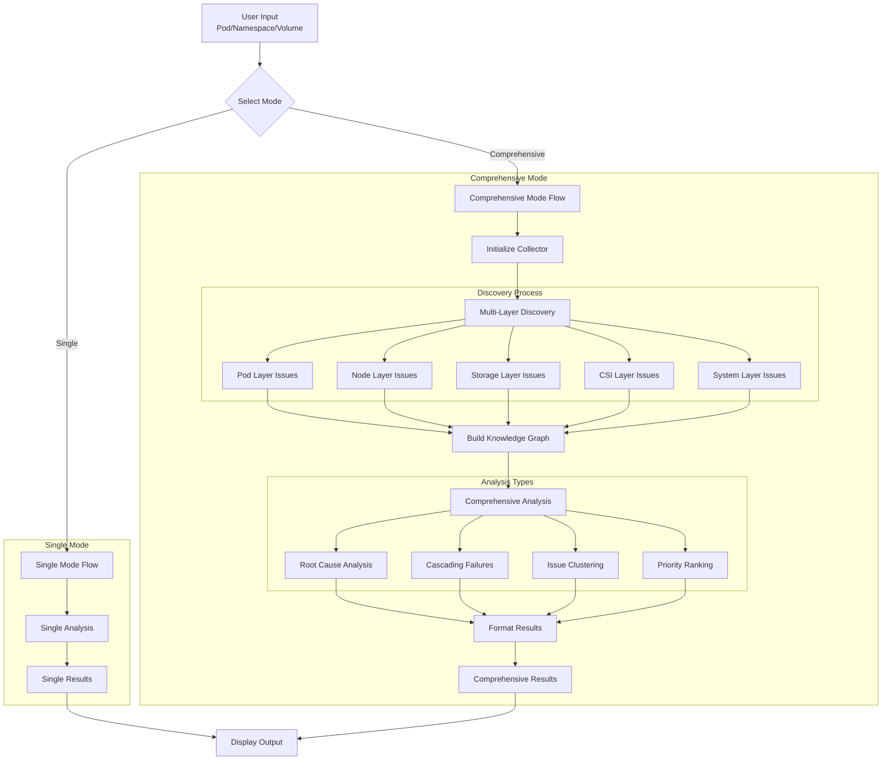

## 🔄 Workflow Specifications

### Workflow 1: Monitoring Workflow
- **Script File**: `monitor.py`
- **Purpose**: Periodically monitors all pods in the Kubernetes cluster for volume I/O errors
- **Enhanced Functionality**:
  - Detects annotation `volume-io-error:<volume-path>` indicating a volume I/O error
  - Can trigger either single or comprehensive mode based on configuration
  - Supports batch processing of multiple detected issues
  - Integrates with comprehensive analysis for pattern detection

### Workflow 2: Single Mode Troubleshooting
- **Script File**: `troubleshoot.py` (single mode)
- **Purpose**: Traditional single-issue focused troubleshooting
- **Process**: Follows existing troubleshooting steps for focused analysis

### Workflow 3: Comprehensive Mode Troubleshooting
- **Script File**: `run_comprehensive_mode.py`
- **Purpose**: Multi-issue ecosystem-wide analysis using knowledge graphs

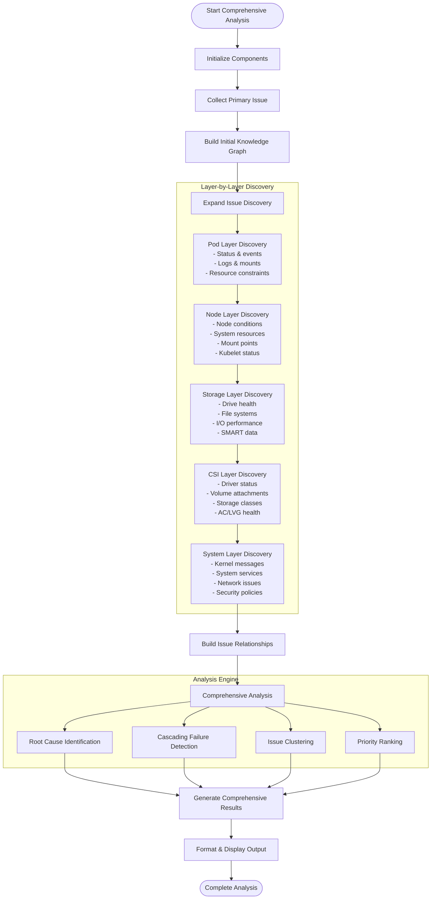

## 🧠 Enhanced System Prompts

### Comprehensive Mode System Prompt

```
You are an AI assistant powering a comprehensive Kubernetes volume troubleshooting system using LangGraph ReAct and knowledge graphs. Your role is to systematically analyze ALL related storage issues across Kubernetes/Linux/storage layers, build issue relationships, and provide comprehensive root cause analysis and fix plans.

COMPREHENSIVE MODE INSTRUCTIONS:

1. **Multi-Layer Issue Discovery**:
   - Systematically collect issues from Pod, Node, Storage, CSI, and System layers
   - Use the ComprehensiveIssueCollector to discover related problems
   - Build a knowledge graph of all discovered issues and their relationships

2. **Knowledge Graph Analysis**:
   - Classify issues by type (POD_*, NODE_*, STORAGE_*, CSI_*, SYSTEM_*)
   - Assign severity levels (CRITICAL, HIGH, MEDIUM, LOW)
   - Establish relationships (CAUSES, AFFECTS, RELATED_TO, DEPENDS_ON)
   - Identify root causes vs symptoms through graph traversal

3. **Comprehensive Analysis Process**:
   a. Root Cause Identification: Find issues with no incoming CAUSES relationships
   b. Cascading Failure Detection: Map how root causes propagate through the system
   c. Issue Clustering: Group related issues by type, node, timing, or symptoms
   d. Priority Ranking: Order fixes by impact, dependencies, and feasibility

4. **Enhanced Output Requirements**:
   - Provide summary statistics (total issues, severity breakdown, primary issue)
   - Include knowledge graph visualization
   - List root causes ordered by impact
   - Show cascading failure patterns
   - Present issue clusters with dominant types
   - Generate comprehensive root cause analysis narrative
   - Provide comprehensive fix plan with priority order

5. **Safety and Validation**:
   - All existing safety requirements apply
   - Enhanced validation for comprehensive scope
   - Interactive approval for any write/change operations
   - Comprehensive logging of all discovery and analysis steps

You must collect ALL related storage issues, analyze their relationships comprehensively, and provide holistic solutions rather than addressing isolated symptoms.
```

## 📊 Performance Requirements

### Performance Characteristics

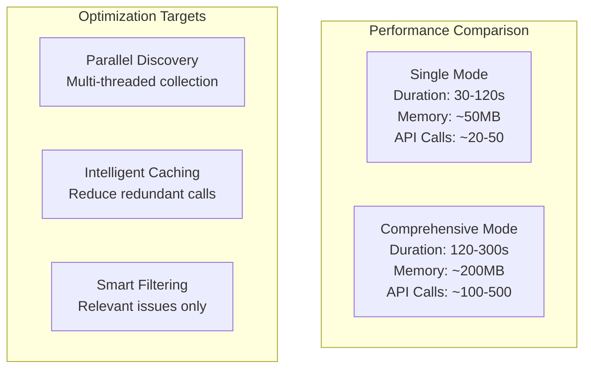

**Requirements**:
- Single mode: Complete within 2 minutes
- Comprehensive mode: Complete within 5 minutes
- Memory usage: < 500MB peak
- API rate limiting: Respect cluster limits
- Concurrent analysis: Support up to 3 simultaneous comprehensive analyses

## 🔒 Security Requirements

### Enhanced Security Architecture

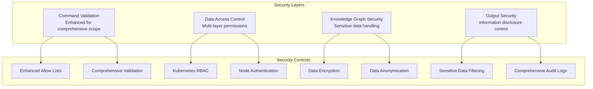

## 🧪 Testing Requirements

### Comprehensive Testing Strategy

```mermaid
graph TD
    subgraph "Test Categories"
        Unit[Unit Tests<br/>Individual components]
        Integration[Integration Tests<br/>Layer interactions]
        E2E[End-to-End Tests<br/>Complete workflows]
        Performance[Performance Tests<br/>Scale and timing]
        Security[Security Tests<br/>Attack scenarios]
    end
    
    subgraph "Comprehensive Mode Tests"
        Unit --> KGTests[Knowledge Graph Tests]
        Unit --> CollectorTests[Issue Collector Tests]
        Unit --> AnalysisTests[Analysis Algorithm Tests]
        
        Integration --> LayerTests[Multi-Layer Integration]
        Integration --> RelationTests[Relationship Building]
        
        E2E --> ScenarioTests[Failure Scenario Tests]
        E2E --> WorkflowTests[Complete Workflow Tests]
        
        Performance --> ScaleTests[Large Cluster Tests]
        Performance --> TimingTests[Analysis Timing Tests]
        
        Security --> ValidationTests[Command Validation Tests]
        Security --> AccessTests[Access Control Tests]
    end
```

## 📈 Success Metrics

### Key Performance Indicators

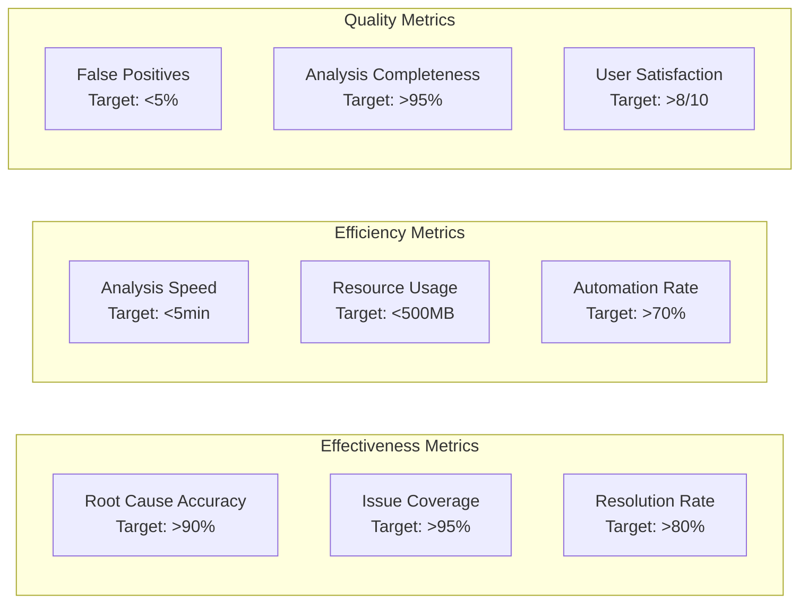

## 🚀 Deployment Strategy

### Deployment Architecture

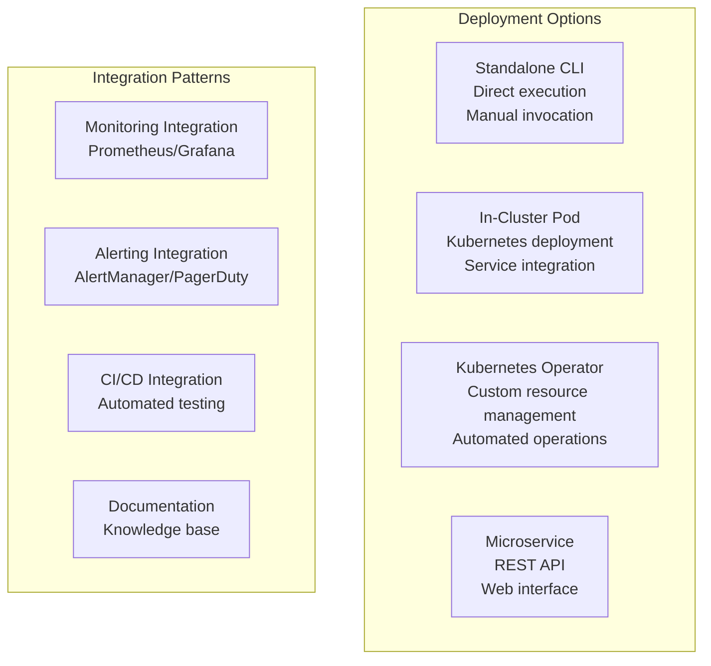

## 📝 Documentation Requirements

### Documentation Structure

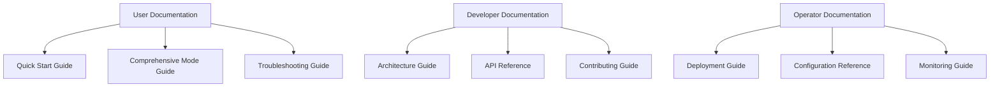

## 🔮 Future Enhancements

### Roadmap

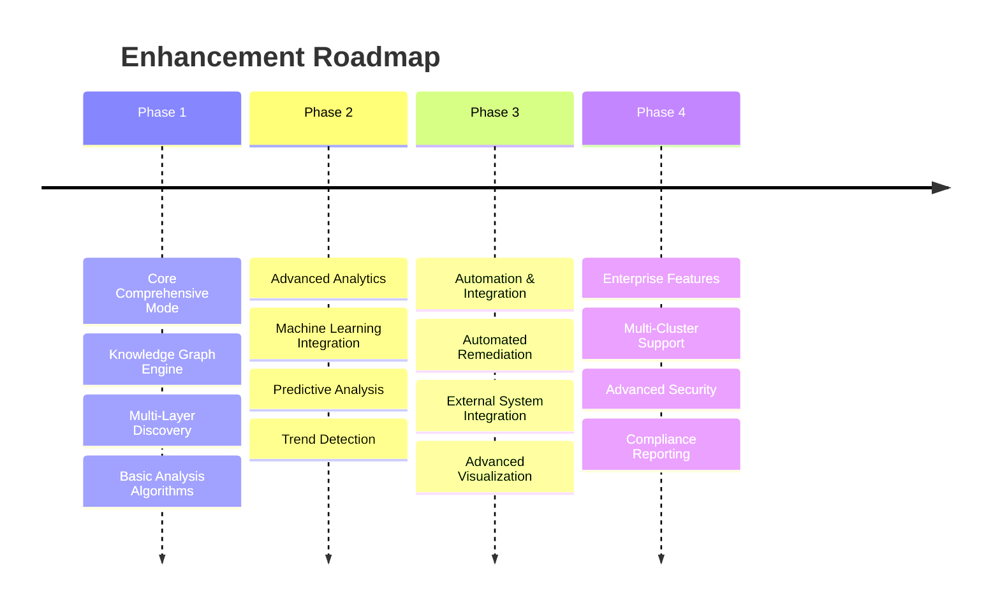

### Planned Features
- **ML-Enhanced Analysis**: Machine learning for pattern recognition and prediction
- **Automated Remediation**: Safe automated fixes for common issues
- **Advanced Visualization**: Interactive knowledge graph exploration
- **Multi-Cluster Support**: Cross-cluster issue correlation
- **Integration APIs**: REST APIs for external system integration
- **Compliance Reporting**: Automated compliance and audit reports

---

**This comprehensive design enables intelligent, systematic troubleshooting of complex storage issues across the entire Kubernetes infrastructure.**
