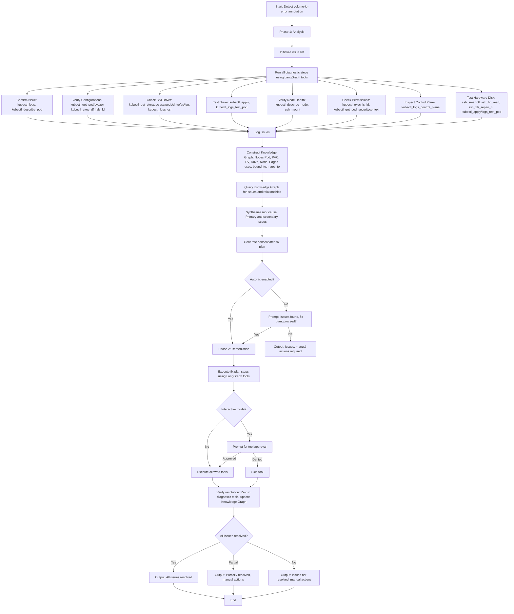

# Enhanced Kubernetes Volume Troubleshooting Project Requirements with Knowledge Graph and LangGraph Tools

## Project Overview
This Python-based troubleshooting system uses the LangGraph ReAct module to monitor and resolve volume I/O errors in Kubernetes pods backed by local HDD/SSD/NVMe disks managed by the CSI Baremetal driver. Deployed on the Kubernetes master node, it consists of two workflows: a monitoring workflow to detect volume I/O errors via pod annotations and an enhanced troubleshooting workflow to diagnose and resolve all related issues in two phases (Analysis and Remediation). The system integrates Linux tools, implemented as LangGraph tools, supports SSH for worker node interactions, and uses a configuration file for customizable settings, including interactive mode, auto-fix mode, and prefix/wildcard-based command restrictions. During Phase 1, a Knowledge Graph is constructed from diagnostic data to organize entities and relationships, enabling comprehensive root cause analysis and fix plan generation. The troubleshooting process focuses on local storage (excluding remote storage like NFS, Ceph, or cloud-based solutions) and covers Pod, PersistentVolumeClaim (PVC), PersistentVolume (PV), CSI Baremetal driver, AvailableCapacity (AC), LogicalVolumeGroup (LVG), and hardware disk diagnostics.

## Functional Requirements

### General Requirements
- **Deployment Environment**: Runs on the Kubernetes master node (host).
- **Language and Framework**: Python 3.8+ with LangGraph ReAct module for agent-based troubleshooting.
- **Tool Integration**:
  - Implements diagnostic and remediation commands as LangGraph tools (e.g., `kubectl`, `df`, `lsblk`, `smartctl`, `fio`, CSI Baremetal-specific commands like `kubectl get drive`).
  - Uses SSH (via a LangGraph SSH tool) to run diagnostic commands on worker nodes (`workernode1`, `workernode2`, `masternode1`).
  - LangGraph tools are defined in `troubleshoot.py` and validated against `commands.disallowed` in `config.yaml` using prefix/wildcard matching.
- **Configuration File**:
  - A YAML configuration file (`config.yaml`) defines:
    - LLM settings (e.g., model, API endpoint, temperature).
    - Disallowed commands with prefix/wildcard support (e.g., `fsck *`, `kubectl delete *`).
    - SSH connection settings (e.g., credentials, target nodes).
    - Interactive mode enable/disable flag (`interactive_mode`).
    - Auto-fix mode enable/disable flag (`auto_fix`) for automatic remediation.
    - Default disablement of write/change commands in `commands.disallowed`.
  - **Command Matching Logic**:
    - LangGraph tools encapsulate allowed commands (e.g., `kubectl get *`, `smartctl -a *`).
    - A command is blocked if it matches any entry in `commands.disallowed`, using prefix/wildcard matching (e.g., `fsck *` blocks all `fsck` commands).
    - Exact matching takes precedence over prefix/wildcard.
- **Interactive Mode**:
  - When `interactive_mode: true`, prompts the user for permission before executing any LangGraph tool, providing a description of the tool’s purpose.
  - If disabled, executes tools automatically, respecting `commands.disallowed` restrictions.
- **Auto-Fix Mode**:
  - When `auto_fix: true`, automatically proceeds to Phase 2 (Remediation) after Phase 1 (Analysis) without user input, executing the fix plan using allowed LangGraph tools.
  - When `auto_fix: false`, prompts the user after Phase 1: "Issues found: <list of issues>. Fix plan: <consolidated plan>. Proceed to remediation phase? (y/n)".
- **Security**:
  - Write/change commands (e.g., `fsck`, `chmod`, `dd`, `kubectl delete *`) are disabled by default in `commands.disallowed`.
  - Only LangGraph tools not matching `commands.disallowed` can be executed.
  - SSH commands (via SSH LangGraph tool) are logged for auditing, with credentials stored securely.

### Workflow 1: Monitoring Workflow
- **Script File**: `monitor.py`
- **Purpose**: Periodically monitors all pods in the Kubernetes cluster for volume I/O errors by checking pod annotations.
- **Functionality**:
  - Queries pod annotations using the Kubernetes Python client (`kubernetes.client`).
  - Detects the annotation `volume-io-error:<volume-path>` indicating a volume I/O error.
  - Invokes the troubleshooting workflow (`troubleshoot.py`) with parameters:
    - `PodName`: Name of the affected pod.
    - `PodNamespace`: Namespace of the affected pod.
    - `VolumePath`: Volume path from the annotation.
  - Monitoring interval is configurable in `config.yaml` (default: 60 seconds).
- **Dependencies**:
  - Kubernetes Python client (`kubernetes`).
  - YAML parser (`pyyaml`).
- **Error Handling**:
  - Logs errors for unreachable Kubernetes API or malformed annotations.
  - Retries failed API calls with exponential backoff (configurable in `config.yaml`).

### Workflow 2: Troubleshooting Workflow
- **Script File**: `troubleshoot.py`
- **Purpose**: Uses LangGraph ReAct module to diagnose and resolve all volume I/O errors for a specified pod and volume, split into two phases: Analysis (Phase 1) and Remediation (Phase 2). In Phase 1, constructs a Knowledge Graph from diagnostic data collected via LangGraph tools and uses it for root cause analysis and fix plan generation.
- **Parameters** (minimum):
  - `PodName`: Name of the pod with the error.
  - `PodNamespace`: Namespace of the pod.
  - `VolumePath`: Path of the volume experiencing I/O errors.
- **Dependencies**:
  - LangGraph ReAct module (`langgraph`).
  - Kubernetes Python client (`kubernetes`).
  - Paramiko for SSH (`paramiko`, wrapped in a LangGraph tool).
  - YAML parser (`pyyaml`).
  - NetworkX for Knowledge Graph (`networkx`).
- **LangGraph Tools**:
  - Define tools for each diagnostic/remediation command, e.g.:
    ```python
    from langgraph.prebuilt import Tool

    # Example LangGraph tool for kubectl logs
    kubectl_logs = Tool(
        name="kubectl_logs",
        description="Retrieve logs for a Kubernetes pod to identify errors",
        func=lambda pod_name, namespace: run_command(f"kubectl logs {pod_name} -n {namespace}"),
        parameters={"pod_name": str, "namespace": str}
    )

    # Example LangGraph tool for SSH smartctl
    ssh_smartctl = Tool(
        name="ssh_smartctl",
        description="Run smartctl on a node to check disk health",
        func=lambda node, device: run_ssh_command(node, f"smartctl -a /dev/{device}"),
        parameters={"node": str, "device": str}
    )

    # Register tools
    tools = [
        kubectl_logs,
        kubectl_describe_pod=Tool(...),
        kubectl_get_pod=Tool(...),
        kubectl_get_pvc=Tool(...),
        kubectl_get_pv=Tool(...),
        kubectl_get_storageclass=Tool(...),
        kubectl_get_drive=Tool(...),
        kubectl_get_csibmnode=Tool(...),
        kubectl_get_ac=Tool(...),
        kubectl_get_lvg=Tool(...),
        df_h=Tool(...),
        lsblk=Tool(...),
        ssh_mount=Tool(...),
        ssh_fio_read=Tool(...),
        ssh_xfs_repair_n=Tool(...),
        # Add other tools as needed
    ]
    ```
  - Each tool validates its command against `commands.disallowed` before execution.
  - Tools log their execution and output for traceability.
- **Error Handling**:
  - Logs all tool executions, outputs, SSH results, user interactions, and Knowledge Graph creation.
  - Handles SSH and API failures with retries (configurable in `config.yaml`).
  - Reports unresolved issues with detailed findings from the Knowledge Graph and manual intervention suggestions.

#### Phase 1: Analysis
- **Purpose**: Executes all diagnostic steps using LangGraph tools, constructs a Knowledge Graph, and uses it to synthesize a comprehensive root cause analysis and fix plan.
- **Functionality**:
  - Uses LangGraph ReAct agent to execute diagnostic steps via predefined LangGraph tools, collecting issues in a list.
  - Validates tool commands against `commands.disallowed` using prefix/wildcard matching.
  - Constructs a Knowledge Graph using `networkx` to represent entities, relationships, and diagnostic data.
  - LLM queries the Knowledge Graph to identify and prioritize issues, generating a root cause analysis and fix plan.
  - If `auto_fix: false`, prompts: "Issues found: <list of issues>. Fix plan: <consolidated plan>. Proceed to remediation phase? (y/n)".
  - If `auto_fix: true`, proceeds directly to Phase 2.
- **Diagnostic Steps** (using LangGraph tools):
  1. **Confirm Issue**:
     - Use `kubectl_logs` and `kubectl_describe_pod` tools to identify errors (e.g., "Input/Output Error", "Permission Denied", "FailedMount"). Log errors to issue list.
  2. **Verify Configurations**:
     - Use `kubectl_get_pod`, `kubectl_get_pvc`, `kubectl_get_pv` tools to check Pod, PVC, and PV.
     - Confirm PV uses local volume, valid disk path (e.g., `/dev/sda`), and correct `nodeAffinity`.
     - Use `kubectl_exec_df_h` and `kubectl_exec_ls_ld` tools to verify mount points. Log mismatches.
  3. **Check CSI Baremetal Driver and Resources**:
     - Use `kubectl_get_storageclass` to verify driver (e.g., `csi-baremetal-sc-ssd`).
     - Use `kubectl_get_pods_csi` and `kubectl_logs_csi` to check driver pod. Log crashes or errors.
     - Use `kubectl_get_csidrivers` to confirm driver registration. Log missing registrations.
     - Use `kubectl_get_drive` to check drive status. Verify `Health: GOOD`, `Status: ONLINE`, `Usage: IN_USE`, and match `Path` with `VolumePath`. Log unhealthy drives.
     - Use `kubectl_get_csibmnode` to map drive to node. Log mapping issues.
     - Use `kubectl_get_ac` to check AvailableCapacity. Log capacity issues.
     - Use `kubectl_get_lvg` to check LogicalVolumeGroup. Log unhealthy LVGs.
  4. **Test Driver Functionality**:
     - Create a test PVC/Pod with `csi-baremetal-sc-ssd` (use YAML from original document).
     - Use `kubectl_apply` and `kubectl_logs_test_pod` tools to apply and check. Log read/write errors.
  5. **Verify Node Health**:
     - Use `kubectl_describe_node` to check for `Ready` state and no `DiskPressure`. Log node issues.
     - Use `ssh_mount` to verify disk mounting. Log mount failures.
  6. **Check Permissions**:
     - Use `kubectl_exec_ls_ld` and `kubectl_get_pod_securitycontext` to verify permissions. Log mismatches.
  7. **Inspect Control Plane**:
     - Use `kubectl_logs_control_plane` to check `kube-controller-manager` and `kube-scheduler` logs. Log errors.
  8. **Test Hardware Disk**:
     - Use `kubectl_get_pv` and `kubectl_get_drive` to identify disk.
     - Use `ssh_smartctl` to check health. Log SMART errors (e.g., non-zero `Reallocated_Sector_Ct`).
     - Use `ssh_fio_read` to test performance. Log performance issues.
     - Use `ssh_xfs_repair_n` (if approved) to check file system. Log errors.
     - Use test Pod (via `kubectl_apply`, `kubectl_logs_test_pod`). Log read/write failures.
- **Knowledge Graph Construction**:
  - **Library**: Use `networkx` to create a directed graph.
  - **Nodes**:
    - Pod: Attributes include name, namespace, errors, SecurityContext.
    - PVC: Attributes include name, storageClass, bound PV.
    - PV: Attributes include name, diskPath, nodeAffinity, bound PVC.
    - Drive: Attributes include UUID, Health, Status, Path.
    - Node: Attributes include name, Ready, DiskPressure.
    - StorageClass: Attributes include name, provisioner.
    - LVG: Attributes include name, Health, drive UUIDs.
    - AC: Attributes include name, size, storage class, location.
  - **Edges**:
    - Pod → PVC: "uses".
    - PVC → PV: "bound_to".
    - PV → Drive: "maps_to".
    - Drive → Node: "located_on".
    - PV → Node: "affinity_to".
    - LVG → Drive: "contains".
    - AC → Node: "available_on".
  - **Attributes**: Store tool outputs as node attributes (e.g., `Pod.errors`, `Drive.Health`).
  - **Example Graph**:
    ```python
    import networkx as nx
    G = nx.DiGraph()
    G.add_node("Pod:app-1", namespace="default", errors=["Permission Denied"], fsGroup=1000)
    G.add_node("PVC:pvc-1", storageClass="csi-baremetal-sc-ssd")
    G.add_node("PV:pv-1", diskPath="/dev/sda", nodeAffinity="workernode1")
    G.add_node("Drive:2a96dfec", Health="SUSPECT", Status="ONLINE", Path="/dev/sda")
    G.add_node("Node:workernode1", Ready=True, DiskPressure=False)
    G.add_edge("Pod:app-1", "PVC:pvc-1", relationship="uses")
    G.add_edge("PVC:pvc-1", "PV:pv-1", relationship="bound_to")
    G.add_edge("PV:pv-1", "Drive:2a96dfec", relationship="maps_to")
    G.add_edge("Drive:2a96dfec", "Node:workernode1", relationship="located_on")
    ```
  - Log graph creation for traceability.
- **Root Cause Analysis**:
  - LLM queries the Knowledge Graph to identify issues (e.g., `Drive.Health="SUSPECT"`, `Pod.errors="Permission Denied"`).
  - Analyzes relationships to correlate issues (e.g., bad drive affecting PV used by Pod).
  - Prioritizes issues by severity (e.g., disk failure > permissions > configuration).
  - Outputs: "Issues found: <list>. Primary root cause: <primary cause>. Secondary issues: <list>."
- **Fix Plan**:
  - Generates a consolidated, prioritized fix plan based on graph analysis, e.g.:
    - "Step 1: Update Pod SecurityContext."
    - "Step 2: Back up data and replace suspect drive."
  - Outputs: "Fix plan: <prioritized steps>."

#### Phase 2: Remediation
- **Purpose**: Executes the consolidated fix plan using LangGraph tools to resolve all identified issues.
- **Functionality**:
  - Uses LangGraph ReAct agent to execute remediation tools, validating against `commands.disallowed`.
  - For each step:
    - If `interactive_mode: true`, prompts: "Proposed tool: <tool_name>. Purpose: <purpose>. Approve? (y/n)".
    - If tool command matches `commands.disallowed`, skips unless enabled/approved.
  - Verifies resolution by re-running diagnostic tools and updating the Knowledge Graph.
  - Outputs final result:
    - If resolved: "All issues resolved: <details>."
    - If partially resolved: "Partially resolved: <resolved issues>. Unresolved: <details>. Manual actions required: <suggestions>."
    - If unresolved: "Issues not resolved. Findings: <details>. Manual actions required: <suggestions>."

## Non-Functional Requirements
- **Performance**:
  - Monitoring workflow minimizes API calls to avoid overloading the Kubernetes API server.
  - Troubleshooting workflow completes within 5 minutes (configurable timeout in `config.yaml`).
  - Knowledge Graph construction and querying optimized for clusters with up to 1000 pods.
- **Scalability**:
  - Handles clusters with up to 1000 pods.
  - Configurable monitoring intervals and retry policies.
  - LangGraph tools and Knowledge Graph scale to handle all relevant entities and relationships.
- **Security**:
  - SSH credentials stored securely.
  - Tools validated against `commands.disallowed` with prefix/wildcard matching.
  - Write/change commands disabled by default in `commands.disallowed`.
- **Logging**:
  - Logs to `troubleshoot.log` and optionally stdout.
  - Log format: `%(asctime)s - %(levelname)s - %(message)s`.
  - Logs all tool executions, outputs, and Knowledge Graph operations.

## Configuration File Example (`config.yaml`)
```yaml
# LLM Configuration
llm:
  model: "grok3"
  api_endpoint: "https://x.ai/api"
  temperature: 0.7
  max_tokens: 1000

# Monitoring Configuration
monitor:
  interval_seconds: 60
  api_retries: 3
  retry_backoff_seconds: 5

# Troubleshooting Configuration
troubleshoot:
  timeout_seconds: 300
  interactive_mode: true
  auto_fix: false
  ssh:
    enabled: true
    user: "admin"
    key_path: "/path/to/ssh/key"
    nodes:
      - "workernode1"
      - "workernode2"
      - "masternode1"
    retries: 3
    retry_backoff_seconds: 5

# Disallowed Commands
commands:
  disallowed:
    - "fsck *"
    - "chmod *"
    - "chown *"
    - "dd *"
    - "mkfs *"
    - "rm *"
    - "kubectl delete *"
    - "kubectl apply *"
    - "xfs_repair *"

# Logging Configuration
logging:
  file: "troubleshoot.log"
  stdout: true
```

## Global Health Check Instruction (System Prompt for LLM)
**System Prompt**:
```
You are an AI assistant powering an enhanced Kubernetes volume troubleshooting system using LangGraph ReAct. Your role is to monitor and resolve volume I/O errors in Kubernetes pods backed by local HDD/SSD/NVMe disks managed by the CSI Baremetal driver (csi-baremetal.dell.com). Exclude remote storage (e.g., NFS, Ceph). The troubleshooting process is split into two phases: Analysis (Phase 1) and Remediation (Phase 2). All diagnostic and remediation commands are implemented as LangGraph tools, validated against `commands.disallowed` in `config.yaml` using prefix/wildcard matching. In Phase 1, a Knowledge Graph is constructed to organize diagnostic data, which you query for root cause analysis and fix plan generation. Follow these strict guidelines:

1. **Safety and Security**:
   - Only execute predefined LangGraph tools (e.g., kubectl_logs, ssh_smartctl). Validate tool commands against `commands.disallowed` (e.g., `fsck *`, `kubectl delete *`).
   - Never execute tools whose commands match `commands.disallowed` unless explicitly enabled and approved.
   - Exact matches take precedence over prefix/wildcard. A `commands.disallowed` match blocks execution.
   - Validate all tool commands for safety and relevance.
   - Log all tool executions, SSH commands, and outputs for auditing, using secure credential handling.

2. **Interactive and Auto-Fix Modes**:
   - If `troubleshoot.interactive_mode` is `true`, prompt before executing any tool: "Proposed tool: <tool_name>. Purpose: <purpose>. Approve? (y/n)".
   - If `troubleshoot.auto_fix` is `false`, after Phase 1, prompt: "Issues found: <list of issues>. Fix plan: <consolidated plan>. Proceed to remediation phase? (y/n)". If `true`, proceed to Phase 2 automatically.
   - If `interactive_mode` is `false`, execute allowed tools automatically, respecting `commands.disallowed`.

3. **Troubleshooting Process**:
   - Use the LangGraph ReAct module to reason about volume I/O errors based on parameters: `PodName`, `PodNamespace`, and `VolumePath`.
   - **Phase 1: Analysis**:
     a. Execute **all** diagnostic steps using LangGraph tools, collecting issues in a list and logging outputs.
     b. **Confirm Issue**: Use `kubectl_logs` and `kubectl_describe_pod` tools to identify errors (e.g., "Input/Output Error", "Permission Denied", "FailedMount"). Log errors.
     c. **Verify Configurations**: Use `kubectl_get_pod`, `kubectl_get_pvc`, `kubectl_get_pv` to check configurations. Confirm PV uses local volume, valid disk path, and correct `nodeAffinity`. Use `kubectl_exec_df_h`, `kubectl_exec_ls_ld` for mount points. Log mismatches.
     d. **Check CSI Baremetal Driver and Resources**:
        - Use `kubectl_get_storageclass` to identify driver.
        - Use `kubectl_get_pods_csi`, `kubectl_logs_csi` for driver pod. Log crashes.
        - Use `kubectl_get_csidrivers` for driver registration. Log issues.
        - Use `kubectl_get_drive` for drive status. Log unhealthy drives.
        - Use `kubectl_get_csibmnode` for drive-to-node mapping. Log issues.
        - Use `kubectl_get_ac` for AvailableCapacity. Log issues.
        - Use `kubectl_get_lvg` for LogicalVolumeGroup. Log unhealthy LVGs.
     e. **Test Driver**: Use `kubectl_apply`, `kubectl_logs_test_pod` for test PVC/Pod. Log errors.
     f. **Verify Node Health**: Use `kubectl_describe_node` for node status, `ssh_mount` for disk mounting. Log issues.
     g. **Check Permissions**: Use `kubectl_exec_ls_ld`, `kubectl_get_pod_securitycontext`. Log mismatches.
     h. **Inspect Control Plane**: Use `kubectl_logs_control_plane` for `kube-controller-manager`, `kube-scheduler`. Log errors.
     i. **Test Hardware Disk**:
        - Use `kubectl_get_pv`, `kubectl_get_drive` to identify disk.
        - Use `ssh_smartctl` for health. Log SMART errors.
        - Use `ssh_fio_read` for performance. Log issues.
        - Use `ssh_xfs_repair_n` (if approved) for file system. Log errors.
        - Use `kubectl_apply`, `kubectl_logs_test_pod` for test Pod. Log failures.
     j. **Construct Knowledge Graph**:
        - Create a directed graph using `networkx`.
        - Nodes: Pod (name, namespace, errors, SecurityContext), PVC (name, storageClass), PV (name, diskPath, nodeAffinity), Drive (UUID, Health, Status, Path), Node (name, Ready, DiskPressure), StorageClass, LVG, AC.
        - Edges: Pod→PVC ("uses"), PVC→PV ("bound_to"), PV→Drive ("maps_to"), Drive→Node ("located_on"), PV→Node ("affinity_to"), LVG→Drive ("contains"), AC→Node ("available_on").
        - Store tool outputs as node attributes.
        - Log graph creation.
     k. **Root Cause Analysis**:
        - Query the Knowledge Graph to identify issues and relationships.
        - Prioritize issues by severity (e.g., disk failure > permissions > configuration).
        - Output: "Issues found: <list>. Primary root cause: <primary cause>. Secondary issues: <list>."
     l. **Fix Plan**:
        - Generate a consolidated, prioritized fix plan based on graph analysis (e.g., "Step 1: Update SecurityContext", "Step 2: Replace drive").
        - If `auto_fix: false`, prompt user to proceed. If `true`, proceed to Phase 2.
   - **Phase 2: Remediation**:
     a. Execute fix plan steps using LangGraph tools, validating against `commands.disallowed`.
     b. For each step, if `interactive_mode: true`, prompt for approval. Skip disallowed tools unless enabled/approved.
     c. Verify resolution by re-running diagnostic tools and updating the Knowledge Graph.
     d. Output result:
        - If resolved: "All issues resolved: <details>."
        - If partially resolved: "Partially resolved: <resolved issues>. Unresolved: <details>. Manual actions required: <suggestions>."
        - If unresolved: "Issues not resolved. Findings: <details>. Manual actions required: <suggestions>."

4. **Error Handling**:
   - Log all tool executions, outputs, SSH results, Knowledge Graph creation, and errors to the configured log file and stdout (if enabled).
   - Handle Kubernetes API or SSH failures with retries as specified in `config.yaml`.
   - If unresolved, provide a detailed report of all findings from the Knowledge Graph and suggest manual intervention.

5. **Constraints**:
   - Restrict operations to the Kubernetes cluster and configured worker nodes.
   - Do not modify cluster state unless explicitly allowed and approved via LangGraph tools.
   - Adhere to `troubleshoot.timeout_seconds`.
   - Recommend data backup before write/change operations.

6. **Output**:
   - Provide clear explanations of diagnostic steps, Knowledge Graph contents, issues, root cause, fix plan, and remediation results.
   - In interactive mode, format prompts as: "Proposed tool: <tool_name>. Purpose: <purpose>. Approve? (y/n)".
   - Include performance benchmarks (e.g., HDD: 100–200 IOPS, SSD: thousands, NVMe: tens of thousands).
   - Log all outputs with timestamps and context.

You must adhere to these guidelines to ensure safe, reliable, and comprehensive troubleshooting of local disk issues in Kubernetes with the CSI Baremetal driver.
```

## Technical Requirements
- **Dependencies**:
  - Python packages: `kubernetes`, `langgraph`, `paramiko`, `pyyaml`, `networkx`.
  - Install via: `pip install kubernetes langgraph paramiko pyyaml networkx`.
- **Kubernetes Access**:
  - Master node requires a valid `kubeconfig` or in-cluster configuration.
  - Service account with permissions to read pod metadata, annotations, PVCs, PVs, nodes, control plane logs, and CSI Baremetal resources.
- **SSH Setup**:
  - SSH private key accessible on the master node.
  - Worker nodes must allow SSH access for the configured user (via SSH LangGraph tool).
- **Logging**:
  - Uses Python’s `logging` module for file and stdout output.
  - Log format: `%(asctime)s - %(levelname)s - %(message)s`.

## Example Workflow Execution
1. **Monitoring Workflow**:
   - `monitor.py` detects `volume-io-error:/data` on pod `app-1` in namespace `default`.
   - Invokes `troubleshoot.py app-1 default /data`.

2. **Troubleshooting Workflow**:
   - **Phase 1: Analysis**:
     - Executes LangGraph tools:
       - `kubectl_logs` detects "Permission Denied" with mismatched `fsGroup`.
       - `kubectl_get_drive` shows `Health: SUSPECT` for drive UUID `2a96dfec-47db-449d-9789-0d81660c2c4d`.
       - `ssh_smartctl` shows non-zero `Reallocated_Sector_Ct`.
     - Constructs Knowledge Graph:
       - Nodes: `Pod:app-1` (errors="Permission Denied", fsGroup=1000), `PVC:pvc-1`, `PV:pv-1` (diskPath="/dev/sda"), `Drive:2a96dfec` (Health="SUSPECT"), `Node:workernode1` (Ready=True).
       - Edges: `Pod:app-1→PVC:pvc-1` ("uses"), `PVC:pvc-1→PV:pv-1` ("bound_to"), `PV:pv-1→Drive:2a96dfec` ("maps_to"), `Drive:2a96dfec→Node:workernode1` ("located_on").
     - LLM queries graph, identifies: "Permission issue on Pod:app-1" and "Suspect drive health on Drive:2a96dfec."
     - Root cause: "Primary: Suspect disk health. Secondary: Permissions issue."
     - Fix plan: "Step 1: Update Pod SecurityContext. Step 2: Back up data. Step 3: Replace disk."
     - If `auto_fix: false`, prompts: "Issues found: Permissions, suspect disk. Fix plan: Update SecurityContext, back up data, replace disk. Proceed? (y/n)". If `true`, proceeds to Phase 2.
   - **Phase 2: Remediation**:
     - Executes remediation tools (e.g., `kubectl_apply` if enabled, validated against `commands.disallowed`).
     - Skips disallowed tools (e.g., `kubectl_delete`) unless approved.
     - Verifies resolution with diagnostic tools and updates Knowledge Graph.
     - Outputs: "Partially resolved: Permissions fixed. Unresolved: Disk replacement required. Manual action: Replace disk."

## Future Enhancements
- Support for automated AC and LVG diagnostics in the Knowledge Graph.
- Integration with Prometheus for real-time disk metrics linked to graph nodes.
- Additional LangGraph tools for advanced remediation (e.g., automated backups).
- Parallel execution of diagnostic tools to reduce analysis time.
- Visualization of the Knowledge Graph for user review.

## Workflow Chart
The following chart illustrates the updated troubleshooting workflow with LangGraph tools and Knowledge Graph integration.

<xaiArtifact artifact_id="40477831-3fa9-4fae-8fad-96adcdae5955" artifact_version_id="729efb57-8b13-467b-9e3b-31a8d5d31129" title="Troubleshooting Workflow Chart with Knowledge Graph and LangGraph Tools" contentType="text/mermaid">

