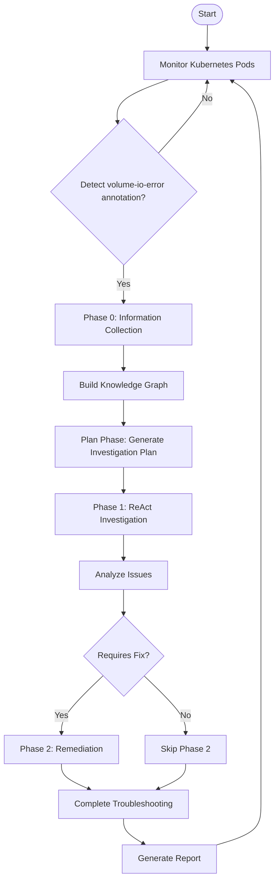
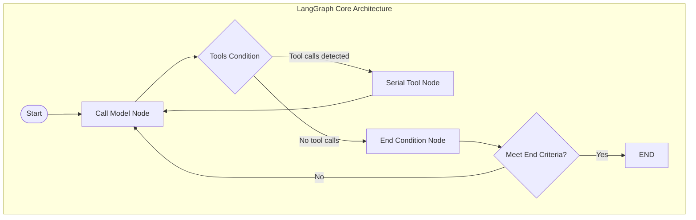

# Cluster Storage Troubleshooting System Documentation

## Introduction

This documentation provides a comprehensive overview of the Cluster Storage Troubleshooting System, an intelligent system for diagnosing and resolving Kubernetes cluster storage issues using Large Language Models (LLMs).

## Table of Contents

1. [Executive Summary](summary.md)
   - Project overview
   - Key innovations
   - Architecture highlights
   - Technical implementation
   - Key strengths
   - Use cases
   - Future directions

2. [System Overview](overview.md)
   - Introduction to the system
   - Key features
   - System goals
   - High-level architecture
   - Target use cases

3. [System Architecture](architecture.md)
   - Core components
   - System interactions
   - Configuration
   - Deployment model

4. [Workflow Diagrams and Processes](workflow.md)
   - Overall workflow
   - LangGraph ReAct loop
   - Phase 0: Information Collection
   - Plan Phase: Investigation Planning
   - Phase 1: ReAct Investigation
   - Phase 2: Remediation
   - Knowledge Graph construction
   - Chat Mode workflow
   - Tool execution workflow
   - MCP integration workflow
   - End-to-end sequence diagram

5. [Key Components and Implementations](components.md)
   - Knowledge Graph
   - LangGraph ReAct Agent
   - Phased Workflow System
   - Information Collector
   - Tool Registry
   - MCP Integration
   - Chat Mode

## Key Diagrams

### Overall Workflow



### LangGraph ReAct Loop



### End-to-End Sequence

```mermaid
sequenceDiagram
    participant User
    participant Monitor
    participant InfoCollector
    participant KnowledgeGraph
    participant PlanPhase
    participant Phase1
    participant Phase2
    participant Tools
    
    User->>Monitor: Start monitoring
    Monitor->>InfoCollector: Trigger troubleshooting
    InfoCollector->>KnowledgeGraph: Build knowledge graph
    InfoCollector->>PlanPhase: Pass collected info
    PlanPhase->>Phase1: Pass investigation plan
    Phase1->>Tools: Execute investigation tools
    Phase1->>Phase1: Generate fix plan
    Phase1->>Phase2: Pass fix plan
    Phase2->>Tools: Execute remediation tools
    Phase2->>User: Return remediation results
