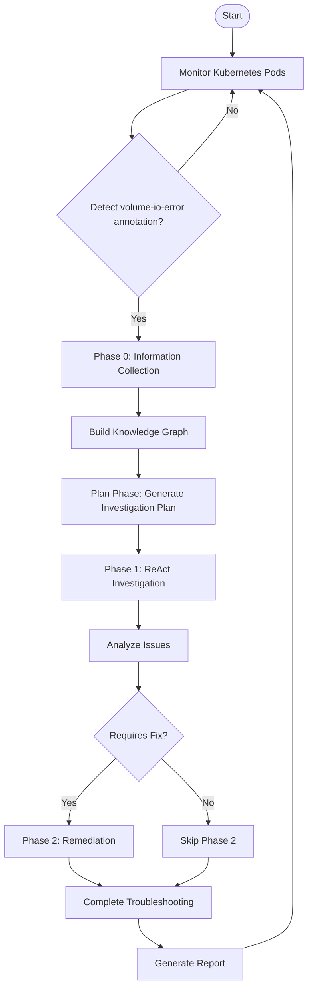
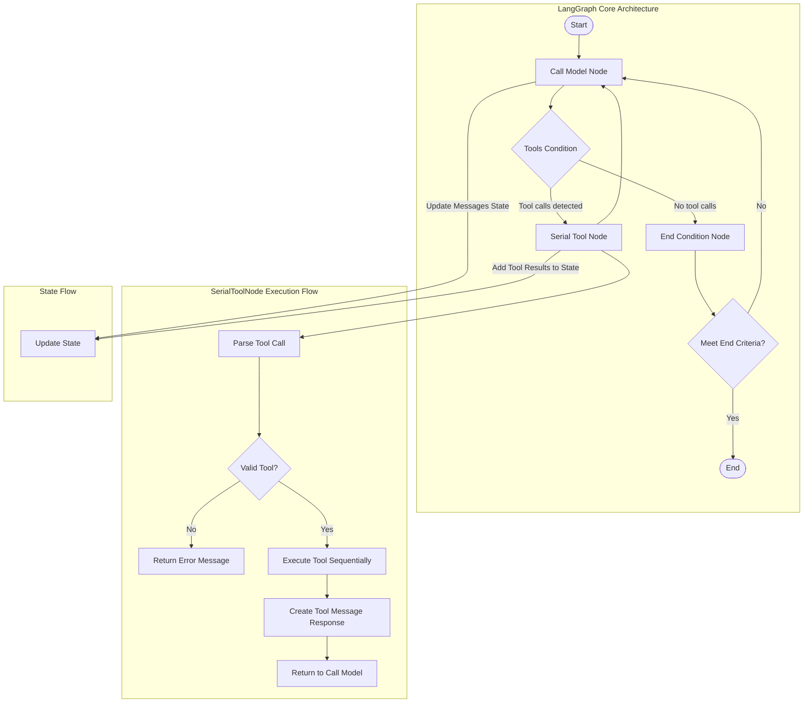
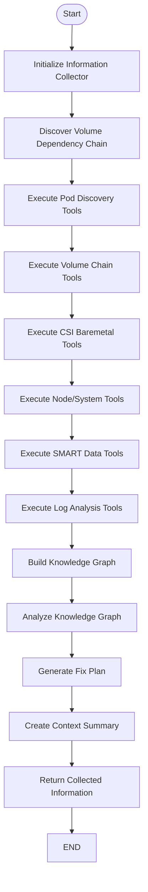
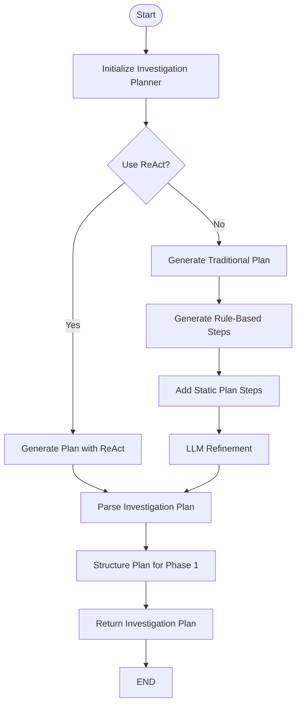
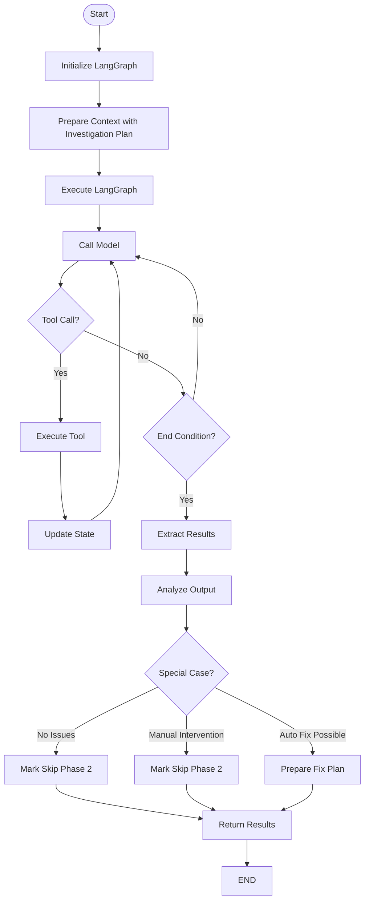
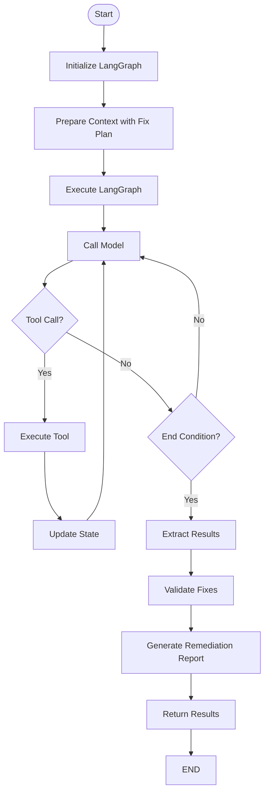
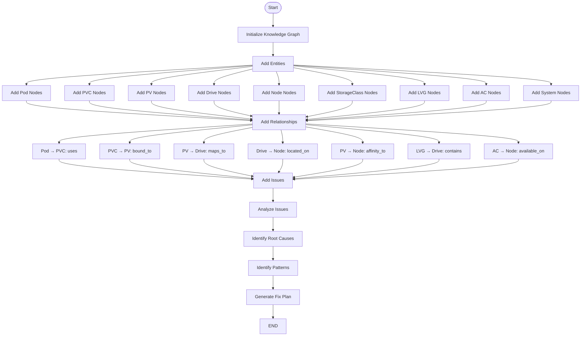
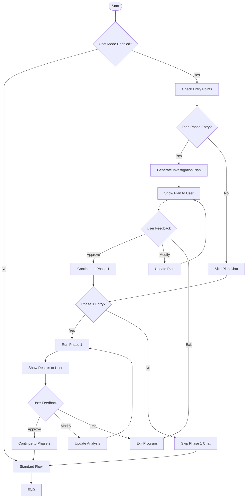
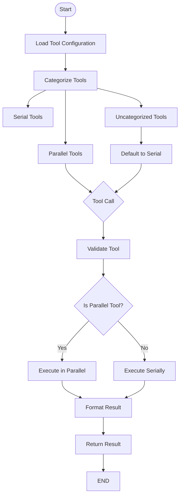
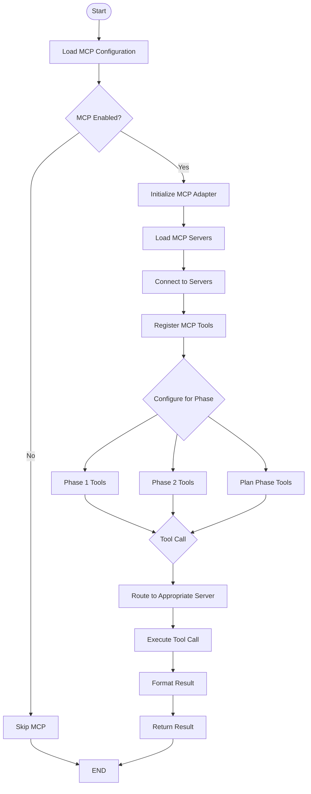

# Workflow Diagrams and Processes

## Overall Workflow

The Cluster Storage Troubleshooting System follows a structured workflow with multiple phases:



## LangGraph ReAct Loop

The LangGraph ReAct agent operates in a loop of reasoning and acting:



## Phase 0: Information Collection

The Information Collection phase gathers all necessary diagnostic data upfront:



## Plan Phase: Investigation Planning

The Plan Phase generates a structured investigation plan:



## Phase 1: ReAct Investigation

The ReAct Investigation phase executes the investigation plan:



## Phase 2: Remediation

The Remediation phase executes the fix plan:



## Knowledge Graph Construction

The Knowledge Graph is constructed from diagnostic data:



## Chat Mode Workflow

The Chat Mode enables interactive troubleshooting:



## Tool Execution Workflow

The system executes tools in both parallel and serial modes:



## MCP Integration Workflow

The MCP integration enables communication with external tools and resources:



## End-to-End Sequence Diagram

```mermaid
sequenceDiagram
    participant User
    participant Monitor
    participant InfoCollector
    participant KnowledgeGraph
    participant PlanPhase
    participant Phase1
    participant Phase2
    participant Tools
    
    User->>Monitor: Start monitoring
    loop Monitoring Loop
        Monitor->>Monitor: Check pod annotations
        Monitor->>Monitor: Detect volume-io-error
    end
    
    Monitor->>InfoCollector: Trigger troubleshooting
    InfoCollector->>InfoCollector: Collect diagnostic data
    InfoCollector->>KnowledgeGraph: Build knowledge graph
    InfoCollector->>PlanPhase: Pass collected info
    
    PlanPhase->>KnowledgeGraph: Query knowledge graph
    PlanPhase->>PlanPhase: Generate investigation plan
    PlanPhase->>Phase1: Pass investigation plan
    
    Phase1->>KnowledgeGraph: Query knowledge graph
    Phase1->>Tools: Execute investigation tools
    Tools->>Phase1: Return tool results
    Phase1->>Phase1: Analyze issues
    Phase1->>Phase1: Generate fix plan
    Phase1->>Phase1: Check if fix needed
    
    alt Fix Needed
        Phase1->>Phase2: Pass fix plan
        Phase2->>Tools: Execute remediation tools
        Tools->>Phase2: Return tool results
        Phase2->>Phase2: Validate fixes
        Phase2->>Phase2: Generate remediation report
        Phase2->>User: Return remediation results
    else No Fix Needed
        Phase1->>User: Return analysis results
    end
