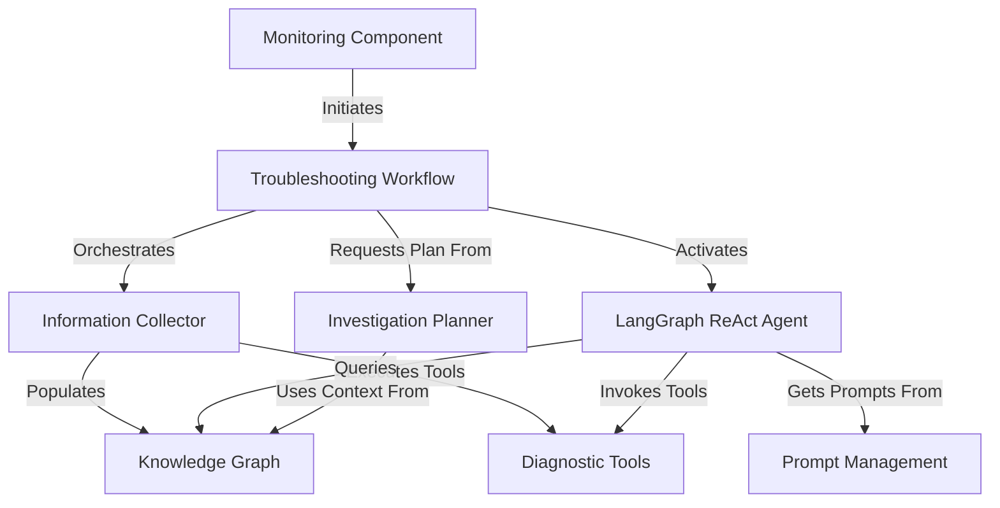

# Tutorial: cluster-storage-troubleshooting

The `cluster-storage-troubleshooting` project is an intelligent system designed to
*automatically detect and resolve* Kubernetes volume I/O errors. It operates through a
**multi-stage workflow**: first collecting _comprehensive diagnostic data_ into a
**Knowledge Graph**, then using an _AI agent_ to **plan investigations** and *analyze
root causes*, and finally proposing and executing **remediation steps**. A **monitoring
component** continuously watches for new issues, *triggering the entire process* when
necessary.

**Source Repository:** [None](None)

## Chapters

1. [Monitoring Component
](01_monitoring_component_.md)
2. [Troubleshooting Workflow
](02_troubleshooting_workflow_.md)
3. [Information Collector
](03_information_collector_.md)
4. [Diagnostic Tools
](04_diagnostic_tools_.md)
5. [Knowledge Graph
](05_knowledge_graph_.md)
6. [LangGraph ReAct Agent
](06_langgraph_react_agent_.md)
7. [Prompt Management
](07_prompt_management_.md)
8. [Investigation Planner
](08_investigation_planner_.md)

---

Generated by [AI Codebase Knowledge Builder](https://github.com/The-Pocket/Tutorial-Codebase-Knowledge)