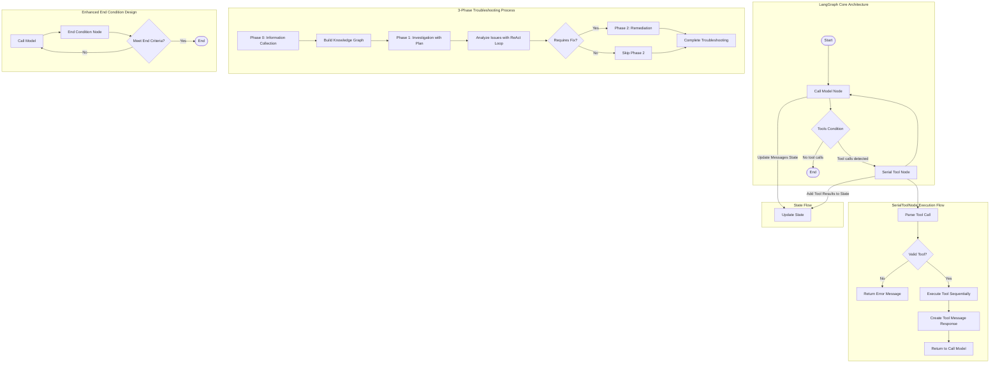

# LangGraph Workflow Diagram



## LangGraph ReAct Workflow Explanation

### Core Components

1. **StateGraph**: The foundation of LangGraph, managing state transitions between nodes

2. **Nodes**:
   - **Call Model Node**: Invokes the LLM with the current state
   - **Serial Tool Node**: Executes tools sequentially (not in parallel)
   - **End Condition Node**: Evaluates whether to terminate the graph

3. **Edges**:
   - **Standard Edges**: Direct connections between nodes
   - **Conditional Edges**: Transitions based on conditions

4. **State**:
   - **MessagesState**: Maintains conversation history
   - **Custom States**: Can extend with application-specific data

### Execution Flow

1. **Start**: Initialize the graph with initial state
2. **Call Model**: LLM generates a response based on current state
3. **Tools Condition**: Determine if tools need to be executed
   - If yes: Pass to Serial Tool Node
   - If no: Check end conditions or terminate
4. **Serial Tool Node**: Execute tools in sequence
   - Parse tool calls from model response
   - Validate each tool
   - Execute tools one by one
   - Format results as tool messages
5. **Loop**: Return to Call Model with updated state
6. **End**: Terminate when end conditions are met

### Enhanced End Conditions

For more specific control over graph termination:

1. **Content-based endings**: Check for specific sections in the response
2. **Maximum iterations**: End after a certain number of steps
3. **Goal achievement**: Verify if specific objectives are met
4. **Convergence detection**: End if the model repeats itself
5. **Special command detection**: Allow explicit termination signals

### Implementation Pattern

```python
# Define state
class CustomState(TypedDict):
    messages: List[BaseMessage]
    iteration_count: int
    goals_achieved: List[str]

# Define nodes
def call_model(state): ...
def execute_tools(state): ...
def check_end_conditions(state): ...

# Build graph
builder = StateGraph(CustomState)
builder.add_node("call_model", call_model)
builder.add_node("tools", SerialToolNode(tools))
builder.add_node("check_end", check_end_conditions)

# Add edges
builder.add_conditional_edges(
    "call_model",
    tools_condition,
    {
        "tools": "tools",
        "none": "check_end"
    }
)

builder.add_conditional_edges(
    "check_end",
    lambda state: "end" if check_end_conditions(state) else "continue",
    {
        "end": END,
        "continue": "call_model"
    }
)

builder.add_edge("tools", "call_model")
builder.add_edge(START, "call_model")

# Compile and run
graph = builder.compile()
result = graph.invoke({"messages": [system_message, user_message]})
