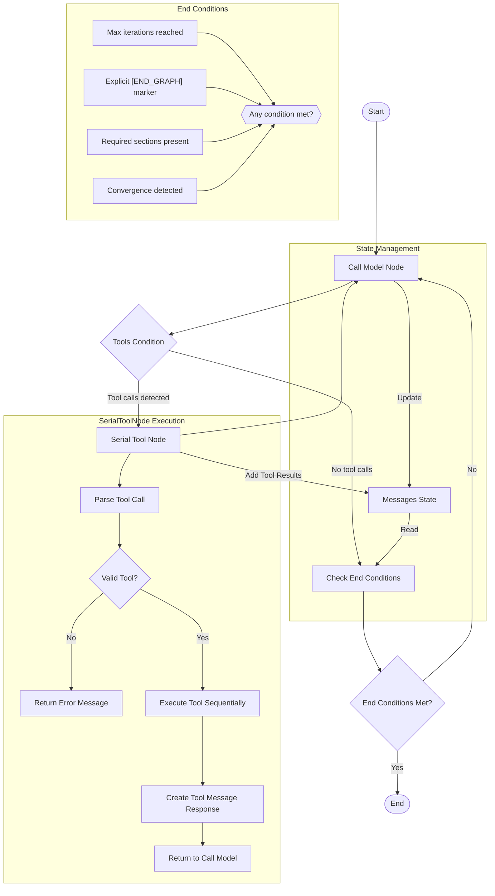

# Refactored LangGraph Workflow Diagram

## Enhanced End Condition Implementation

The refactored LangGraph implementation adds a dedicated end condition node that evaluates multiple criteria:

1. **Maximum Iterations Check**: Terminates if the graph has executed more than a configured number of iterations
2. **Explicit End Marker**: Ends if the model output contains an explicit `[END_GRAPH]` marker
3. **Required Sections Check**: 
   - For Phase 1: Checks for presence of key sections like "Summary of Findings", "Root Cause", "Fix Plan"
   - For Phase 2: Checks for sections like "Actions Taken", "Test Results", "Resolution Status"
4. **Convergence Detection**: Ends if the model starts repeating itself (comparing current output with previous outputs)

This approach provides more controlled termination compared to the original implementation that ended solely based on the absence of tool calls.

## Key Improvements

1. **Better Completion Control**: The graph now ends when the analysis is actually complete, not just when no tools are called
2. **Explicit Output Requirements**: The model is guided to produce structured output with required sections
3. **Convergence Prevention**: Avoids infinite loops by detecting when the model starts repeating itself
4. **Flexible Configuration**: End conditions can be adjusted through configuration parameters

## Flow Explanation

1. The graph starts at the `START` node and proceeds to the `Call Model Node`
2. The model generates a response which is evaluated by the `Tools Condition`
3. If tool calls are detected, they are executed sequentially by the `Serial Tool Node`
4. If no tool calls are detected, the response is evaluated by the `Check End Conditions` node
5. If end conditions are met, the graph terminates at `END`
6. If end conditions are not met, the graph loops back to the `Call Model Node`
7. This process continues until end conditions are satisfied
